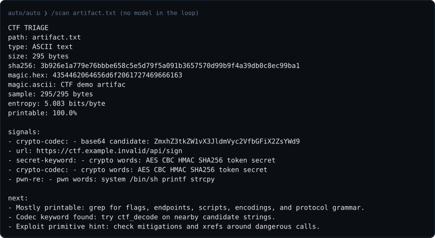
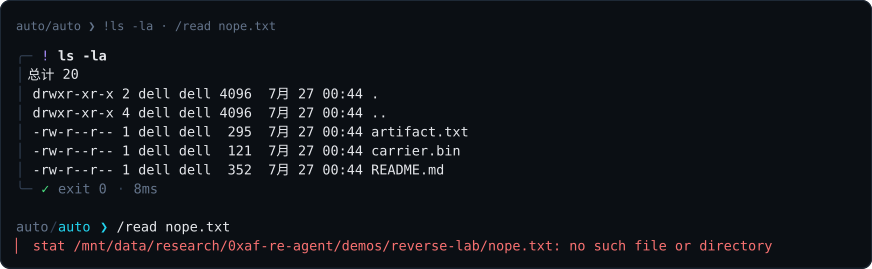
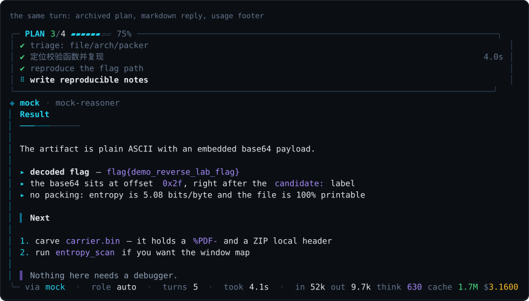
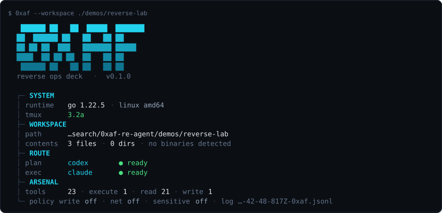
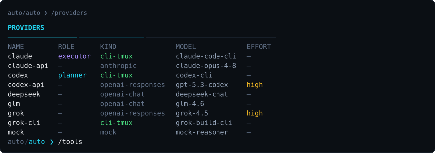
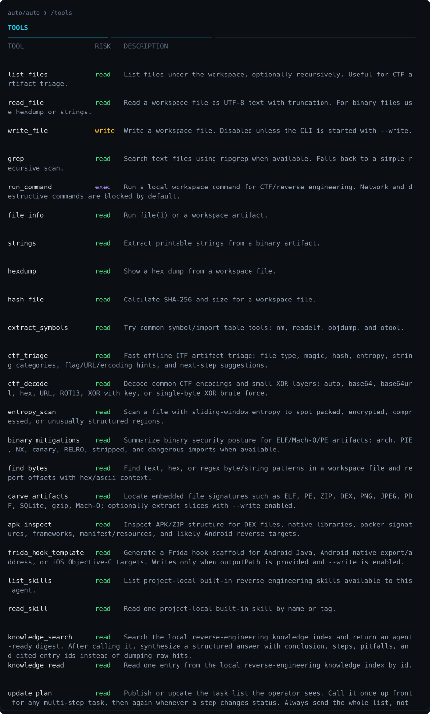
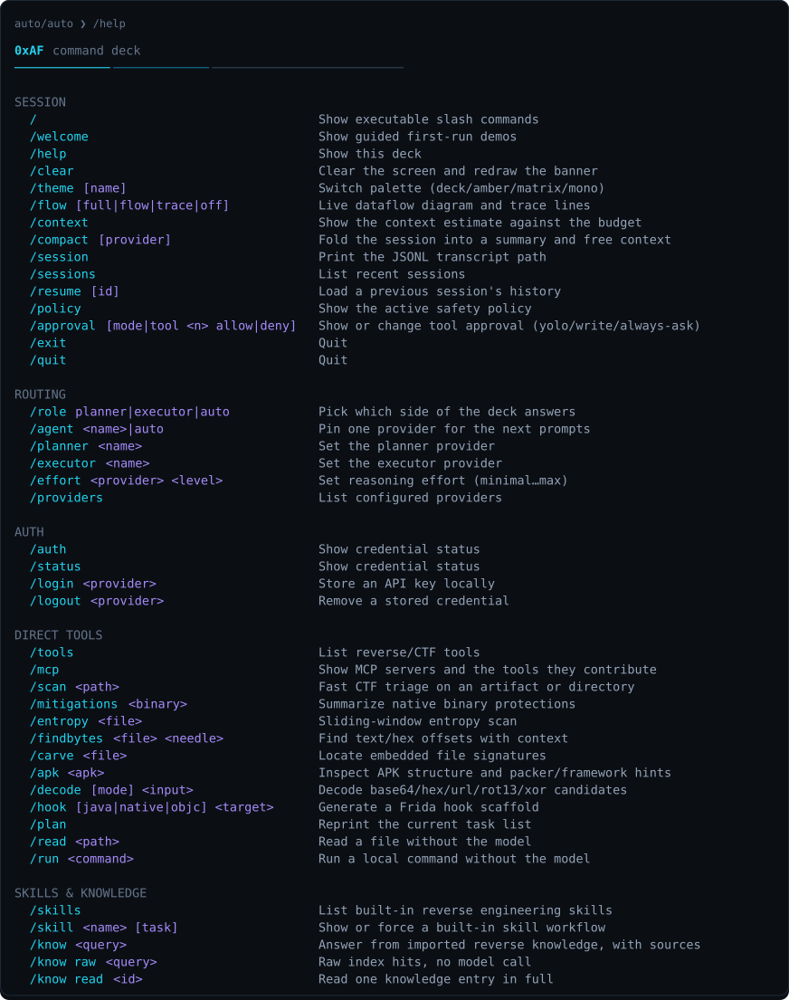
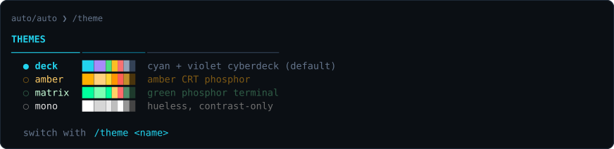
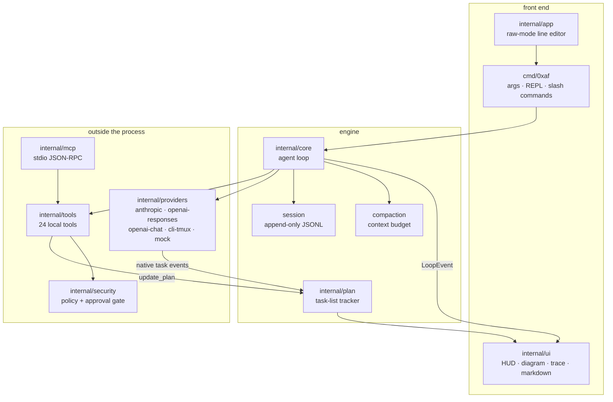
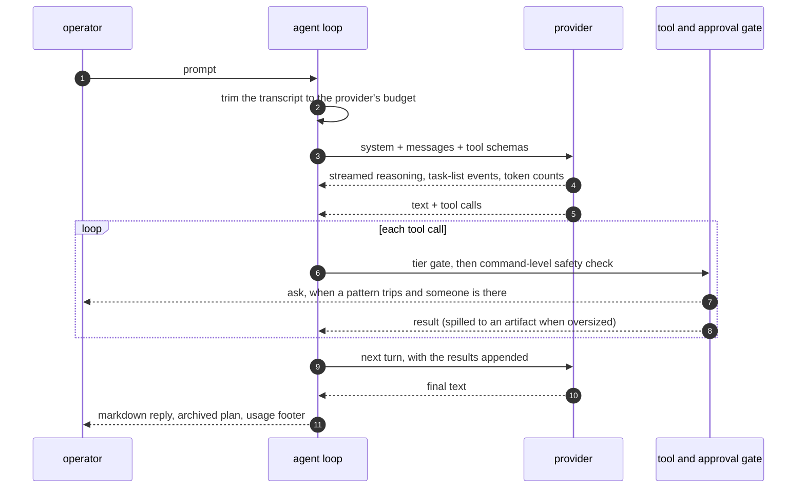

# 0xAF-Re

A reverse-engineering and CTF agent that lives in your terminal. One planner
model, one executor model, 24 local tools, explicit workflow modes, queued
next prompts, and a live picture of what the turn is actually doing — as a
single static Go binary with no runtime to install.

[中文说明](README.zh-CN.md) · [Architecture](docs/ARCHITECTURE.md) · [Project page](https://overkazaf.github.io/re-agent/)

<p align="center">
  
</p>

```bash
go install github.com/overkazaf/re-agent/cmd/0xaf@latest
0xaf --welcome          # guided first-run demos
0xaf --workspace ./ctf  # open a workspace and start working
```

---

## Why

Reverse engineering is a long conversation with a binary, and the two things
that make an agent useful for it are **local tools** and **visibility**. This
one runs `strings`, `readelf`, `unzip`, `frida` scaffolds and its own triage
passes on your machine, keeps everything inside a workspace by default, and
draws the turn while it happens so you can see where the time went and stop it
when it goes somewhere useless.

- **One binary, no runtime.** ~6.7 ms to start, 6.7 MB, prompts and skills
  embedded. `make cross` builds linux/darwin × amd64/arm64 — the boxes where
  lab work actually happens rarely have a JS runtime on them.
- **Two seats, one loop — and you pick who sits in them.** A planner reasons
  about the target; an executor drives the tools. Neither seat is bound to a
  vendor: any of the eight providers can take either one. The default is your
  local `codex` and `claude` CLIs in tmux because it reuses logins you already
  have, but `grok-build` (`grok-cli`) is a first-class CLI provider too, and
  seats can be mixed — a local CLI planning, a direct API executing, or the
  reverse. Swap either seat mid-run with `/planner`, `/executor` or `/agent`,
  and override the concrete model with `/model`; no restart, no config edit.
- **Cancellation that reaches the tree.** `^C` cancels the HTTP request, kills
  the tmux session, and signals tool subprocesses in their own process group —
  no orphaned `objdump` chewing a core.
- **Nothing silently escapes the workspace.** Reads are contained, writes are
  off unless you ask, network and credential-shaped commands stop and ask.

## Design, in nine lines

Reverse engineering has a fixed rhythm — triage, hypothesis, verification,
revised hypothesis — and every decision here follows from it.

- **One loop.** Everything hangs off `AgentLoop.Run`. The UI subscribes to its
  events and never influences them: a HUD that draws wrong is ugly, not wrong.
- **Tools run locally, inside a workspace.** The subject is the real file on
  your disk, not a description of it.
- **Visibility is a precondition for trust,** not decoration. You should be able
  to see which request was slow, which tool stalled, and how much context got
  trimmed away.
- **An interrupt is an outcome, not a failure.** Every tool call that was issued
  still gets a result recorded, or the transcript stops being resumable.
- **Context is a budget, not a bin.** The disk record stays whole; only the view
  sent upstream is trimmed, and a tool call is never split from its results.
- **A refusal is an answer.** A blocked command becomes a tool result the model
  reads, and the turn continues.
- **Decorative layers must never fail a run.** Plan and HUD errors are swallowed.
- **One binary.** Prompts and skills are embedded; on-disk same-name skills override them.
- **Sessions are the record.** Append-only JSONL that repairs itself on load.

### What oh-my-pi is, and how it works

[`can1357/oh-my-pi`](https://github.com/can1357/oh-my-pi) is a terminal coding
agent (MIT). GitHub labels it TypeScript, but that is only the language
statistic: it is a **Bazel-built polyglot monorepo** — 16 TypeScript packages,
**9 Rust crates** and a resident Python, with 123 modules under
`coding-agent/src` alone.

What makes it worth studying is not that it is another coding CLI — it is that
it treats the **agent harness** as the engineering object: the loop, tool
execution, context management, subagent orchestration. Those are the parts that
decide whether an agent can do work at all, and they are almost entirely
independent of which model you point at them.

Its architecture is drawn in
[the oh-my-pi diagram](docs/diagrams/06-oh-my-pi.svg). Seven load-bearing ideas:

1. **One event-driven agent loop.** Not a chain, not a graph — a loop: assemble
   context, call the model, take tool calls, execute, write results back, go
   again until the model stops asking for tools. State leaves through an event
   stream; the UI is just one consumer. That is what makes it interruptible and
   resumable — every step of the loop has a defined persistence point.
2. **Hash-anchored edits.** Its most distinctive design. Edits locate their
   target by hashing the surrounding snippet rather than by line number, and the
   anchor is verified before writing. If the file moved under the model, the
   edit fails loudly instead of **landing in the wrong place** — turning the most
   common class of silent LLM corruption into an explicit error.
3. **An optimized tool harness.** Output budgets, spill-to-disk, timeouts,
   process-group management, and a real distinction between "the tool failed"
   and "the tool was refused" — unified into one layer.
4. **Cross-language workers with a loopback bridge.** A persistent Python and a
   Bun worker that can call **back into the agent's own tools** (read, search,
   task). Scripts the model writes are not running in a vacuum.
5. **LSP as a first-class citizen.** Renames go through
   `workspace/willRenameFiles`, so re-exports, barrel files and aliased imports
   are updated *before* the file moves. Let the language server do what it is
   good at instead of making the model guess.
6. **Subagents with typed results.** The `task` tool splits work across
   subagents whose return values are schema-validated structures the parent
   reads directly — no free-text parsing.
7. **The performance-critical path pushed down into Rust.** The clearest
   statement of its priorities: `pi-shell` vendors **brush** (bash in Rust),
   `pi-uu-grep` / `pi-uu-diff` rewrite the coreutils on uutils, and `pi-walker`,
   `pi-ast` and `pi-iso` handle traversal, per-language parsing and isolation.
   The tell is `pi-shell/src/minimizer/`: output filters written per toolchain —
   cargo, git, go, jvm, npm — each with test fixtures. Their real bottleneck was
   never model quality, it was **tool noise**. A coding agent runs `cargo build`
   a thousand times a day, and no context window survives that raw. So they cut
   the noise at the source rather than compacting it afterwards.

### What we took, and what we deliberately did not

This project takes **1, 3 and 6** — the loop, tool budgets, structured results.
It does **not** take 2, 4, 5 or 7. Hash-anchored edits, LSP integration and
cross-language workers are all optimizations for *changing code*, and reverse
engineering is mostly **reading**: binaries, decompilation, logs. Writing files
is a secondary action here, and building an entire edit-safety net for it does
not pay for itself. The Rust substrate is the same calculation: `objdump -d`
produces noise the same way every time, so one output budget plus spill-to-disk
covers it — there is no per-toolchain filter worth writing.

[The comparison diagram](docs/diagrams/07-vs-oh-my-pi.svg) lays the two side by
side across seven axes.

The skeleton comes from the core ideas in `oh-my-pi` — one agent loop, pluggable
provider adapters, a single tool registry, append-only sessions, planner/executor
routing, interruptible turns, context compaction, tiered approval, MCP — narrowed
to the shape of reverse engineering work. The REPL conventions (slash commands,
approval modes, session resume, MCP as the way to borrow someone else's tools)
deliberately match today's coding CLIs, so nobody has to learn a second dialect.
The tool list is not derived from "what should an LLM agent have"; it is copied
off a real first pass: `file` → `strings` → entropy → flag-shaped strings →
mitigations → carve → APK → Frida hook. Which is why every one of those is also
a slash command: the fast path costs no tokens at all.

## Why these defaults

The default route is **planner = your local `codex` CLI, executor = your local
`claude` CLI**, both driven inside tmux. Four reasons:

1. **The split follows the work.** "Where is the check and is it worth a
   breakpoint" and "read these three files, run this, tidy the output" are
   different jobs. `codex` takes the planner seat with `--sandbox read-only` —
   planning should not touch the disk. `claude` takes the executor seat, where
   tool use and file work land more reliably.
2. **It reuses logins you already have.** No API key is required by default, and
   none has to be handed over. The CLI providers even `unset OPENAI_API_KEY` /
   `ANTHROPIC_API_KEY` before spawning, so a stale variable cannot override a
   working CLI login.
3. **Their native task lists drive the UI.** Claude streams
   `TaskCreate`/`TaskUpdate`, codex streams `plan_update`/`todo_list`; those
   events *are* the task list you see. It is the model's own reported progress,
   not something the host invented — and with a resumed native session it keeps
   growing across turns.
4. **The rest are deliberate fallbacks, not filler.**

| provider | kind | reach for it when |
| --- | --- | --- |
| `codex` · `claude` | local CLI in tmux | the default: existing logins, native task lists, their own sandbox |
| `codex-api` · `claude-api` | OpenAI Responses · Anthropic Messages | you would rather pay per token, run headless, or need **structured host tool calls** |
| `grok` · `grok-cli` | xAI API · local CLI | a genuinely independent third opinion when reviewing a plan for blind spots |
| `deepseek` · `glm` | OpenAI-compatible chat | cheap and fast for high-volume grinding — and the template for any self-hosted endpoint |
| `mock` | offline | `--smoke` and the tests; scriptable, so tool flows run in CI with no network |

### The four axes behind the split

The planner/executor split is drawn along four axes. They are independent — a
model strong on one is not automatically strong on another, which is exactly why
there are two seats.

**1 — Context window, which decides who plans.** Planning a reverse job means
holding symbol-table fragments, several decompilations, string hits and the last
few dead ends all at once. That reaches hundreds of thousands of tokens fast. A
model with too small a window does not answer *worse* — it starts **forgetting
earlier leads** and re-proposes directions you ruled out two turns ago. The
planner seat goes to the larger window, with the two-pass compaction budget as a
backstop (see the [context budget diagram](docs/diagrams/03-context-budget.svg)).
Compaction defers that ceiling; it does not remove it.

**2 — Planning ability is not execution ability.** In practice these are often
anti-correlated. Guessing where a check function hides in a pile of noise wants
divergence and association; reading three files, running one command and tidying
the output wants strict compliance and no improvisation. One model doing both
means compromising on both. `codex` takes the planner seat for stable
long-chain reasoning; `claude` takes the executor seat for a lower **failure
rate** on tool calls and file work.

**3 — Thinking budget.** On backends that support it, reasoning effort is tuned
per seat:

```text
/effort codex high      spend it on planning — a wrong direction costs a dozen turns
/effort claude low      "read the file, run the command" does not need deep thought
```

Spending the reasoning budget on planning rather than execution is itself part
of the split, and it is not something you can express with a single model.

**4 — Risk controls in CTF and RE work.** The axis most often overlooked, and
the one with the largest practical impact. Vendors differ sharply in how they
handle reverse engineering, exploitation and protection-bypass requests — and
the same vendor differs across models and across time. What you actually hit:

- an outright refusal (`stop_reason=refusal`), and the whole turn is wasted
- no refusal, but a *softened* answer: generic advice that dodges the specific
  check you asked about
- a normal answer

This is not hypothetical. During development, a `/know` call through the real
CLI came back with an upstream `stop_reason=refusal` — which incidentally proved
the host's failure-attribution path works end to end.

The host does three things about it:

1. **A refusal is a first-class failure cause,** not "the request errored". The
   interface distinguishes refusal from rate-limiting from a dead CLI, because
   the three want completely different responses from you.
2. **Providers swap without a restart.** On a refusal, `/agent grok` or
   `/planner deepseek` and ask again — far cheaper than arguing with the model
   you have.
3. **The first pass never touches a model.** All 24 tools are slash commands;
   `/scan`, `/decode` and `/mitigations` answer directly. No risk policy can
   block `strings`.

That is also a real reason `grok` and `deepseek` / `glm` ship in the box: their
policy boundaries do not overlap with the other two, and **asking a different
vendor often just works**. That is not a trick — it is accepting that model
refusal is a normal operating condition in this domain, and leaving an exit in
the architecture instead of improvising when you hit one.

One trade-off worth stating plainly: **the CLI providers do not call host
tools.** They run their own, and the host's 24 tools are passed to them as
information. Structured host tool calls — and `update_plan` — need a direct-API
provider. Both paths exist because each has its moment.

Because `deepseek` / `glm` are the OpenAI-compatible kind, self-hosting is one
config block: point `baseUrl` at `http://localhost:8080/v1` and llama.cpp, vLLM
or Ollama work as-is.

## Quick start

```bash
# from source
git clone https://github.com/overkazaf/re-agent && cd re-agent
make build            # ./bin/0xaf and ./bin/import-knowledge
make test

# offline wiring check — no API key, no network, no CLI login
./bin/0xaf --smoke

# a real workspace
./bin/0xaf --workspace ./demos/reverse-lab
```

The default route uses your local CLIs, so check those logins once:

```bash
codex login status
claude auth status --text
0xaf auth status        # what 0xAF-Re itself can see
```


Read that table as three distinct claims, not two. **`● ready`** means a
credential was found, or the CLI reported a real login — `codex login status`
and `claude auth status` both answer that question. **`◐ present`** means the
CLI runs but offers no way to ask (`grok` has no auth subcommand), so the first
turn is what will find out. **`○ missing`** means nothing usable was found. The
`source` column always names the mechanism, and none of this reads your session
files or stores anything: it is a live subprocess probe of the CLI you already
logged into.

Prefer a direct API instead? Set a key and pick the provider:

```bash
export DEEPSEEK_API_KEY=...           # or ANTHROPIC_API_KEY / OPENAI_API_KEY / XAI_API_KEY / ZAI_API_KEY
0xaf --planner deepseek --executor deepseek --workspace ./ctf
0xaf auth login claude-api            # or store one locally instead
```

## Workflow modes

Workflow mode is explicit. With it off, prompts are sent as-is. Turn it on when
you want the host to shape reverse-engineering work before it reaches the model:

```text
/workflow off          default: no extra workflow wrapper
/workflow auto         use specialist if GPT Cyber / CC CVP is configured, else caveman
/workflow specialist   plan and run directly with a cyber/CVP-style route
/workflow caveman      split into small local evidence packets
```

`specialist` is for a configured GPT Cyber, Claude Code CVP, or comparable
authorized RE route: publish a short plan, use the bundled skills and local
tools, preserve paths/offsets/hashes/commands, and keep going on the allowed
artifact-analysis parts.

`caveman` is the fallback for ordinary providers. It is deliberately **not**
translation, classical Chinese, ciphering, euphemism, or prompt laundering. It
turns the task into bounded, local-first evidence packets — file type, strings,
entropy, imports, platform-specific skill, focused hypothesis, one verification
command — so the operator can keep solving authorized reverse tasks without
asking the model to bypass a policy boundary.

```bash
0xaf --workflow auto --workspace ./ctf
0xaf --workflow caveman -p "triage ./app.apk and identify the next local check"
```

## Common usage

**Triage an unknown artifact.** The fast path is no model at all — the direct
tool commands run locally and print straight to your terminal:

```text
/scan ./chall                  fast CTF triage: type, magic, hash, entropy, string signals, next steps
/mitigations ./chall           PIE / NX / canary / RELRO / stripped / dangerous imports
/entropy ./chall               sliding-window entropy — finds packed or encrypted regions
/carve ./blob                  embedded ELF/PE/ZIP/DEX/PNG/PDF/SQLite/Mach-O signatures
/findbytes ./chall flag{       offsets with hex+ascii context (hex needles too)
/decode base64 ZmxhZ3s...      base64/hex/url/rot13/xor, or `auto` to try them all
/apk ./app.apk                 dex count, native libs, packer and framework fingerprints
/retool inventory              check radare2, JADX, Ghidra, Unicorn, unidbg and friends
/retool radare2 info ./chall   fixed-action wrapper around deeper local RE tools
/hook java com.a.Crypto sign   a Frida hook scaffold for the method you name
```



**Ask for a plan, then let it work.** Route the thinking to the planner and the
doing to the executor:

```bash
0xaf -p "Triage ./chall, identify the check, and propose a solve plan" --role planner
0xaf --workspace ./ctf                  # then just talk to it
```

**Switch the concrete model without changing provider.**

```text
/model deepseek deepseek-reasoner
/model planner gpt-5.3-codex-high
```

```bash
0xaf --model deepseek=deepseek-reasoner --planner deepseek -p "triage ./chall"
```

HTTP providers use the override in the request body. Known local CLI providers
get a `--model` argument; custom CLI configs can pass it with a `{model}`
placeholder in `cliArgs`.

**Queue the next task while the current one is still running.** In an interactive
turn, type a normal line and press Enter: it is queued instead of interrupting
the current provider call. Before it runs:

```text
/queue list
/queue edit 2 triage ./fixed.apk instead
/queue cancel 2
/tasks collapse     # fold the live task list
/tasks expand       # show as much as the terminal budget allows
```

**Run a command yourself mid-conversation.** A line starting with `!` runs in
the workspace under the same policy; the output streams live and lands in the
transcript, so the next prompt can refer to what you both just saw:

```text
!file ./chall && strings -n 8 ./chall | head
```



**Write notes when you trust it.** Writes stay off until you say otherwise:

```bash
0xaf --workspace ./ctf --write -p "Write notes/solve.md: triage, the check, the flag, and the repro command"
```

**Pick up where you left off.**

```bash
0xaf --sessions          # list recent sessions
0xaf --continue          # resume the most recent
0xaf --resume 2026-07-28T00-45   # or an id, an id prefix, or a path
```

## The turn, drawn

Two layers, both on by default. The **diagram** animates above the HUD while
the turn runs — packets move along the wires, nodes light up as they take part,
and the loop closes back into the context that feeds the next request. The task
list hangs off `[you]` as a badge, because the plan is the operator's view of
the work.

The **trace** lands in the scrollback and stays there, stamped from the start of
the turn, so a finished run reads like a packet capture:


Duration bars share one scale per turn (the slowest request fills the bar), so
the shape of a turn is readable at a glance: where the time went, how many round
trips it took, which tool was slow. Plan updates appear as *transitions*, never
as dumps — a list still being written stays silent until something actually
moves, and the full list is archived once, at the end.



```text
/flow full     diagram + trace (default)
/flow flow     diagram only
/flow trace    trace lines only
/flow off      neither — the plain tool tree comes back
```

The choice is saved. The diagram hides itself below 46 columns and in non-TTY
output; the trace degrades to plain text without escape sequences, which is what
you want when piping a run into a log.

## Boot screen

Every line of the self-check is a real probe — runtime, tmux, a shallow
magic-byte triage of the workspace, provider auth, tool inventory, active
policy. The boot screen doubles as the answer to "is this thing actually wired
up right now?"



## Routing

| | |
| --- | --- |
| `--role planner` | route to the planner (analysis, exploitability, solve plans) |
| `--role executor` | route to the executor (tools, inspection, summarizing) |
| `--role auto` | pick per prompt — execution-shaped prompts go to the executor |
| `/agent <name>` | pin one provider for the next prompts |
| `/planner <name>` · `/executor <name>` | change either side mid-session |
| `/effort <provider> high` | reasoning effort, for the backends that take one |



Eight providers ship: the local `codex` / `claude` / `grok` CLIs through tmux,
Anthropic Messages, OpenAI Responses, any OpenAI-compatible chat endpoint
(DeepSeek, GLM, a local llama.cpp server), and an offline `mock` used by
`--smoke` and the tests.

## The arsenal



| | |
| --- | --- |
| **files** | `list_files` `read_file` `write_file` `grep` |
| **shell** | `run_command` |
| **binaries** | `file_info` `strings` `hexdump` `hash_file` `extract_symbols` `binary_mitigations` |
| **CTF** | `ctf_triage` `ctf_decode` `entropy_scan` `find_bytes` `carve_artifacts` |
| **external** | `reverse_toolkit` |
| **mobile** | `apk_inspect` `frida_hook_template` |
| **knowledge** | `list_skills` `read_skill` `knowledge_search` `knowledge_read` |
| **plan** | `update_plan` |

Large output never lands in context whole: anything over `--max-output`
(default 24000 chars) keeps head+tail, and the full text is written to
`sessions/artifacts/` with the path handed to the model so it can `read_file` or
`grep` the rest deliberately.

MCP servers join the same registry. For reverse engineering the obvious one is
[`ida-pro-mcp`](https://github.com/mrexodia/ida-pro-mcp), which puts
decompilation, xrefs and renaming in reach:

```json
{ "mcpServers": { "ida": { "command": "python3", "args": ["-m", "ida_pro_mcp.server"], "timeoutMs": 120000 } } }
```

Its tools appear as `mcp__ida__<tool>` and go through the same approval gate and
output budget as the built-ins. A server that fails to start is reported at boot
and skipped, never fatal. `/mcp` shows the state of each one.

## Skills and knowledge

Project-local workflows live in `skills/<name>/SKILL.md`. They are loaded at
startup, summarized into the system prompt, exposed as tools, and can be forced
for a single turn. The checkout ships a broader reverse-engineering set now:
CTF first pass, APK/Frida, native pwn/RE, web/WASM crypto, radare2, Ghidra,
JADX, Unicorn, unidbg, and imported local RE playbooks.

```text
/skills                                  ctf-first-pass · android-apk-frida · native-pwn-re · radare2-reverse · ...
/skill android-apk-frida inspect this APK and propose hooks
```

### Where it looks for your files

The single most common trip-up. The binary embeds a copy of the prompts and
skills. A project directory found on disk supplies your local files; same-name
skills override the embedded copies, while embedded skills that are missing on
disk still stay available.

Resolution order, first hit wins:

| # | Location |
| --- | --- |
| 1 | `$OXAF_RE_HOME` |
| 2 | the **executable's directory**, then up to 6 parent directories |
| 3 | the **working directory**, then up to 6 parent directories |
| 4 | nothing found → the embedded prompt and built-in skills |

The test for "is this a project root" is specific: the directory must contain
**both** `prompts/system.md` **and** a `skills/` directory. One without the other
does not count.

So if you copy the binary somewhere else, say so explicitly:

```bash
export OXAF_RE_HOME=/path/to/re-agent
0xaf                       # now it can see your skills/ and knowledge/
```

### Loading your own skill

A skill is a directory and a markdown file. That is all:

```bash
mkdir -p $OXAF_RE_HOME/skills/my-unpacker
$EDITOR $OXAF_RE_HOME/skills/my-unpacker/SKILL.md
```

```markdown
---
name: my-unpacker
description: Strip the XX packer and recover the dex. Use when an APK's classes.dex is a stub.
---

# Steps

1. Confirm the packer's fingerprint with `apk_inspect`
2. Attach frida, hook `OpenMemory` in `libart.so`
3. Dump the in-memory dex, validate the header with `carve_artifacts`
```

Then:

```text
/skills                              built-ins plus yours
/skill my-unpacker look at this APK  force this turn through the skill
```

The `description` is worth real effort — it is what gets summarized into the
system prompt, and it is the only thing the model uses to decide *when* this
skill applies. "Unpacking tool" will rarely fire; the phrasing above, with its
trigger condition, fires far more reliably.

### Loading your own knowledge base

A local markdown corpus can be indexed and queried without leaving the REPL:

```bash
# one or more directories, or single .md files — markdown is found recursively
go run ./cmd/import-knowledge ~/notes/re ~/notes/ctf ~/some/single-note.md

# or the compiled helper
./bin/import-knowledge ~/notes/re
```

It writes `$OXAF_RE_HOME/knowledge/reverse-index.json` and prints how many
documents it indexed. Run with **no arguments** and it falls back to a hardcoded
set of default paths (`~/frida/reverse-engineering/...`) — so to index your own
notes, **pass the paths**.

```text
/know frida ssl pinning        answer from local knowledge, with sources
/know raw frida ssl            raw index hits, no model call — zero tokens
/know read <entry-id>          read one entry in full
```

One rule is worth stating plainly: **answers may only come from retrieved
entries, and the entry ids must be cited.** If the model cites an id that is not
in the index, the interface says so loudly — a knowledge tool that invents its
sources is worse than one that gives none.

Re-run `import-knowledge` after editing notes; the index is a snapshot and does
not refresh itself. It stays out of version control: it points at paths on your
disk and carries excerpts of the text.

## Safety

Two inputs decide whether a call runs: the tool's tier (`read` / `write` /
`exec`) and the session's mode.

| Mode | Auto-approves | Asks |
| --- | --- | --- |
| `yolo` | everything | nothing |
| `safe` (default) | every tier | commands tripping a safety pattern |
| `write` | read, write | exec tools, and safety patterns |
| `always-ask` | read | everything else |

Safety patterns — destructive shell forms, network commands while the network is
off, credential-shaped paths — outrank an "always allow": allowing
`run_command` is not the same as allowing `rm -rf /`. With no one to ask
(`--print`, pipes, CI) a prompt becomes a refusal that states the reason.


```bash
0xaf --approval always-ask     # confirm every write and exec
0xaf --yolo                    # never ask (unattended runs)
0xaf --write --allow-network   # lift a specific restriction instead
```

Default policy: reads stay inside the workspace, writes are disabled, network
commands are disabled, secret-like paths are blocked, destructive shell patterns
are blocked. `/policy` prints the active one; `/approval` changes it.

## Context

The full transcript is always on disk. What gets *sent* is trimmed to the
provider's budget (48k tokens by default) in two mechanical passes: old
tool-result bodies are elided first, their first line surviving as a pointer,
then whole oldest exchanges are dropped behind a `[context compacted]` marker. A
tool call is never separated from its results, because strict chat APIs reject
that shape.

```text
/context      ≈12400 tokens of 48000 budget (25%) · 42 messages
/compact      ask the model for a briefing and restart the working history from it
```

`^C` during a turn aborts it and keeps the partial work: every tool call that
was issued still gets a result recorded, so the next prompt — or a resumed
session — is a valid history.

## The command deck



Typing a `/` opens the palette under the prompt. It is clamped to the rows
actually available below the caret, so it never scrolls the prompt away:


Four palettes ship. `/theme` previews each one in its own colours:



## Architecture



One turn:



`docs/ARCHITECTURE.md` goes deeper: package map, invariants a change can
silently break, data formats, extension points, and the concurrency model.

## Configuration

Copy `config.example.json` to `agent.config.json` (gitignored) and change what
you need — every provider, model, budget, timeout and MCP server is
configurable:

```json
{
  "plannerProvider": "codex",
  "executorProvider": "claude",
  "maxTurns": 8,
  "providers": {
    "deepseek": {
      "type": "openai-chat",
      "model": "deepseek-chat",
      "baseUrl": "https://api.deepseek.com/v1",
      "apiKeyEnv": ["DEEPSEEK_API_KEY"],
      "contextBudgetTokens": 48000
    }
  }
}
```

Credential lookup order: process env, then `./.env`, `~/.0xaf-re-agent/.env`,
`~/.env`, then `~/.0xaf-re-agent/secrets.json` written by `0xaf auth login`.
Nothing is ever written into the repo.

## Verification

```bash
make test     # 10 packages
make vet
make build
```


## Layout

```text
cmd/0xaf                CLI entrypoint
cmd/import-knowledge    corpus indexer
internal/core           agent loop · JSONL session · compaction · shell escape
internal/providers      the five adapters + the CLI JSONL stream normalizer
internal/tools          reverse/CTF registry · process runner · output budget
internal/security       command safety patterns · tier × mode approval gate
internal/plan           task-list tracker both sources feed
internal/ui             theme · HUD · dataflow diagram · trace · markdown · palette
internal/app            args · REPL · slash commands · queued prompts · line editor
internal/mcp            stdio MCP client and tool adapter
internal/knowledge      index search · context packing · answer parsing
internal/skills         SKILL.md loading
internal/workflow       explicit off/auto/specialist/caveman prompt shaping
internal/assets         embedded prompt/skills · project-root resolution
prompts/ skills/        loaded from disk when present, embedded otherwise
demos/                  two toy workspaces used by --welcome
docs/                   architecture deep-dive · screenshots · project page
```

`OXAF_RE_HOME` points an installed binary at a checkout, when you want live
`skills/`, `knowledge/` and `demos/` instead of the embedded copies.

---

Scoped for authorized CTF, lab, and local reverse engineering work: binary
triage, static inspection, local dynamic experiments, solve planning, and
reproducible notes.
