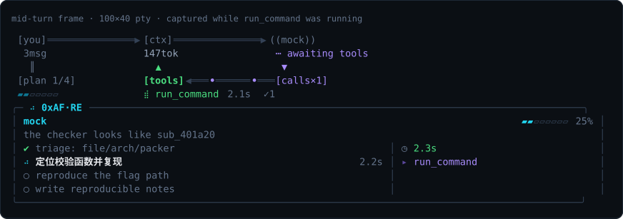

# 0xAF-Re

A terminal agent for authorized reverse-engineering and CTF work. It combines a
planner model, an executor model, local RE tools, workflow modes, queued prompts,
and a live view of each turn in one static Go binary.

**Language:** English | [中文](README.zh-CN.md)

**Links:** [Project page](https://overkazaf.github.io/re-agent/) · [Architecture](docs/ARCHITECTURE.md) · [Architecture diagrams](docs/diagrams/) · [Comparison diagram](docs/diagrams/07-vs-oh-my-pi.svg)

<p align="center">
  
</p>

## Table of Contents

- [Why 0xAF-Re](#why-0xaf-re)
- [Overview](#overview)
- [Developer Highlights](#developer-highlights)
- [Project Motivation](#project-motivation)
- [Install](#install)
- [Quick Start](#quick-start)
- [Basic Demos](#basic-demos)
- [Worked Case](#worked-case-solve-a-challenge-end-to-end)
- [Workflow Modes](#workflow-modes)
- [Providers and Models](#providers-and-models)
- [Skills and Knowledge](#skills-and-knowledge)
- [Safety](#safety)
- [Common Commands](#common-commands)
- [More Docs](#more-docs)

## Bilingual Map

The English and Chinese READMEs keep the same structure for quick switching.

| English | 中文 |
| --- | --- |
| [Why 0xAF-Re](#why-0xaf-re) | [为什么用 0xAF-Re](README.zh-CN.md#为什么用-0xaf-re) |
| [Overview](#overview) | [概览](README.zh-CN.md#概览) |
| [Developer Highlights](#developer-highlights) | [开发者亮点](README.zh-CN.md#开发者亮点) |
| [Project Motivation](#project-motivation) | [项目动机](README.zh-CN.md#项目动机) |
| [Install](#install) | [安装](README.zh-CN.md#安装) |
| [Quick Start](#quick-start) | [快速开始](README.zh-CN.md#快速开始) |
| [Basic Demos](#basic-demos) | [基础 Demos](README.zh-CN.md#基础-demos) |
| [Worked Case](#worked-case-solve-a-challenge-end-to-end) | [实战案例](README.zh-CN.md#实战案例完整解一道题) |
| [Workflow Modes](#workflow-modes) | [Workflow 模式](README.zh-CN.md#workflow-模式) |
| [Providers and Models](#providers-and-models) | [Provider 与模型](README.zh-CN.md#provider-与模型) |
| [Skills and Knowledge](#skills-and-knowledge) | [Skills 与知识库](README.zh-CN.md#skills-与知识库) |
| [Safety](#safety) | [安全策略](README.zh-CN.md#安全策略) |
| [Common Commands](#common-commands) | [常用命令](README.zh-CN.md#常用命令) |
| [More Docs](#more-docs) | [更多文档](README.zh-CN.md#更多文档) |

## Why 0xAF-Re

Reverse engineering is already a pipeline: `file`, `strings`, `entropy`, r2,
JADX, Frida, a scratch script, a note somewhere. The slow part is rarely any
single tool — it is holding the thread across all of them, and re-deriving what
you already knew two hours ago.

0xAF-Re keeps that pipeline and adds a planner on top of it. Five things it does
that a chat window bolted onto a terminal does not:

1. **The cheap path stays free.** `/scan`, `/hex`, `/entropy`, `/carve`,
   `/decode`, `/mitigations`, `/apk` are direct local tools. No model, no token,
   no latency. You only spend a model when you actually want one to think.
2. **Two seats, not one.** A planner model writes the route; a separate executor
   model drives the tools. Give the planning to a strong reasoner and the tool
   calls to something cheap and fast — or point them at different vendors
   entirely, at runtime, with `/planner` and `/executor`.
3. **Cautious models can still work the case.** `caveman` mode splits one
   request into a planner phase and an isolated executor phase that sees only a
   bounded local-evidence packet. Ordinary providers that would otherwise stall
   on RE phrasing keep collecting file facts.
4. **You watch it work, and you can steer mid-turn.** Plan rows, tool calls,
   reasoning, tokens, and timings render live. `/think expand`, `/tasks
   collapse`, `/queue edit` and `/model` all take effect **while the turn is
   still running** — you do not have to kill a turn to redirect it.
5. **Nothing leaves the workspace by accident.** Reads are workspace-scoped;
   writes, network, and sensitive paths are off until you say otherwise; exec
   tier prompts before it runs. Every turn lands in a JSONL transcript you can
   diff, replay, and hand to someone else.

And when the agent is the wrong tool for the next five minutes, `/r2 <file>`
hands the terminal straight to radare2 and takes it back when you quit.

## Overview

- **Local first:** slash commands run file triage, strings, entropy, carving,
  APK inspection, mitigations, and reverse-tool inventory directly on your disk.
- **Two seats:** planner and executor providers can be different models or
  vendors. Switch them at runtime with `/planner`, `/executor`, and `/model`.
- **Visible turns:** the HUD shows route, phase, task list, tools, token counts,
  and timing while the turn is still running.
- **Scoped by default:** reads stay inside the workspace; writes, network, and
  sensitive actions need explicit policy changes.
- **Installable binary:** prompts and built-in skills are embedded, while
  project-local files can override them when `OXAF_RE_HOME` points at a checkout.

For the full design, see [docs/ARCHITECTURE.md](docs/ARCHITECTURE.md). For the
visual overview, see [the architecture diagrams](docs/diagrams/).

## Developer Highlights

If you build agents, 0xAF-Re is a compact RE-focused reference implementation:
one Go binary with provider routing, tool governance, live telemetry,
prompt/skill overrides, queueing, and audit logs. It is small enough to read,
but opinionated enough to show the parts most agent demos skip.

- **Single-file install feel:** one static binary, one Go dependency, no Node or
  browser runtime in the critical path.
- **Composable model seats:** planner, executor, and researcher can use
  different providers, models, and editable prompts.
- **Evidence-first workflows:** specialist routes use GPT Cyber / CC CVP / Grok
  style subscriptions directly; caveman mode isolates ordinary executors to
  read-only local evidence packets.
- **Visible agent loop:** HUD, trace lines, token/timing telemetry, task state,
  and JSONL sessions make each turn debuggable.
- **Hackable surface area:** built-in RE tools, MCP tools, skills, knowledge
  import, project-local overrides, and runtime queue editing.

## Project Motivation

0xAF-Re grew out of daily authorized RE/CTF work where coding-agent risk
controls tightened and general models became more cautious around
reverse-engineering language. The goal is not to hide intent. The agent keeps
work local, authorized, and auditable, then improves the experience by splitting
roles and composing models.

- **Model composition:** use one model for planning, another for tool execution,
  and a researcher role for background context.
- **Specialist routes:** GPT Cyber, Claude Code CVP, Grok, or similar
  security-research-friendly routes make `workflow auto` smoother.
- **Ordinary-provider path:** caveman mode narrows the task into local evidence
  packets so cautious executors can still collect file facts safely.
- **Roadmap:** local models and reproducible benchmark cases will be added so
  provider/workflow quality can be measured and improved over time.

## Install

```bash
go install github.com/overkazaf/re-agent/cmd/0xaf@v0.1.5
0xaf --version
0xaf --welcome
```

From source:

```bash
git clone https://github.com/overkazaf/re-agent
cd re-agent
make build
./bin/0xaf --version
```

`go install ...@v0.1.5` is the recommended install path. `@main` can lag behind
through the Go module proxy cache, and `@latest` resolves to the newest tag.

**Requires Go 1.21 or newer.** `go.mod` declares `go 1.22`; from 1.21 the
toolchain fetches the right version itself, so 1.21 is enough to start.

<details>
<summary>If <code>go install</code> fails with <code>//go:build comment without // +build comment</code></summary>

```text
.../re-agent@v0.1.5/internal/app/repl.go:22:2: //go:build comment without // +build comment
.../re-agent@v0.1.5/internal/ui/live.go:23:2: //go:build comment without // +build comment
```

Nothing is wrong with those two lines — they are the imports of
`golang.org/x/sys/unix` and `golang.org/x/term`. A Go toolchain older than 1.17
cannot parse the bare `//go:build` constraints those dependencies use, and it
reports the failure at the import site rather than in the dependency. Check and
upgrade:

```bash
go version          # need go1.21+
# then reinstall, e.g. via your package manager or https://go.dev/dl/
```

</details>

## Quick Start

```bash
0xaf --smoke                    # offline wiring check, no API key required
0xaf --workspace ./demos/reverse-lab
```

Inside the REPL:

```text
/scan artifact.txt
/decode auto ZmxhZ3s...
/policy
/help
```

The default route uses local CLIs when available. Check what 0xAF-Re can see:

```bash
0xaf auth status
codex login status
claude auth status --text
```

Inside the REPL, use `/auth` for the same check. Prefix raw CLI commands with
`!`, for example `!codex login status`.

## Basic Demos

Use the built-in demo workspace first, then replace paths with your own files.

| Goal | Start With |
| --- | --- |
| Open the guided tour | `0xaf --welcome` |
| Verify offline wiring | `0xaf --smoke` |
| Start a demo workspace | `0xaf --workspace ./demos/reverse-lab` |
| Identify an unknown file | `/scan ./chall` |
| Check binary protections | `/mitigations ./chall` |
| Find packed or encrypted regions | `/entropy ./chall` |
| Carve embedded payloads | `/carve ./blob` |
| Decode a token or flag-like string | `/decode auto ZmxhZ3s...` |
| Inspect an APK | `/apk ./app.apk` |
| Check local RE tools | `/retool inventory` |
| Prepare mobile/API traffic capture | `/retool mitmproxy template api.example.test` |
| Ask for a solve plan | `0xaf --role planner -p "triage ./chall and propose next checks"` |
| Run delegated local evidence mode | `0xaf --workflow caveman -p "triage ./app.apk"` |

The fast path does not need a model: `/scan`, `/decode`, `/entropy`,
`/mitigations`, `/carve`, and `/apk` are direct local tools.

## Worked Case: solve a challenge end to end

Everything below is a real run against `demos/welcome`, which ships with the
repo. The plan text, the commands, the timings and the answer are copied from
the session transcript — you can reproduce it with the same two lines.

### Case A — no model at all

`demos/welcome/chall.js` compares your input against a token it builds at
startup. Before asking anyone to think, look at the file:

```bash
0xaf --workspace ./demos/welcome
```

```text
/read chall.js
# const key = 0x2a;
# const encoded = [26, 82, 75, 76, 81, 93, 75, 88, 71, 95, 90, 117, 78, 79, 73, 65, 87];

!node -e 'const k=0x2a,e=[26,82,75,76,81,93,75,88,71,95,90,117,78,79,73,65,87];console.log(e.map(v=>String.fromCharCode(v^k)).join(""))'
# 0xaf{warmup_deck}

!node chall.js '0xaf{warmup_deck}'
# accepted
```

That is the whole solve, at zero token cost. The same shape works on real
samples: `/scan` to classify, `/hex <file> 0x20` to read the header you care
about, `/carve` to pull embedded payloads, `/r2 <file>` when you want a
disassembler instead of an answer.

### Case B — let the agent run the case

Same workspace, one sentence, and now you can watch it plan:

```bash
0xaf --workspace ./demos/welcome
```

```text
Recover the expected token from chall.js, verify it by actually running the
checker, and explain how the check works.
```

**The planner opens a route.** `codex` writes four steps before any tool runs,
and the HUD tracks them as they land:

```text
PLAN 0/4 · via codex
  1  Locate chall.js and identify its runtime/checker interface
  2  Reverse the validation logic and derive the expected token
  3  Run the checker with the recovered token and capture the result
  4  Explain the check in concise solve notes
```

**The executor works the steps.** Every command is a real tool call against the
workspace, gated by the policy and logged in order:

```text
rg --files                              inventory the workspace
file chall.js                           classify the target
node -v                                 confirm the runtime exists
sed -n '1,240p' chall.js                read the check
sha256sum chall.js && wc -c chall.js    pin the exact bytes examined
node chall.js '0xaf{warmup_deck}'       accepted · exit=0
node chall.js 'wrong'                   rejected · exit=1
```

Note the last two lines. It did not stop at "the token decodes to X" — it ran
the checker for a **positive and a negative case**, so the claim rests on
observed behaviour rather than on reading the source correctly.

**The answer arrives with its evidence:**

```text
Recovered token:   0xaf{warmup_deck}
Verification run:  node chall.js '0xaf{warmup_deck}'  → accepted, exit=0

How it works: chall.js:3 stores an integer array and XORs each byte with 0x2a.
Decoding that array gives 0xaf{warmup_deck}. The script then compares
process.argv[2] directly against that decoded string; exact match prints
accepted and exits 0, otherwise rejected and exit 1.

╰─ via codex · role auto · turns 1 · took 1m34s · in 162k out 2.2k think 895 cache 122k
```

### What to watch while it runs

The turn is not a black box you wait on. During the run:

| You want | Type this, mid-turn |
| --- | --- |
| See the model's reasoning, not just a 3-line tail | `/think expand` |
| Get the reasoning out of the way again | `/think collapse` |
| See every plan step, including the pending tail | `/tasks expand` |
| Line up the next question without interrupting | `/queue add <text>` |
| Fix a queued prompt before it runs | `/queue edit <id> <text>` |
| Swap the model for the rest of the session | `/model executor <name>` |

Afterwards, `/session` prints the JSONL path. Plan snapshots, tool calls,
results and token counts are all in there, in order — which is what makes a run
auditable rather than merely impressive.

> **Reproducing this:** a real planner and executor are needed for Case B.
> `--smoke` and the `mock` provider verify wiring offline, but mock does not
> plan and does not call tools, so it cannot produce the run above.

## Workflow Modes

Workflow mode is explicit. Default `off` sends prompts unchanged.

| Mode | Use When | Behavior |
| --- | --- | --- |
| `off` | default | no workflow wrapper |
| `auto` | mixed machines | use specialist if a GPT Cyber / CC CVP-style route is configured, otherwise caveman |
| `specialist` | authorized cyber/CVP-style provider | plan, use skills and local tools, preserve evidence |
| `caveman` | ordinary providers | planner writes a bounded packet; executor starts fresh with a narrow read-only evidence toolset |

```text
/workflow auto
/workflow caveman
0xaf --workflow specialist -p "triage ./app.apk"
```

The "delegated local evidence mode" demo is the `caveman` workflow. It means the
host splits one operator request into two model calls:

1. **Planner phase:** the planner sees the full authorized RE/CTF task and
   writes a short plan plus an `EXECUTOR_PACKET`.
2. **Executor phase:** the executor starts in a fresh isolated context. It sees
   only that packet, a dedicated executor system prompt, and a narrowed read-only
   toolset for local evidence.
3. **Evidence collection:** the executor can list/read/search files, identify
   file type, hash, strings, byte ranges, entropy, symbols/imports, mitigations,
   carved signatures, and APK structure.
4. **Merge:** 0xAF-Re appends both phases to the same session transcript and
   returns a combined `planner->executor` result.

`auto` is a resolver: it uses `specialist` when a GPT Cyber / CC CVP-style
provider marker is configured; otherwise it selects `caveman`. True delegated
caveman runs when role is `auto` and no provider is pinned. If you explicitly
set `/role planner`, `/role executor`, or force one provider, 0xAF-Re respects
that choice and only wraps the prompt.

Caveman mode is not translation, ciphering, or prompt laundering. It keeps the
ordinary executor focused on workspace-local file facts and refuses unsafe live
target, credential, persistence, deployment, or network work.

About provider safety systems: 0xAF-Re does not bypass model policy checks or
guarantee that a provider will not classify a turn. It reduces false positives
for authorized local RE by changing what each role legitimately needs to see:

- the planner sees the full authorized objective and produces a bounded packet
- the executor sees only workspace paths and evidence-collection steps
- the executor tool list is read-only and local
- the session transcript keeps both phases auditable
- unsafe requests are refused instead of being hidden in alternate wording

## Providers and Models

Planner, executor, and researcher are roles. Providers are replaceable seats.

```text
/planner deepseek
/executor claude-api
/researcher grok
/agent auto
/model deepseek deepseek-reasoner
/model planner gpt-5.3-codex-high
```

HTTP providers use model overrides in the request body. Built-in CLI providers
inject `--model`; custom CLI configs can use the `{model}` placeholder.

Role prompts are editable at runtime:

```text
/prompt list
/prompt show planner
/prompt path executor
/prompt edit researcher
/prompt set executor <text>
/prompt reset system
/prompt reload
```

Editable targets are `system`, `planner`, `executor`, and `researcher`.
`/prompt edit` seeds the file from the embedded prompt, opens `$VISUAL` or
`$EDITOR`, and reloads immediately. With a detected project root it writes under
`prompts/`; otherwise it writes under `~/.0xaf-re-agent/prompts/`.

Minimal config override:

```json
{
  "plannerProvider": "codex",
  "executorProvider": "claude",
  "providers": {
    "deepseek": {
      "type": "openai-chat",
      "model": "deepseek-chat",
      "baseUrl": "https://api.deepseek.com/v1",
      "apiKeyEnv": ["DEEPSEEK_API_KEY"]
    }
  }
}
```

Copy `config.example.json` to `agent.config.json` for a full local config.

## Skills and Knowledge

Built-in skills cover common RE paths: CTF first pass, Android APK + Frida,
native pwn/RE, Web/WASM crypto, radare2, Ghidra, JADX, Burp/mitmproxy, angr, Unicorn, unidbg,
and local playbooks.

```text
/skills
/skill android-apk-frida inspect this APK
/skill proxy-capture capture api.example.test traffic
```

Add your own skill:

```bash
export OXAF_RE_HOME=/path/to/re-agent
mkdir -p "$OXAF_RE_HOME/skills/my-unpacker"
$EDITOR "$OXAF_RE_HOME/skills/my-unpacker/SKILL.md"
```

Index local notes:

```bash
go run ./cmd/import-knowledge ~/notes/re ~/notes/ctf
```

Query them:

```text
/know frida ssl pinning
/know raw frida ssl
/know read <entry-id>
```

## Safety

Default policy:

- reads stay inside the workspace
- writes are off
- network commands are off
- credential-shaped paths are blocked
- destructive shell patterns are blocked

Useful flags:

```bash
0xaf --approval always-ask
0xaf --write
0xaf --allow-network
0xaf --yolo
```

Inside the REPL:

```text
/policy
/approval
```

## Common Commands

| Command | Purpose |
| --- | --- |
| `/help` | command deck |
| `/scan <path>` | local CTF/file triage |
| `/hex <file> [offset] [len]` | hex view of a window; `0x` offsets accepted |
| `/decode auto <text>` | try common encodings |
| `/mitigations <path>` | native binary protections |
| `/r2 <file> [-w]` | hand the terminal to an interactive radare2 session |
| `/retool inventory` | check radare2/JADX/Ghidra/Burp/mitmproxy/angr/Unicorn/unidbg availability |
| `/retool angr template ./chall` | emit an angr symbolic execution harness |
| `/retool frida template android_ssl_pinning` | emit common Frida SSL/crypto/root/debug/native templates |
| `/retool mitmproxy template api.example.test` | emit a scoped mitmproxy capture addon |
| `/retool burp template mobile` | emit a Burp mobile/API capture checklist |
| `/queue list` | show queued prompts |
| `/queue edit <id> <text>` | edit queued work before it runs |
| `/queue cancel <id>` | cancel queued work |
| `/tasks collapse` / `/tasks expand` | fold or expand the live task list |
| `/think expand` / `/think collapse` | fold or expand streamed reasoning, mid-turn |
| `/prompt edit <role>` | edit system, planner, executor, or researcher prompts |
| `/sessions` / `/continue` / `/resume <id>` | resume prior work |
| `!<command>` | run a workspace shell command under policy |

## More Docs

- [Architecture deep dive](docs/ARCHITECTURE.md): package map, turn sequence,
  context budget, approval gate, data formats, invariants, and extension points.
- [Architecture diagrams](docs/diagrams/): visual index for the core runtime.
- [Module graph](docs/diagrams/01-module-graph.svg)
- [One turn sequence](docs/diagrams/02-one-turn.svg)
- [Context budget](docs/diagrams/03-context-budget.svg)
- [Approval gate](docs/diagrams/04-approval-gate.svg)
- [Live pane](docs/diagrams/05-live-pane.svg)
- [oh-my-pi architecture note](docs/diagrams/06-oh-my-pi.svg)
- [0xAF-Re vs oh-my-pi](docs/diagrams/07-vs-oh-my-pi.svg)
- [Project page and marketing assets](https://overkazaf.github.io/re-agent/)

Scoped for authorized CTF, lab, and local reverse-engineering work: binary
triage, static inspection, local dynamic experiments, solve planning, and
reproducible notes.
