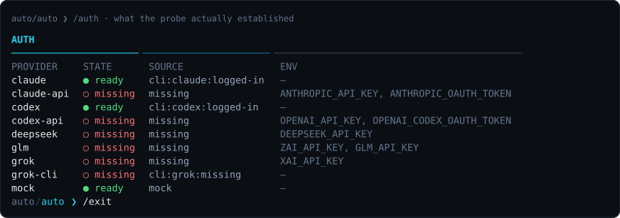
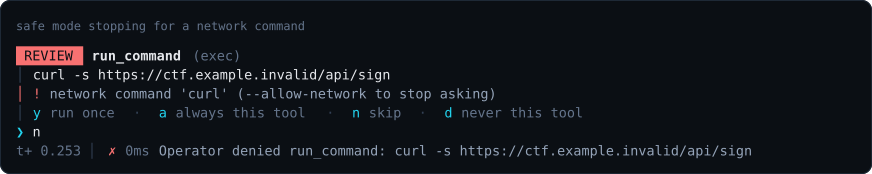
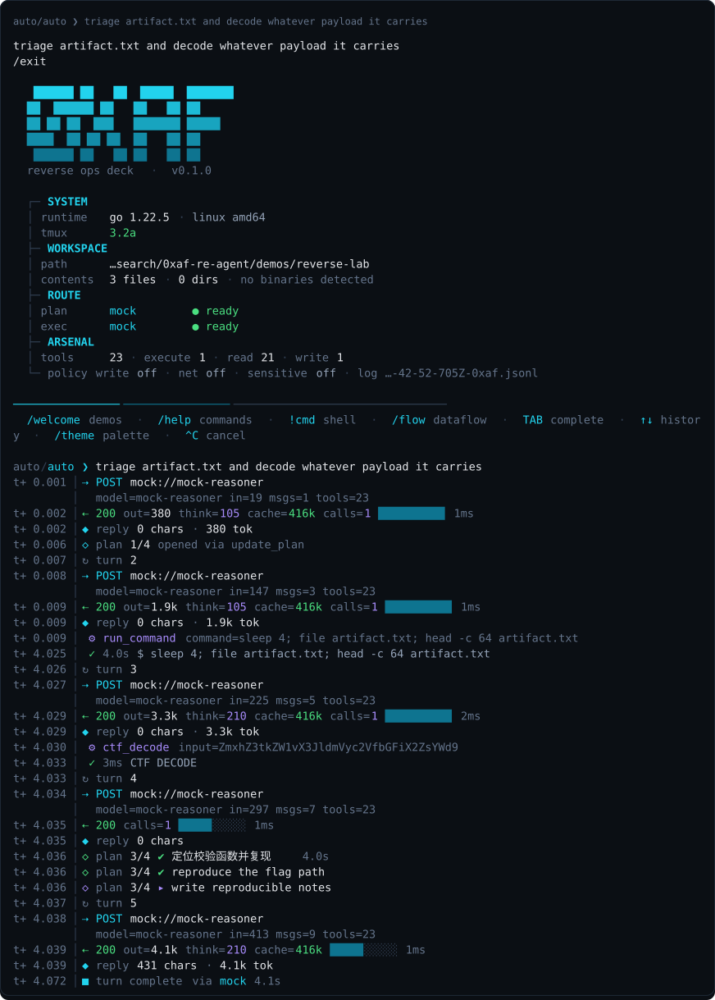
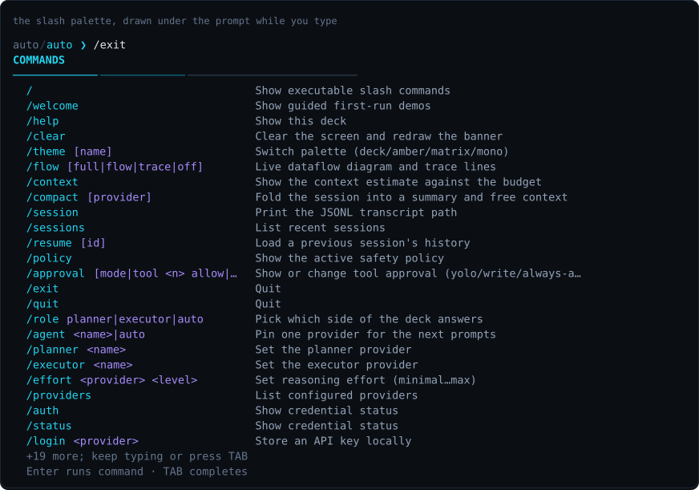
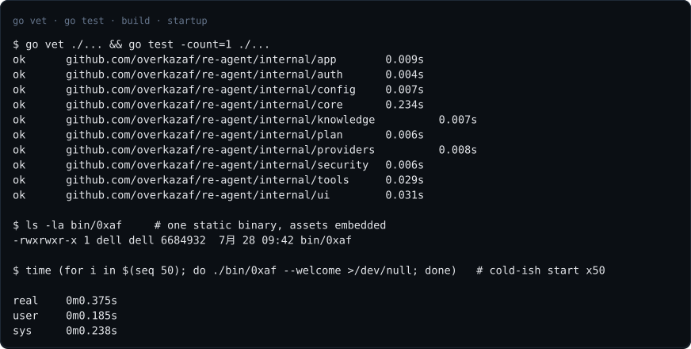

# 0xAF-Re

一个住在终端里的逆向工程与 CTF agent。一个规划模型、一个执行模型、24 个本地工具、
显式 workflow 模式、运行中排队下一任务，外加一张能看清「这一轮到底在干什么」的实时画面 ——
打包成单个静态 Go 二进制，不需要装任何运行时。

**语言:** [English](README.md) | 中文 · [架构文档](docs/ARCHITECTURE.md) · [项目主页](https://overkazaf.github.io/re-agent/index.zh-CN.html)

<p align="center">
  
</p>

```bash
go install github.com/overkazaf/re-agent/cmd/0xaf@v0.1.1
0xaf --version           # 查看版本、commit、module version
0xaf --welcome           # 引导式首次运行示例
0xaf --workspace ./ctf   # 打开工作区开始干活
```

---

## 设计理念

逆向是一场跟二进制的长对话。它的节奏很固定：**先粗筛，再假设，再验证，再回头改假设**。
围绕这个节奏，整个项目只坚持九件事。

**一、只有一个循环。** 所有东西都挂在 `AgentLoop.Run` 上：拼上下文 → 请求模型 → 跑工具 →
把结果接回去 → 再来一轮。界面不参与决策，它只订阅循环吐出的事件（`LoopEvent`）。
这条边界是刻意的：HUD 画错了顶多难看，绝不会让一轮对话跑偏。

**二、工具跑在本地，而且跑在工作区里。** 分析的对象是你机器上那个真实文件，不是它的描述。
所以 `strings`、`readelf`、`unzip`、熵扫描、carve 全在本地执行；默认读不出工作区、写不了盘、
连不了网 —— 要放开就显式加 `--write` / `--allow-network`。

**三、可见性不是装饰，是能不能信它的前提。** 你必须能看见钱和时间花在哪儿：
哪次请求慢、哪个工具卡住、模型在想还是在写、上下文被裁掉了多少。
所以每一轮都会自己画出来：上面是会动的数据流图，下面是带任务列表和 token 遥测的 HUD，
滚动区里留下一份「像抓包一样」的 trace。时长条共用一个刻度（最慢那次请求撑满），一眼就能看出这一轮的形状。

**四、中断是一种结果，不是一次失败。** `^C` 会取消 HTTP 请求、杀掉 tmux 里的 CLI、
把信号送进工具子进程所在的进程组。但**已经发出的每一个工具调用，仍然会被补上一条结果** ——
否则严格的 chat API 会拒收这段历史，这个会话就再也接不下去了。

**五、上下文是预算，不是垃圾桶。** 一条 `objdump -d` 就能把整段对话的价值压没。
所以磁盘上的记录永远是完整的，**送上去的那份**才做裁剪：先把老的工具输出正文折叠成一行指针，
再整段丢掉最老的往返、留一个 `[context compacted]` 标记。任何时候都不会把一次工具调用和它的结果拆开。
超大输出直接落盘成 artifact，只把「头 + 尾 + 路径」交给模型，让它自己决定要不要 `read_file`。

**六、拒绝也是一种回答。** 危险命令不是抛异常终止对话，而是变成一条模型能读到的工具结果，
这一轮继续往下走。安全模式（`rm -rf`、关网时的 `curl`、像凭据的路径）的优先级高于「永久允许」：
允许 `run_command` 不等于允许 `rm -rf /`。没人可问的时候（`--print`、管道、CI），询问就退化成一条带原因的拒绝。

**七、装饰层永远不许拖垮运行。** 任务列表、HUD、trace 的任何失败都被吞掉。
计划解析不出来就当没有计划，绝不让一次画图错误毁掉一次真实分析。

**八、一个二进制。** prompt 和 skills 用 `go:embed` 塞进二进制，从任何目录都能跑；
磁盘上有仓库时，同名 skill 优先用磁盘的版本，所以改 skill 不用重新编译。
启动大约 6.7 ms —— 做粗筛时你会连着敲几十次命令，这个数字是有意义的。

**九、会话就是记录。** append-only JSONL，可列出、可续接、可复现；被中途 kill 留下的半行、
以及结果没落盘的工具调用，都在加载时自愈。

## 思路来源

### oh-my-pi 是什么，它的原理是什么

[`can1357/oh-my-pi`](https://github.com/can1357/oh-my-pi) 是一个跑在终端里的 AI 编程 agent（MIT，两万多 star）。
GitHub 把它标成 TypeScript，但那只是主语言统计 —— 它实际是一个 **Bazel 管理的混合 monorepo**：
16 个 TypeScript 包、**9 个 Rust crate**、外加一个常驻 Python，光 `coding-agent/src` 下就有 123 个模块。

它值得研究的地方不在「又一个 coding CLI」，而在于它把**agent harness**
本身当成了工程对象 —— 也就是围绕模型的那一圈基础设施：循环怎么转、工具怎么执行、
上下文怎么管、子 agent 怎么编排。这些恰恰是决定一个 agent 能不能干活的部分，
而它们跟「用哪个模型」几乎无关。

它的架构见 [oh-my-pi 架构图](docs/diagrams/06-oh-my-pi.svg)，核心原理有七条：

**一、单一 agent loop，事件驱动。** 不是「链」也不是「图」，就是一个循环：
组装上下文 → 调模型 → 拿到工具调用 → 执行 → 把结果写回历史 → 再来一轮，
直到模型不再要求调工具。所有中间状态通过事件流向外暴露，UI 只是这条流的一个消费者。
好处是**可中断**和**可续接**：循环的每一步都有明确的持久化点。

**二、hash-anchored edits（哈希锚定编辑）。** 这是它最有辨识度的设计。
模型改文件时，不靠行号定位（行号一改就失效），而是对目标片段取哈希作为锚点。
编辑时先校验锚点还在不在 —— 文件被别的进程动过、或者模型记忆的是旧版本，
校验就会失败并明确报错，而不是**改错地方**。这把 LLM 编辑里最常见的一类静默损坏变成了显式失败。

**三、优化过的 tool harness。** 工具不是「给模型一堆函数」那么简单：
输出要有预算（否则一次 `grep` 就能吃掉整个上下文）、要能溢写到磁盘、
要有超时和进程组管理、要区分「工具失败」和「工具被拒绝」。它把这些做成了统一的一层。

**四、跨语言 worker + 回环桥。** 它跑一个常驻 Python 和一个 Bun worker，
而且这些 worker 能**反向调用 agent 自己的工具**（read、search、task）——
通过一条 loopback bridge。也就是说模型写的脚本不是在真空里跑，
它能用宿主已经建好的那套能力。

**五、LSP 作为一等公民。** 重命名走 `workspace/willRenameFiles`，
所以 re-export、barrel 文件、别名 import 会在文件移动**之前**就被正确更新。
这是「让编译器/语言服务器去做它擅长的事，而不是让模型猜」的典型例子。

**六、子 agent 带类型化结果。** `task` 工具把活拆给子 agent，
子 agent 的返回值是**schema 校验过的结构化数据**，父 agent 直接读，不用解析自由文本。

**七、把性能关键路径下沉到 Rust。** 这条是看了仓库才发现的，也是最能说明它取舍的一条：
`pi-shell` 里塞了一个 vendored 的 **brush**（Rust 写的 bash），`pi-uu-grep` / `pi-uu-diff`
基于 uutils 重写了 coreutils，还有 `pi-walker`（文件遍历）、`pi-ast`（按语言做 AST 解析）、
`pi-iso`（隔离沙箱）。

最能说明问题的是 `pi-shell/src/minimizer/` —— 它给 **cargo、git、go、jvm、npm** 各写了一套
输出过滤器，还配了测试 fixture。也就是说：**他们认定的真正瓶颈不是模型质量，是工具噪音**。
一个编程 agent 一天要跑上千次 `cargo build` / `npm install`，那些刷屏输出如果原样进上下文，
再大的窗口也不够用。所以他们不是「压缩上下文」，而是**在源头把噪音掐掉**，而且是按工具链定制的。

### 我们吸收了什么，又改了什么

上面七条里，这个项目吸收了 **一、三、六**（循环、工具预算、结构化结果），
**没有**吸收 二、四、五、七 —— 因为 hash-anchored edits、LSP 集成、跨语言 worker
都是为「改代码」优化的，而逆向工作的主体是**读**：读二进制、读反编译、读日志。
写文件在这里是次要动作，为它建一整套编辑安全网并不划算。

第七条（Rust 基座）是同一笔账：`objdump -d` 的噪音每次都长一个样，
一个输出预算加上溢写磁盘就够了，没有哪条工具链值得单独写一套过滤器。
两边的完整对照见 [差异对比图](docs/diagrams/07-vs-oh-my-pi.svg)，按七个维度并排。

具体的对应关系：

| 借来的 | 在这里长成了什么 |
| --- | --- |
| 单一 Agent Loop | `internal/core/agentloop.go`，外加一条纯观测的事件流 |
| 可插拔的 provider 适配层 | 五个适配器共用一个 `Complete()`：Anthropic、OpenAI Responses、OpenAI 兼容 chat、tmux 里的本地 CLI、离线 mock |
| 单一工具注册表 | 24 个逆向/CTF 工具 + MCP 工具，共用同一个审批闸门和输出预算 |
| append-only JSONL 会话 | 加上了「加载时自愈」：补不齐的工具调用和孤儿结果都会被剪掉 |
| planner / executor 角色路由 | 默认双模型分工，`auto` 模式按 prompt 形状分流 |
| 可中断的轮次、上下文压缩、分级审批、会话续接、MCP | 全部保留，并且每一条都有测试钉住 |

反过来，下面这些是**这个项目自己加的**，oh-my-pi 里没有对应物：

| 新增的 | 为什么逆向需要它 |
| --- | --- |
| **24 个逆向/CTF 工具同时也是斜杠命令** | 一次粗筛（`file` → `strings` → 熵 → flag 形状 → 保护措施 → carve → APK → Frida → radare2/JADX/Unicorn/unidbg）压根不需要模型参与。让它们既能被模型调用、也能被人直接敲，是最省 token 的路径 |
| **planner / executor 双模型分工** | oh-my-pi 是单模型 + 子 agent；这里是两个**不同厂商**的模型各司其职，规划的那个还带 `--sandbox read-only` |
| **本地 CLI 作为 provider（跑在 tmux 里）** | 复用你已有的订阅登录，默认零 API key。代价是这类 provider 不能结构化调用宿主工具，所以直连 API 的路子也留着 |
| **带出处强制的本地知识库** | 回答只能来自检索到的条目，必须给出条目 id；引用了不存在的 id 会当场告警。一个会编造出处的知识工具比不给出处更糟 |
| **最后一轮兜底（last-exchange floor）** | 压缩宁可超预算，也不删掉「正在被回答的那一轮」 |
| **全 all-or-nothing 的流程图 + 分级降级的 HUD** | 终端窄的时候，半张流程图会误导你对 agent 状态的判断，所以宁可整张不画 |
| **拒绝即答案** | 被闸门挡下的命令写成工具结果回喂给模型，轮次继续 —— 不是抛异常终止 |

另一条来源是**现在这批编程 CLI 自己的使用约定**：斜杠命令、审批模式、会话续接、
把 MCP 当作「借用别人工具」的标准接口。这些约定已经被大量使用验证过了，没有理由另发明一套。
所以 `/help`、`/resume`、`/approval`、`!command` 的手感刻意跟它们保持一致 —— 换过来的人不用重新学。

第三条来源就是逆向本身。工具清单不是从「LLM agent 应该有什么工具」推出来的，
而是从一次真实的粗筛里抄下来的：`file` → `strings` → 熵 → 找 flag 形状的串 → 看保护措施 →
carve 内嵌文件 → 拆 APK → 写 Frida hook。所以这些工具**同时也是斜杠命令**：
一次粗筛压根不需要模型参与，这是最省 token 也最快的路径。

## 为什么默认内置这几个模型

先说清楚一件容易误会的事：**这两个位置都不绑厂商**。planner 和 executor 只是两个「座位」，
八个 provider 里任何一个都能坐上去，而且可以混搭 —— 本地 CLI 规划 + 直连 API 执行，反过来也行。
`grok-build`（provider 名 `grok-cli`，模型 `grok-build-cli`）就是一个一等公民的本地 CLI provider，
跟 codex / claude 同等地位。换座位是运行时的事，不用重启也不用改配置：

```text
/planner grok-cli        规划换成 grok-build
/executor claude-api     执行换成直连 API
/agent grok              这几轮两个位置都用 grok
/agent auto              回到角色路由
/model planner gpt-5.3-codex-high
/model deepseek deepseek-reasoner
```

默认路由是 **planner = 本地 `codex` CLI，executor = 本地 `claude` CLI**，都跑在 tmux 里。
之所以拿这两个当默认，不是因为它们特殊，而是下面四条理由：

**1. 分工是照着逆向的节奏来的。** 「这个校验函数可能在哪、值不值得下断点」和
「把这三个文件读出来、跑一遍、把输出整理好」是两种不同的活。前者要长链条推理，后者要稳定的工具执行。
`codex` 拿到的是 planner 位，还带 `--sandbox read-only` —— 规划的时候本来就不该动盘。
`claude` 拿到 executor 位，它的工具使用和文件处理更稳。

**2. 复用你已经有的登录，而不是再开一份 API 账单。** 本地 CLI 走的是你的订阅登录，
所以这个 agent **默认不需要任何 API key**，也不需要把 key 交给它保管。
它甚至会在启动子进程前主动 `unset OPENAI_API_KEY` / `ANTHROPIC_API_KEY`，
免得一个过期的环境变量把 CLI 的登录顶掉。

**3. `claude` 的原生任务列表正好能驱动界面。** 它在 stream-json 里吐 `TaskCreate` / `TaskUpdate`，
codex 吐 `plan_update` / `todo_list` —— 这些事件被解析出来，直接变成你看到的那个任务列表。
换句话说：**任务列表是模型自己报的进度，不是宿主编出来的**。
配上 `cliResumeSession`，跨轮次续接的是同一个原生会话，那份列表也就跟着一路长下去。

**4. 剩下的都是有明确用途的备胎，不是凑数。**

| provider | 类型 | 什么时候用它 |
| --- | --- | --- |
| `codex` / `claude` | 本地 CLI + tmux | 默认。复用订阅登录，带原生任务列表和沙箱 |
| `codex-api` / `claude-api` | OpenAI Responses / Anthropic Messages | 想按 token 付费、要跑无头环境，或者需要**宿主工具的结构化调用**时 |
| `grok` / `grok-cli` | xAI API / 本地 CLI | 换一个「第三方视角」复查计划盲点 —— 它的知识盲区跟前两家不重合 |
| `deepseek` / `glm` | OpenAI 兼容 chat | 便宜、快、中文好，适合量大的重复活；也是**接自建端点的模板** |
| `mock` | 离线 | `--smoke` 和测试用。scriptable，能在没有网络的 CI 里跑完整的工具流 |

### 分工背后的四个维度

上面说「分工是照着逆向的节奏来的」，具体是按这四个维度分的。它们彼此独立，
一个模型在某一维强不代表在别的维也强 —— 这正是要拆成两个位置的原因。

**一、上下文窗口 —— 决定谁坐 planner 位。**
逆向的规划阶段要同时端着一堆东西：符号表片段、几段反编译、字符串命中、
之前几轮的失败尝试。这些加起来很快就到几十万 token。窗口不够的模型不是「答得差」，
而是**开始遗忘前面的线索**，于是反复提议你两轮前已经排除过的方向。
所以 planner 位优先给窗口大的那个，并且宿主这边还配了两遍式压缩预算兜底
（见 [context budget 图](docs/diagrams/03-context-budget.svg)）——
即便如此，窗口本身仍然是硬约束，压缩只能延后它，不能取消它。

**二、规划能力 ≠ 执行能力。** 这两件事在实测里经常反相关：
擅长「从一堆噪声里猜出校验函数大概在哪」的模型，未必擅长「把这三个文件读出来、
跑一遍、把输出整理成表」。前者要发散和联想，后者要严格照做、不自作主张。
把两者放在同一个模型身上，你只能取折中；拆开就可以各取所长。
`codex` 拿 planner 位是因为长链条推理稳，`claude` 拿 executor 位是因为工具调用和文件操作的**失败率低**。

**三、思考能力（显式推理预算）。** 支持推理强度调节的后端，可以用 `/effort` 单独调：

```text
/effort codex high      规划时给高推理预算 —— 值得，因为一个错误的方向会浪费后面十几轮
/effort claude low      执行时给低预算 —— 「读文件然后跑命令」不需要深思
```

这也是分工的一部分：**推理预算应该花在规划上，不是花在执行上**。
在同一个模型上你没法这样分配。

**四、CTF / 逆向场景下的风控差异 —— 这条最容易被忽略，但影响最大。**

不同厂商对「逆向工程、漏洞利用、绕过保护」这类请求的风控策略差别很大，
而且**同一家的不同模型、不同时期也会变**。实际会遇到的情况：

- 明确拒答（`stop_reason=refusal`），整轮白跑
- 不拒答但「软化」—— 给一堆通用建议，回避你真正问的那个具体的检查点
- 正常作答

这不是假设。本项目开发过程中，`/know` 走真实 CLI 时就吃过一次
上游模型的 `stop_reason=refusal` —— 那次反而验证了宿主的失败归因链路是通的
（tmux runner、流解析、拒答原因提取都正常工作）。

宿主这边为此做了三件事：

1. **拒答被当作一等公民的失败原因**，而不是「请求出错」。界面会明确告诉你
   这是模型拒答、还是限流、还是 CLI 本身挂了 —— 三者的处理方式完全不同。
2. **provider 可以随时换，不用重启**。撞上拒答时 `/agent grok` 或
   `/planner deepseek` 换一个再问，比跟当前模型argue便宜得多。
3. **粗筛路径不经过模型**。24 个工具都是斜杠命令，
   `/scan`、`/decode`、`/mitigations` 这些直接出结果 —— 风控再严也拦不住 `strings`。

顺带一提，这也是内置 `grok` 和 `deepseek` / `glm` 的实际理由之一：
它们的风控口径和前两家不重合，**换一家问经常就通了**。这不是什么技巧，
只是承认「模型拒答」是这个领域的常态工况，需要在架构上留出退路，
而不是等撞上了再手忙脚乱。

这里有个必须说清楚的取舍：**本地 CLI provider 不会调用宿主工具**，它们跑自己那套工具，
宿主的 24 个工具只是作为信息告诉它们。要让模型结构化地调用宿主工具（以及 `update_plan`），
得用直连 API 的 provider。两条路都留着，是因为它们各有各的场合。

`deepseek` / `glm` 是 OpenAI 兼容 chat 类型，这一条顺便解决了自建部署：把 `baseUrl`
指向 `http://localhost:8080/v1`，llama.cpp / vLLM / Ollama 就直接能用，一行配置的事：

```json
{ "providers": { "local": {
  "type": "openai-chat", "model": "qwen2.5-coder",
  "baseUrl": "http://localhost:8080/v1", "apiKeyEnv": ["LOCAL_KEY"]
} } }
```

换路由随时可以，不用重启：

```text
/planner deepseek        把规划换成 deepseek
/executor claude-api     执行换成直连 API
/agent grok              这几轮只用 grok
/agent auto              回到角色路由
/effort codex high       调推理强度（支持的后端才有效）
```

## 使用场景

把路径换成你自己的目标即可。斜杠命令直接跑本地工具；`-p` 会启动一次 agent 任务。

| # | 想做什么 | 从这里开始 |
| --- | --- | --- |
| 1 | 不知道文件是什么 | `/scan ./chall` |
| 2 | 看 ELF/Mach-O/PE 保护 | `/mitigations ./chall` |
| 3 | 找加壳、压缩或加密区段 | `/entropy ./chall` |
| 4 | 从 blob 里挖内嵌文件 | `/carve ./blob` |
| 5 | 解可疑 flag/token | `/decode auto ZmxhZ3s...` |
| 6 | APK 首轮分析 | `/apk ./app.apk` |
| 7 | 生成 Java/native hook 脚手架 | `/hook java com.example.Crypto sign` |
| 8 | 检查 radare2/JADX/Ghidra/Unicorn 等工具 | `/retool inventory` |
| 9 | Web/WASM 加密题 | `/skill web-wasm-crypto inspect ./dist/app.js and ./dist/module.wasm` |
| 10 | 调研壳、算法或相似样本 | `0xaf --role researcher -p "调研这个壳名，并列出安全的本地检查步骤"` |

## Workflow 模式

workflow 是显式开启的。默认 `off` 不会改写你的 prompt；只有你通过命令打开时，
宿主才会在请求模型之前把逆向任务整理成指定工作流：

```text
/workflow off            默认：不加额外 workflow wrapper
/workflow auto           检测到 GPT Cyber / CC CVP 配置就走 specialist，否则走 caveman
/workflow specialist     有 cyber/CVP 类订阅时，直接规划并跑授权逆向任务
/workflow caveman        没有专用订阅时，拆成小的本地证据包
```

`specialist` 面向 GPT Cyber、Claude Code CVP 或同类授权逆向路线：先给短计划，
再用内置 skills 和本地工具推进，保留路径、偏移、哈希、命令和输出；如果请求里混进越界部分，
只拒绝越界部分，继续做允许的本地 artifact 分析。

`caveman` 是普通 provider 的兜底模式。它**不是**翻译成文言文、暗语、编码或其它 prompt
laundering；它会把任务拆成有边界的本地证据包：文件类型、字符串、熵、导入/符号、平台 skill、
聚焦假设、一个最小验证命令。这样用户能继续解决授权逆向问题，同时不要求模型绕过平台策略。

```bash
0xaf --workflow auto --workspace ./ctf
0xaf --workflow caveman -p "粗筛 ./app.apk，指出下一个本地检查点"
```

## 常用用法

**先做一次不花 token 的粗筛。** 每个分析工具同时也是斜杠命令，本地直接出结果：

```text
/scan ./chall                  类型、magic、哈希、熵、字符串信号、下一步建议
/mitigations ./chall           PIE / NX / canary / RELRO / 是否 strip / 危险导入
/entropy ./chall               滑窗熵 —— 找加壳、加密、压缩区段
/carve ./blob                  内嵌的 ELF/PE/ZIP/DEX/PNG/PDF/SQLite/Mach-O
/findbytes ./chall flag{       给出偏移，带 hex+ascii 上下文（也支持 hex needle）
/decode base64 ZmxhZ3s...      base64/hex/url/rot13/xor，或者用 auto 全试一遍
/apk ./app.apk                 dex、so、加固壳和框架指纹
/retool inventory              检查 radare2、JADX、Ghidra、Unicorn、unidbg 等工具
/retool radare2 info ./chall   用固定 action 调更深入的本地逆向工具
/hook java com.a.Crypto sign   直接生成 Frida hook 脚手架
```

**要计划就找 planner，要动手就交给 executor：**

```bash
0xaf -p "粗筛 ./chall，指出校验点，给一个 solve 计划" --role planner
0xaf -p "调研这个壳/算法的资料和相似样本" --role researcher
0xaf --workspace ./ctf          # 或者直接进 REPL 聊
```

**要改角色提示词，直接编辑 role system prompt：**

```text
/prompt list
/prompt edit researcher
/prompt set planner 先给假设、证据和最小实验，不要直接跑重命令。
```

**切具体模型，不换 provider：**

```text
/model deepseek deepseek-reasoner
/model planner gpt-5.3-codex-high
```

```bash
0xaf --model deepseek=deepseek-reasoner --planner deepseek -p "粗筛 ./chall"
```

HTTP provider 会把 model override 放进请求体；内置的 codex/claude CLI provider 会注入
`--model` 参数；自定义 CLI provider 可以在 `cliArgs` 里写 `{model}` 占位符。

**当前任务还在跑时，先把下一条排上。** 交互式 turn 进行中，直接输入普通文本并回车，
它会进入待执行队列，不会打断当前 provider 调用。还没执行前可以改、删、清空：

```text
/queue list
/queue edit 2 改成分析 ./fixed.apk
/queue cancel 2
/tasks collapse     折叠 live 任务列表
/tasks expand       在终端高度允许范围内展开
```

**自己插一条命令进去。** 以 `!` 开头的行在工作区里执行，走同一套策略；
输出实时打印，同时进入对话记录，所以下一句可以直接说「按刚才那个输出继续」：

```text
!file ./chall && strings -n 8 ./chall | head
```

**信得过它了再放开写盘：**

```bash
0xaf --workspace ./ctf --write -p "写 notes/solve.md：粗筛结论、校验点、flag、复现命令"
```

**接着上次干：**

```bash
0xaf --sessions     # 列出最近的会话
0xaf --continue     # 接上最近那次
0xaf --resume 2026-07-28T00-45     # id、id 前缀，或者直接给路径
```

## 登录状态怎么来的



这张表有**三种**状态，不是两种：

| 状态 | 含义 |
| --- | --- |
| `● ready` | 找到了凭据，或者 CLI 报告了真实登录（`codex login status`、`claude auth status` 能回答这个问题） |
| `◐ present` | CLI 能跑，但它没有可以询问登录状态的子命令（`grok` 就没有）—— 到第一轮对话才知道 |
| `○ missing` | 没找到可用的凭据 |

`source` 列always写明判定依据。这里要说清楚一件事：**这不是读你的会话文件，也不保存任何东西** ——
它是在启动时对你本地 CLI 起一个子进程做实时探测，探完就结束。凭据始终在 CLI 自己的位置
（`~/.codex`、`~/.claude` 之类），这个工具既不复制也不上传。

顺带一提：CLI provider 在启动子进程前会主动 `unset OPENAI_API_KEY` / `ANTHROPIC_API_KEY`，
免得一个过期的环境变量把 CLI 的登录顶掉。

## 安全策略

两个输入决定一次调用能不能跑：工具的等级（`read` / `write` / `exec`）和会话的模式。

| 模式 | 自动放行 | 会问你 |
| --- | --- | --- |
| `yolo` | 全部 | 什么都不问 |
| `safe`（默认） | 各等级都放行 | 命中安全模式的命令 |
| `write` | read、write | exec 工具，以及安全模式 |
| `always-ask` | read | 其余全部 |



默认策略：读不出工作区、不许写盘、不许联网、挡掉像凭据的路径、挡掉破坏性 shell 写法。
`/policy` 打印当前策略，`/approval` 改它。

## 界面



计划更新只以**状态转移**的形式出现，不会整段刷屏；一份还在逐条构建的列表会保持安静，
直到真的有东西动了 —— 完整列表在这一轮结束时归档一次。

```text
/flow full     图 + trace（默认）
/flow flow     只要图
/flow trace    只要 trace
/flow off      都不要，回到朴素的工具树
```

输入 `/` 会在提示符下方打开命令面板。它会按光标下方**实际剩余的行数**裁剪，
所以永远不会把提示符顶出屏幕：



终端窄于 46 列、或者输出不是 TTY 时，图会自己隐身；trace 退化成不带转义序列的纯文本 ——
把一次运行重定向进日志时，你要的正是这个。

## 技能与知识库

项目内的工作流放在 `skills/<name>/SKILL.md`，启动时加载、摘要进系统提示、也能当工具调用，
还能强制某一轮就按它走。现在仓库里带的是更完整的逆向技能集合：CTF 首轮粗筛、
Android APK + Frida、native pwn/RE、Web/WASM 加密、radare2、Ghidra、JADX、
Unicorn、unidbg，以及从本机导入的常用逆向 playbook。

### 先搞清楚：它去哪里找你的东西

这是最容易踩坑的一点。二进制里用 `go:embed` 打包了一份 prompts 和 skills。
如果能在磁盘上找到项目目录，会再加载你的本地文件；**同名 skill 由磁盘版本覆盖**，
但磁盘目录里缺失的内置 skill 仍然会从二进制里补回来。

查找顺序，第一个命中就停：

| 顺序 | 位置 |
| --- | --- |
| 1 | `$OXAF_RE_HOME` 环境变量指向的目录 |
| 2 | **可执行文件所在目录**，以及往上最多 6 层父目录 |
| 3 | **当前工作目录**，以及往上最多 6 层父目录 |
| 4 | 都没找到 → 用内嵌 prompt 和内置 skills |

判定「这是不是项目目录」的标准很具体：该目录下**同时存在** `prompts/system.md`
**和** `skills/` 目录。少一个都不算。

所以如果你把二进制拷到别处用，最省事的做法是显式指一下：

```bash
export OXAF_RE_HOME=/path/to/re-agent
0xaf                       # 现在它能看到你的 skills/ 和 knowledge/ 了
```

### 加载你自己的 SKILL

一个 skill 就是一个目录加一个 markdown 文件，没有别的：

```bash
mkdir -p $OXAF_RE_HOME/skills/my-unpacker
$EDITOR $OXAF_RE_HOME/skills/my-unpacker/SKILL.md
```

`SKILL.md` 用 frontmatter 描述它自己，正文写流程：

```markdown
---
name: my-unpacker
description: 脱掉 XX 加固的壳，恢复 dex。当 APK 检测到 classes.dex 是壳时使用。
---

# 步骤

1. 用 `apk_inspect` 确认加固厂商特征
2. 起 frida，hook `libart.so` 的 `OpenMemory`
3. dump 出内存里的 dex，用 `carve_artifacts` 校验头
...
```

重启后：

```text
/skills                              列出所有 skill（内置的 + 你的）
/skill my-unpacker 看看这个 APK       强制这一轮按这个 skill 走
```

写 `description` 时值得花点心思 —— 它会被摘要进系统提示，
模型是靠这一句决定「什么时候该用这个 skill」的。写成「脱壳工具」它基本不会主动用；
写成上面那样带触发条件，命中率高得多。

### 加载你自己的知识库

知识库就是一堆本地 markdown 笔记，建一次索引就能查：

```bash
# 指定一个或多个目录 / 单个 .md 文件，会递归找所有 markdown
go run ./cmd/import-knowledge ~/notes/re ~/notes/ctf ~/some/single-note.md

# 或者用编译好的
./bin/import-knowledge ~/notes/re
```

它会写出 `$OXAF_RE_HOME/knowledge/reverse-index.json`，并打印索引了多少篇。
**不带参数**跑的话它会去找一组硬编码的默认路径（`~/frida/reverse-engineering/...`），
所以想索引自己的笔记，**记得把路径传进去**。

查询：

```text
/know frida ssl pinning       从本地知识回答，带出处
/know raw frida ssl           只看原始命中，不调模型（零 token）
/know read <entry-id>         完整读一条
```

有一条硬规则值得强调：**回答只允许来自检索到的条目，且必须给出引用的条目 id**。
如果模型引用了一个索引里不存在的 id，界面会当场警告 ——
一个会编造出处的知识工具，比不给出处更糟。

笔记改了就重新跑一次 `import-knowledge`；索引是快照，不会自己更新。
索引文件**不进版本库**：它指向你自己磁盘上的路径，还带正文摘录。

## MCP

任何 stdio MCP server 的工具都能加入同一个注册表，共用同一套审批闸门和输出预算。
做逆向最顺手的是 [`ida-pro-mcp`](https://github.com/mrexodia/ida-pro-mcp) ——
反编译、交叉引用、改名字都能让 agent 直接用：

```json
{ "mcpServers": { "ida": {
  "command": "python3", "args": ["-m", "ida_pro_mcp.server"], "timeoutMs": 120000
} } }
```

工具名会变成 `mcp__ida__<tool>`。起不来的 server 在启动时报告并跳过，绝不影响主流程，
`/mcp` 能看到每一个的状态。

## 构建与验证

```bash
git clone https://github.com/overkazaf/re-agent && cd re-agent
make build     # ./bin/0xaf 和 ./bin/import-knowledge
make test      # 10 个包
make cross     # linux/darwin × amd64/arm64 静态二进制
./bin/0xaf --smoke   # 离线自检：不需要 key、网络、CLI 登录
```



测试钉住的正是那些「悄悄坏掉也看不出来」的地方：上下文预算的不变量、
计划追踪器对无变化更新的抑制、CLI 任务 id 的绑定规则、审批矩阵，
以及 HUD 的宽高契约 —— 只要有一行超宽，就地重绘的擦除步长会在接下来整个会话里错位。

## 目录结构

```text
cmd/0xaf                CLI 入口
cmd/import-knowledge    知识库索引器
internal/core           agent 循环 · JSONL 会话 · 上下文压缩 · shell 逃逸
internal/providers      五个适配器 + CLI 的 JSONL 事件归一化
internal/tools          逆向/CTF 工具注册表 · 进程执行 · 输出预算
internal/security       命令安全模式 · 等级 × 模式 审批闸门
internal/plan           两个来源共用的任务列表追踪器
internal/ui             主题 · HUD · 数据流图 · trace · markdown · 命令面板
internal/app            参数解析 · REPL · 斜杠命令 · 待执行队列 · 行编辑器
internal/mcp            stdio MCP 客户端与工具适配
internal/knowledge      索引检索 · 上下文打包 · 回答解析
internal/skills         SKILL.md 加载
internal/workflow       显式 off/auto/specialist/caveman prompt 整形
internal/assets         内嵌 prompt/skills · 项目根定位
```

`OXAF_RE_HOME` 可以让已安装的二进制指向某个仓库副本，用磁盘上的 `skills/`、`knowledge/`、
`demos/` 替代内嵌版本。

更深入的内容看 [`docs/ARCHITECTURE.md`](docs/ARCHITECTURE.md)：包依赖图、一轮对话的完整时序、
13 条「改动可能悄悄破坏」的不变量（附对应测试）、会话数据格式，以及扩展点。

---

本工具面向**已获授权**的 CTF、实验环境与本地逆向工作：二进制粗筛、静态分析、
本地动态实验、solve 计划，以及可复现的分析记录。
