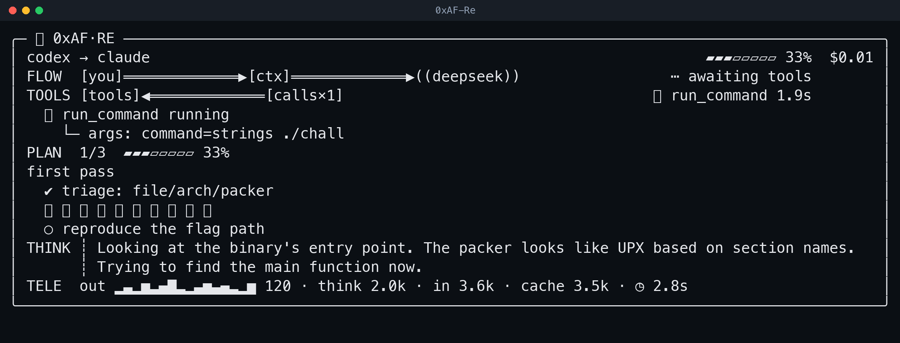
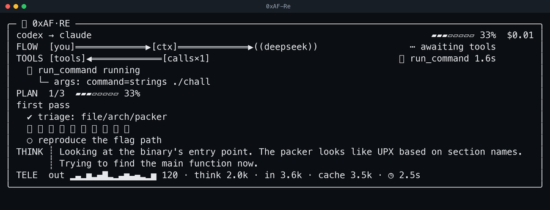
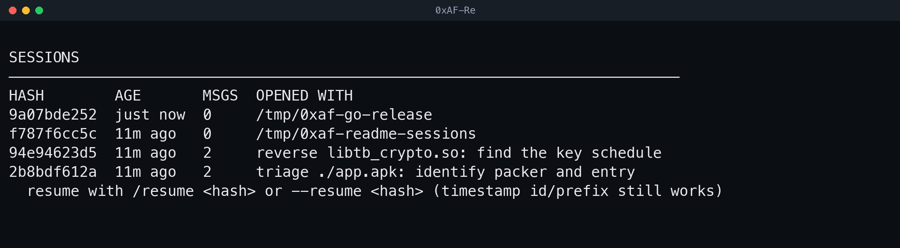
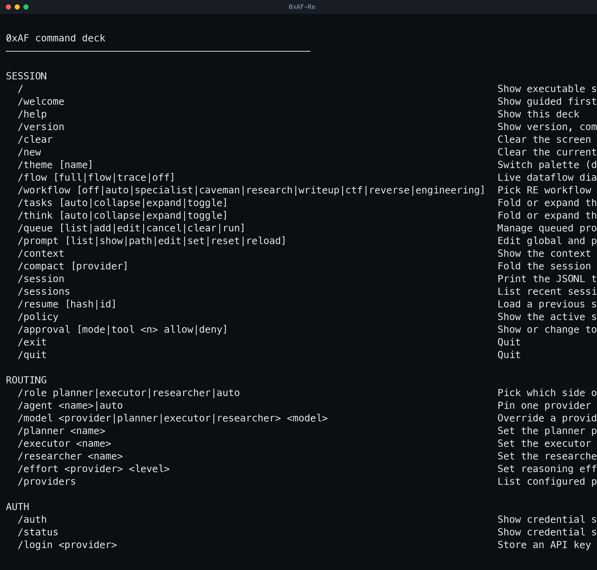
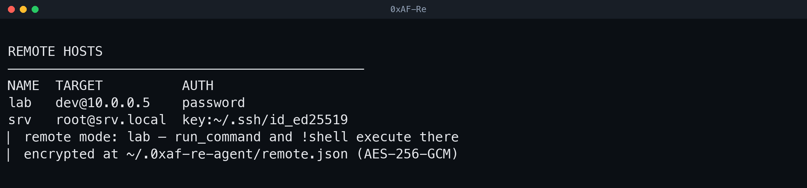

# 0xAF-Re

面向**授权逆向 / CTF** 的终端 Agent。一个静态 Go 二进制，内置 **planner + executor** 双模型座位、
本地 RE 工具、工作模式、任务队列、会话恢复，以及每一轮的实时可视化。

**Language:** [English](README.md) | 中文

**链接:** [项目主页](https://overkazaf.github.io/re-agent/index.zh-CN.html) · [架构总图](docs/diagrams/0xaf-re-agent-architecture.zh-CN.html) · [架构文档](docs/ARCHITECTURE.zh-CN.md) · [架构图](docs/diagrams/index.zh-CN.html) · [对比图](docs/diagrams/07-vs-oh-my-pi.svg)

<p align="center">
  
  <br/>
  
</p>

## 目录

- [动机](#动机)
- [功能特性](#功能特性)
- [演示](#演示)
- [概览](#概览)
- [架构设计](#架构设计)
- [开发者亮点](#开发者亮点)
- [安装](#安装)
- [快速开始](#快速开始)
- [Workflow 模式](#workflow-模式)
- [上下文压缩](#上下文压缩)
- [Provider 与模型](#provider-与模型)
- [Skills 与知识库](#skills-与知识库)
- [安全策略](#安全策略)
- [常用命令](#常用命令)
- [未来设想](#未来设想)
- [更多文档](#更多文档)

## 双语地图

中英 README 结构保持一致，方便快速切换。

| 中文 | English |
| --- | --- |
| [动机](#动机) | [Motivation](README.md#motivation) |
| [功能特性](#功能特性) | [Features](README.md#features) |
| [演示](#演示) | [Demos](README.md#demos) |
| [概览](#概览) | [Overview](README.md#overview) |
| [架构设计](#架构设计) | [Architecture](README.md#architecture) |
| [开发者亮点](#开发者亮点) | [Developer Highlights](README.md#developer-highlights) |
| [安装](#安装) | [Install](README.md#install) |
| [快速开始](#快速开始) | [Quick Start](README.md#quick-start) |
| [Workflow 模式](#workflow-模式) | [Workflow Modes](README.md#workflow-modes) |
| [上下文压缩](#上下文压缩) | [Context Compaction](README.md#context-compaction) |
| [Provider 与模型](#provider-与模型) | [Providers and Models](README.md#providers-and-models) |
| [Skills 与知识库](#skills-与知识库) | [Skills and Knowledge](README.md#skills-and-knowledge) |
| [安全策略](#安全策略) | [Safety](README.md#safety) |
| [常用命令](#常用命令) | [Common Commands](README.md#common-commands) |
| [未来设想](#未来设想) | [Roadmap](README.md#roadmap) |
| [更多文档](#更多文档) | [More Docs](README.md#more-docs) |

## 动机

逆向本身就是一条流水线：`file`、`strings`、`entropy`、r2、JADX、Frida、临时脚本、随手笔记。
慢的从来不是某个单独工具，而是**把整条线串起来**——两个小时后还要重新推导你已经知道的东西。
0xAF-Re 就是为了守住这条线：planner 模型负责规划路线，executor 模型负责驱动工具，
每一步事实都落在可恢复、可 diff、可交接的 JSONL 转录里。

三条原则：

1. **本地优先、证据优先。** 读取被限制在工作区内；写入、网络、敏感路径默认关闭，直到你明确放开。
   事实先来自真实工具（`/scan`、radare2、JADX、Frida…），再来自模型。
2. **双座位，而不是单对话。** 强推理模型规划，便宜模型收集证据；`/planner`、`/executor`、`/model`
   可随时换路由。
3. **看得见、可干预。** 计划行、工具调用、推理、token、耗时全部实时渲染；`/think expand`、
   `/tasks collapse`、`/queue edit`、`/model` 在回合运行中即刻生效。

## 功能特性

| 领域 | 你得到什么 |
| --- | --- |
| **实时仪表盘** | 单框视图：FLOW（动画数据流条）、TOOLS（工具卡）、PLAN（任务清单+进度）、THINK（推理尾）、TELE（吞吐/token/时钟）；矮终端优雅降级，保住当前步骤。 |
| **双模型路由** | planner / executor / researcher 三个座位，可固定、可按角色，运行中可切换。 |
| **工作模式** | `off` / `auto` / `specialist` / `caveman`，以及专用 `research` / `writeup` / `ctf` / `reverse` / `engineering`——每种模式给 prompt 加上聚焦的契约。 |
| **会话恢复** | append-only JSONL 转录；`--resume <hash|id>` / `--continue` / `/sessions`；崩溃自动修复悬挂工具调用；`/new` 开新会话。 |
| **上下文压缩** | 每次请求机械裁剪 + `/compact`；可选 `snapcompact` 把被丢弃历史渲染成 PNG 帧，视觉模型直接读回。 |
| **参考上下文** | `--context "know:…"` 从知识库注入、`--context "file:…"` 从工作区文件注入，原始备注直接透传。 |
| **知识与技能** | `/know` 检索+综合本地知识索引；内置 RE 技能；MCP server 并入同一工具注册表。 |
| **运行中审批** | 分级策略（read/write/exec）+ 安全模式命中即询问；one-shot 在 TTY 下也会弹 **y/a/d/n**，不用重启换模式。 |
| **远程模式** | 后台 SSH 连接已保存的机器；本地规划、同窗口远程执行。（见 [远程模式](#远程模式)） |
| **发布** | `go install @vX.Y.Z`，且每个 tag 自动在 GitHub Releases 附上 darwin/linux 预编译二进制。 |

## 演示

全部来自真实二进制的终端输出：

| 演示 | 说明 |
| --- | --- |
|  | 回合运行中的实时仪表盘（FLOW / TOOLS / PLAN / THINK / TELE）。 |
|  | 同一视图，动画版。 |
|  | `/sessions`——`--resume` 的 hash 别名。 |
|  | 命令面板。 |

动画录制（SVG，内联渲染）：[quickstart](docs/casts/quickstart.svg) · [deck](docs/casts/deck.svg) · [scan](docs/casts/scan.svg)。

更多静态截图：[boot](docs/shots/boot.svg) · [reply](docs/shots/reply.svg) · [approval](docs/shots/approval.svg) · [auth](docs/shots/auth.svg) · [tools](docs/shots/tools.svg) · [providers](docs/shots/providers.svg) · [palette](docs/shots/palette.svg) · [shell](docs/shots/shell.svg) · [verify](docs/shots/verify.svg)。

快速体验：

```bash
0xaf --smoke                                  # 离线自检
0xaf -p "triage ./ctf/chall" --workspace ./ctf
0xaf --workflow reverse -p "静态+动态分析，最后给 PoC"
0xaf --context "know:android packer" -p "识别加壳方式"
```

## 概览
## 概览

- **本地优先:** 斜杠命令直接在本机做文件粗筛、strings、熵扫描、carve、APK 检查、保护检查和逆向工具盘点。
- **双角色:** planner 和 executor 可以用不同模型、不同厂商。运行中用 `/planner`、`/executor`、`/model` 切换。
- **过程可见:** HUD 会显示路由、阶段、任务列表、工具调用、token 和耗时。
- **默认收敛:** 默认只能读工作区；写盘、联网和敏感操作都需要显式放开。
- **单二进制:** prompt 和内置 skills 已嵌入；需要本地覆盖时，用 `OXAF_RE_HOME` 指向仓库目录。

完整设计见 [docs/ARCHITECTURE.zh-CN.md](docs/ARCHITECTURE.zh-CN.md)。图形化概览先看
[Cocoon AI 风格架构总图](docs/diagrams/0xaf-re-agent-architecture.zh-CN.html)。

## 架构设计

核心不是“终端里加一个聊天框”，而是一个很小的 agent loop：用户输入进入 Go 宿主，
宿主按 role/provider/model 路由每一轮，workflow 模式负责收窄上下文，本地证据工具把事实回灌到下一轮。

[打开可导出的架构总图](docs/diagrams/0xaf-re-agent-architecture.zh-CN.html)，或进入
[完整架构图索引](docs/diagrams/index.zh-CN.html)。

| 层 | 设计意图 |
| --- | --- |
| 终端交互层 | 把任务队列、斜杠命令、shell escape 和 live HUD 放在同一个工作区策略下。 |
| Agent loop | 路由 planner/executor/researcher，压缩上下文，流式输出事件，并持久化 JSONL session。 |
| Workflow 模式 | 有 specialist route 就直接用；没有时把 RE 任务拆成有边界的本地证据 executor packet。 |
| 策略闸门 | 默认只读工作区；写盘、联网、敏感路径和高风险命令都需要显式批准。 |
| 证据层 | 优先用 `/scan`、radare2、JADX、Frida、angr、Burp/mitmproxy、skills 和知识库拿本地事实，再让模型总结。 |

## 开发者亮点

如果你在做 agent，0xAF-Re 是一个足够小、但关键部件齐全的 RE 场景参考实现：
单个 Go 二进制里包含 provider 路由、工具治理、实时遥测、prompt/skill 覆盖、
任务队列和审计日志。它不像 demo 那样只展示聊天，而是把 agent 真正落地时麻烦的部分也摊开。

- **安装像单文件工具:** 一个静态二进制，一个 Go 依赖，关键路径不需要 Node 或浏览器 runtime。
- **模型座位可组合:** planner、executor、researcher 可以接不同 provider、不同模型和不同 prompt。
- **证据优先 workflow:** 有 GPT Cyber / Claude Code CVP / Grok 类订阅就直走 specialist；
  普通模型走 caveman，只拿只读本地证据包。
- **过程可调试:** HUD、trace、token/耗时遥测、任务状态和 JSONL session 让每一轮都能复盘。
- **扩展面够直接:** 内置 RE 工具、MCP tools、skills、知识库导入、本地覆盖和运行中任务队列。

## 项目动机

0xAF-Re 源于作者日常授权 RE/CTF 工作里的痛点：CC 类 CLI 风控升级后，普通模型面对逆向语义也更容易过度谨慎，本地样本分析经常被打断。这个项目不做隐写、暗语或绕策略，而是把工作限定在授权、本地、可审计范围内，再通过角色拆分和多模型组合改善体验。

- **模型组合:** planner 负责路线，executor 负责工具，researcher 负责背景资料；三个角色可以接不同模型。
- **专用订阅加成:** 如果有 GPT Cyber、Claude Code CVP、Grok 或类似更适配安全研究/逆向的 route，`workflow auto` 会更顺。
- **普通 provider 也能跑:** caveman 模式把任务收窄成本地证据包，让谨慎的 executor 只收集文件事实。
- **后续计划:** 加入本地模型和可复现评测样例，用样例结果衡量不同 provider/workflow 的效果并迭代。

## 安装

```bash
go install github.com/overkazaf/re-agent/cmd/0xaf@v0.1.11
0xaf --version
0xaf --welcome
```

从源码构建：

```bash
git clone https://github.com/overkazaf/re-agent
cd re-agent
make build
./bin/0xaf --version
```

推荐固定安装 `@v0.1.11`。`@main` 可能受 Go module proxy 缓存影响，`@latest` 会解析到最新 tag。

**需要 Go 1.21 或更新版本**（`go.mod` 声明 `go 1.21`，不会触发工具链下载）。macOS 上
较老的 Go（如 macOS 26+ 上的 1.21.x）编译出的二进制会因缺少 `LC_UUID` 被系统 dyld 拒绝；
如果遇到 `dyld: missing LC_UUID`，请升级到 Go 1.22+，或直接下载 GitHub Releases 里的
预编译二进制。

每个 release tag 都会由 `.github/workflows/release.yml` 附加预编译二进制
（darwin/linux × amd64/arm64），不需要本机 Go 工具链：

```bash
# 示例：下载 darwin-arm64 版 v0.1.14
curl -sL https://github.com/overkazaf/re-agent/releases/download/v0.1.14/0xaf-darwin-arm64 -o 0xaf
chmod +x 0xaf
./0xaf --version
```

<details>
<summary>如果 <code>go install</code> 报 <code>//go:build comment without // +build comment</code></summary>

```text
.../re-agent@v0.1.11/internal/app/repl.go:22:2: //go:build comment without // +build comment
.../re-agent@v0.1.11/internal/ui/live.go:23:2: //go:build comment without // +build comment
```

这两行本身没有问题——它们分别是 `golang.org/x/sys/unix` 和 `golang.org/x/term`
的 import 行。低于 1.17 的 Go 工具链无法解析这两个依赖使用的裸 `//go:build`
约束，而它会把失败报在 import 处而不是依赖内部。检查并升级：

```bash
go version          # 需要 go1.21+
# 然后用包管理器或 https://go.dev/dl/ 重装
```

</details>

## 快速开始

```bash
0xaf --smoke                    # 离线自检，不需要 API key
0xaf --workspace ./demos/reverse-lab
```

进入 REPL 后：

```text
/scan artifact.txt
/decode auto ZmxhZ3s...
/policy
/help
```

默认路由会优先复用本地 CLI 登录。检查当前可用状态：

```bash
0xaf auth status
codex login status
claude auth status --text
```

在 REPL 里用 `/auth` 查看同样状态。要跑原始 CLI 命令时加 `!`，例如
`!codex login status`。

## 基础 Demos

先用内置 demo 工作区熟悉流程，再把路径换成自己的样本。

| 目标 | 从这里开始 |
| --- | --- |
| 打开引导演示 | `0xaf --welcome` |
| 离线检查线路 | `0xaf --smoke` |
| 进入 demo 工作区 | `0xaf --workspace ./demos/reverse-lab` |
| 识别未知文件 | `/scan ./chall` |
| 查看二进制保护 | `/mitigations ./chall` |
| 找加壳、压缩或加密区段 | `/entropy ./chall` |
| 从 blob 里挖内嵌文件 | `/carve ./blob` |
| 解 token 或 flag-like 字符串 | `/decode auto ZmxhZ3s...` |
| 检查 APK | `/apk ./app.apk` |
| 检查本地逆向工具 | `/retool inventory` |
| 准备移动/API 抓包 | `/retool mitmproxy template api.example.test` |
| 让 planner 给 solve 思路 | `0xaf --role planner -p "粗筛 ./chall 并给下一步"` |
| 跑隔离本地证据模式 | `0xaf --workflow caveman -p "粗筛 ./app.apk"` |

最快路径不需要模型：`/scan`、`/decode`、`/entropy`、`/mitigations`、`/carve`、`/apk`
都是本地工具直出。

## 实战案例：完整解一道题

下面全部来自一次针对 `demos/welcome` 的真实运行，这个工作区随仓库一起发布。
plan 文本、命令、耗时和答案都是从 session 记录里抄出来的——你用同样两行就能复现。

### 案例 A —— 完全不用模型

`demos/welcome/chall.js` 会把你的输入和它启动时构造的 token 做比较。
在请任何人思考之前，先看文件：

```bash
0xaf --workspace ./demos/welcome
```

```text
/read chall.js
# const key = 0x2a;
# const encoded = [26, 82, 75, 76, 81, 93, 75, 88, 71, 95, 90, 117, 78, 79, 73, 65, 87];

!node -e 'const k=0x2a,e=[26,82,75,76,81,93,75,88,71,95,90,117,78,79,73,65,87];console.log(e.map(v=>String.fromCharCode(v^k)).join(""))'
# 0xaf{warmup_deck}

!node chall.js '0xaf{warmup_deck}'
# accepted
```

整道题就解完了，token 成本为零。同样的套路直接搬到真实样本上：
`/scan` 定性、`/hex <file> 0x20` 读你关心的那段头部、`/carve` 抠出内嵌载荷、
想要反汇编器而不是答案时就 `/r2 <file>`。

### 案例 B —— 让 agent 自己跑完

同一个工作区，一句话，这次可以看着它规划：

```bash
0xaf --workspace ./demos/welcome
```

```text
Recover the expected token from chall.js, verify it by actually running the
checker, and explain how the check works.
```

**planner 先给出路线。** 任何工具跑起来之前，`codex` 写下四步，HUD 随着完成情况逐条更新：

```text
PLAN 0/4 · via codex
  1  Locate chall.js and identify its runtime/checker interface
  2  Reverse the validation logic and derive the expected token
  3  Run the checker with the recovered token and capture the result
  4  Explain the check in concise solve notes
```

**executor 逐步执行。** 每条命令都是针对工作区的真实工具调用，受策略约束、按顺序留痕：

```text
rg --files                              盘点工作区
file chall.js                           判定目标类型
node -v                                 确认运行时存在
sed -n '1,240p' chall.js                读取校验逻辑
sha256sum chall.js && wc -c chall.js    钉住本次检查的确切字节
node chall.js '0xaf{warmup_deck}'       accepted · exit=0
node chall.js 'wrong'                   rejected · exit=1
```

注意最后两行。它没有停在"token 解出来是 X"，而是**正例和反例各跑了一次**——
结论建立在观察到的行为上，而不是"我源码读对了"这个假设上。

**答案连同证据一起给出：**

```text
Recovered token:   0xaf{warmup_deck}
Verification run:  node chall.js '0xaf{warmup_deck}'  → accepted, exit=0

How it works: chall.js:3 stores an integer array and XORs each byte with 0x2a.
Decoding that array gives 0xaf{warmup_deck}. The script then compares
process.argv[2] directly against that decoded string; exact match prints
accepted and exits 0, otherwise rejected and exit 1.

╰─ via codex · role auto · turns 1 · took 1m34s · in 162k out 2.2k think 895 cache 122k
```

### 跑的过程中你能做什么

这一轮不是一个只能干等的黑盒。运行期间随时可以：

| 你想要 | 中途直接输入 |
| --- | --- |
| 看模型的完整推理，而不是三行尾巴 | `/think expand` |
| 把推理收起来腾出屏幕 | `/think collapse` |
| 展开全部 plan 步骤，含未开始的 | `/tasks expand` |
| 不打断当前轮，先把下一个问题排上 | `/queue add <text>` |
| 修改还没执行的排队任务 | `/queue edit <id> <text>` |
| 换掉这个会话后续使用的模型 | `/model executor <name>` |

跑完之后 `/session` 会打印 JSONL 路径。plan 快照、工具调用、结果和 token 计数
全都按顺序在里面——这才是让一次运行**可审计**而不只是"看着挺唬人"的原因。

> **关于复现：** 案例 B 需要真实的 planner 和 executor。`--smoke` 和 `mock`
> provider 只用于离线验证线路，mock 不会规划也不调工具，跑不出上面这一轮。

## Workflow 模式

workflow 需要显式打开。默认 `off` 会原样发送 prompt。

| 模式 | 适合什么时候 | 行为 |
| --- | --- | --- |
| `off` | 默认 | 不加 workflow wrapper |
| `auto` | 混合机器 | 检测到 GPT Cyber / CC CVP 类 route 就走 specialist，否则走 caveman |
| `specialist` | 授权 cyber/CVP 类 provider | 先计划，再用 skills 和本地工具推进，保留证据 |
| `caveman` | 普通 provider | planner 写本地证据包；executor 开新会话，只拿收窄后的只读证据工具 |
| `research` | 调研类任务 | 调研公开资源（web / GitHub / arXiv）并产出带出处的报告 |
| `writeup` | 写总结报告 | 只基于会话内已有证据，整理成结构化的总结报告 |
| `ctf` | 处理单个具体目标 | 先粗筛再计划，解出并验证精确 flag |
| `reverse` | 目标导向逆向 | 静态 + 动态分析，最后写并验证核心 PoC |
| `engineering` | 接口工程化还原 | 还原目标协议/结构，产出数据模型、客户端 stub 和测试 |

```text
/workflow auto
/workflow caveman
/workflow research
/workflow reverse
/workflow engineering
0xaf --workflow specialist -p "triage ./app.apk"
0xaf --workflow research -p "调研 arXiv 上的混淆论文"
```

“跑隔离本地证据模式”指的就是 `caveman` workflow。它不是单纯改写 prompt，
而是宿主把一次请求拆成两个模型调用：

1. **planner 阶段:** planner 看到完整授权 RE/CTF 任务，输出短计划和 `EXECUTOR_PACKET`。
2. **executor 阶段:** executor 开新的隔离上下文，只看到这个 packet、专用 executor system prompt，以及收窄后的只读工具。
3. **证据收集:** executor 只能围绕工作区本地文件收集事实，例如 list/read/search、文件类型、hash、strings、hex 范围、熵、导入/符号、保护信息、carve 线索和 APK 结构。
4. **结果合并:** 0xAF-Re 把两段记录写进同一个 session transcript，并返回 `planner->executor` 的合并结果。

`auto` 是 resolver：检测到 GPT Cyber / CC CVP 类 provider 标记时走
`specialist`，否则选择 `caveman`。真正的 delegated caveman 只在 role 是
`auto`、且没有固定 provider 时触发；如果显式 `/role planner`、`/role executor`
或强制某个 provider，0xAF-Re 会尊重这个选择，只做 prompt wrapper。

caveman 不是翻译、暗语、编码或 prompt laundering。它让普通 executor 专注本地文件事实；
遇到 live target、凭据、持久化、部署或网络动作会拒绝，不会隐藏成其它说法。

## 上下文压缩（Context Compaction）

长会话保持在 provider 预算内靠两条路：

- **机械裁剪**（每次请求）：旧工具结果正文被 elide，最旧的整段对话替换成压缩标记。
- **`/compact [provider]`**：把会话折成一份密集简报。

在 `agent.config.json` 里设 `"compactionStrategy": "snapcompact"`，被丢弃的历史会
渲染成 PNG 快照帧而不是文本标记——思路与 oh-my-pi 的 snapcompact 相同。支持视觉的
provider（Anthropic、OpenAI Responses、OpenAI 兼容 chat）会直接读图恢复细节，而不是
被总结掉。CLI provider 和 `mock` 不能附带图片，会自动回退到文本标记 / LLM 摘要。
归档过程完全本地、确定性：不需要模型调用、API key 或网络。

关于模型风控和标记：0xAF-Re 不绕过 provider 的策略检查，也不保证某一轮不会被 provider
分类。它做的是降低授权本地 RE 被误伤的概率，让每个角色只看到自己确实需要的内容：

- planner 看到完整授权目标，并产出有边界的 packet
- executor 只看到工作区路径和证据收集步骤
- executor 的工具面是只读、本地的
- session transcript 保留两段完整记录，方便审计
- 不安全请求会被拒绝，而不是藏进其它说法

## 远程模式

在当前窗口规划，在另一台机器上执行。`--remote <name>`（或 `/remote use <name>`）把会话切到
远程模式：`run_command` 和 `!shell` 通过**后台 SSH 连接**执行，模型也能用 `remote_exec`
在任意已保存主机上执行。输出与本地工作进同一份转录，且每条远程命令仍走 exec 级审批，
提示里会写明 `ssh <host> <command>`。

<p align="center">
  
</p>

```text
/remote add lab dev@10.0.0.5                     # 密码提示，不回显
/remote add srv root@srv.local --key ~/.ssh/id_ed25519
/remote list                                     # 已保存主机 + 当前主机
/remote use lab   |  /remote off                 # 切换执行目标
0xaf --remote lab -p "inventory /opt"            # 启动即进入远程模式
```

- **本地加密存储：** 主机配置（含密码）放在 `~/.0xaf-re-agent/remote.json`，
  AES-256-GCM 加密，密钥绑定机器（macOS IOPlatformUUID / `/etc/machine-id` + 用户目录 + 随机盐，
  权限 0600）。把文件拷到别的机器也解不开；`OXAF_REMOTE_KEY` 可覆盖密钥用于便携场景。
- **认证：** 优先 ssh-agent，其次配置的私钥路径，最后密码。
- **信任：** 默认严格校验 `~/.ssh/known_hosts`；`/remote add --insecure` 仅对实验室机器显式开启。
- **审批：** 远程命令一律 exec 级，y/a/d/n 提示显示 `ssh <host> <command>`。

下一步：远程文件工具（`list_files` / `read_file` 走 SSH）、SCP 拉取、一个计划多主机分发。

## Provider 与模型

planner、executor、researcher 是角色；provider 是可替换的座位。

```text
/planner deepseek
/executor claude-api
/researcher grok
/agent auto
/model deepseek deepseek-reasoner
/model planner gpt-5.3-codex-high
```

HTTP provider 会在请求体里覆盖 model。内置 CLI provider 会注入 `--model`；
自定义 CLI provider 可以在 `cliArgs` 里使用 `{model}` 占位符。

不同角色的 prompt 可以运行中编辑：

```text
/prompt list
/prompt show planner
/prompt path executor
/prompt edit researcher
/prompt set executor <text>
/prompt reset system
/prompt reload
```

可编辑目标是 `system`、`planner`、`executor`、`researcher`。`/prompt edit`
会从内置 prompt 初始化文件，打开 `$VISUAL` 或 `$EDITOR`，保存后立即 reload。
如果检测到项目根目录，会写到 `prompts/`；否则写到 `~/.0xaf-re-agent/prompts/`。

最小配置示例：

```json
{
  "plannerProvider": "codex",
  "executorProvider": "claude",
  "providers": {
    "deepseek": {
      "type": "openai-chat",
      "model": "deepseek-chat",
      "baseUrl": "https://api.deepseek.com/v1",
      "apiKeyEnv": ["DEEPSEEK_API_KEY"]
    }
  }
}
```

完整配置可以复制 `config.example.json` 到 `agent.config.json` 后修改。

## Skills 与知识库

内置 skills 覆盖常见逆向路径：CTF first pass、Android APK + Frida、native pwn/RE、
Web/WASM crypto、radare2、Ghidra、JADX、Burp/mitmproxy、angr、Unicorn、unidbg 和本地 playbook。

```text
/skills
/skill android-apk-frida inspect this APK
/skill proxy-capture capture api.example.test traffic
```

添加自己的 skill：

```bash
export OXAF_RE_HOME=/path/to/re-agent
mkdir -p "$OXAF_RE_HOME/skills/my-unpacker"
$EDITOR "$OXAF_RE_HOME/skills/my-unpacker/SKILL.md"
```

索引本地笔记：

```bash
go run ./cmd/import-knowledge ~/notes/re ~/notes/ctf
```

查询：

```text
/know frida ssl pinning
/know raw frida ssl
/know read <entry-id>
```

## 安全策略

默认策略：

- 只能读工作区内文件
- 不允许写盘
- 不允许网络命令
- 阻止像凭据的路径
- 阻止破坏性 shell 模式

常用开关：

```bash
0xaf --approval always-ask
0xaf --write
0xaf --allow-network
0xaf --yolo
```

REPL 内：

```text
/policy
/approval
```

## 常用命令

| 命令 | 用途 |
| --- | --- |
| `/help` | 命令面板 |
| `/scan <path>` | 本地 CTF/file 粗筛 |
| `/hex <file> [offset] [len]` | 十六进制查看指定窗口，支持 `0x` 偏移 |
| `/r2 <file> [-w]` | 把终端交给交互式 radare2 会话 |
| `/decode auto <text>` | 尝试常见编码 |
| `/mitigations <path>` | 查看二进制保护 |
| `/retool inventory` | 检查 radare2/JADX/Ghidra/Burp/mitmproxy/angr/Unicorn/unidbg 可用性 |
| `/retool angr template ./chall` | 生成 angr 符号执行 harness |
| `/retool frida template android_ssl_pinning` | 生成常见 Frida SSL/crypto/root/debug/native 模板 |
| `/retool mitmproxy template api.example.test` | 生成带 host 过滤的 mitmproxy 抓包 addon |
| `/retool burp template mobile` | 生成 Burp 移动/API 抓包检查清单 |
| `/queue list` | 查看待执行任务 |
| `/queue edit <id> <text>` | 修改尚未执行的任务 |
| `/queue cancel <id>` | 取消尚未执行的任务 |
| `/tasks collapse` / `/tasks expand` | 折叠或展开 live 任务列表 |
| `/think expand` / `/think collapse` | 折叠或展开流式推理，运行中可用 |
| `/prompt edit <role>` | 编辑 system、planner、executor、researcher prompt |
| `/new` | 清掉当前会话，开新会话做任务（旧 transcript 仍留在磁盘上） |
| `/sessions` / `/continue` / `/resume <id>` | 续接历史会话 |
| `!<command>` | 在工作区内按当前策略跑 shell 命令 |

## 未来设想

- **远程模式（已发布）**——后台 SSH 连接已保存的机器；下一步：远程文件工具、SCP 拉取、多主机分发。
- **snapcompact 加固**——内置 CJK 字体、帧数上限 UI、按 provider 的图片计费（对齐 oh-my-pi 的 snapcompact 评测）。
- **自动续接提示**——启动时检测到未正常结束的会话，先问你是否继续，再进入提示符。
- **多主机编排**——一个计划跑多台机器，输出统一收进同一份转录。
- **知识库共享**——本地索引导入/导出，可团队共享的打包格式。
- **基准评测**——回放真实会话衡量 provider/workflow 质量，让路由选择有据可依。
- **插件/技能市场**——从目录一键安装社区 RE 技能。

## 更多文档


- [架构总图](docs/diagrams/0xaf-re-agent-architecture.zh-CN.html)：可导出 PNG/PDF 的 Cocoon AI 风格设计概览。
- [架构深挖](docs/ARCHITECTURE.zh-CN.md)：包结构、一轮对话、上下文预算、审批闸门、数据格式、不变量和扩展点。
- [架构图索引](docs/diagrams/index.zh-CN.html)：核心运行机制的图形化入口。
- [模块图](docs/diagrams/01-module-graph.svg)
- [单轮时序](docs/diagrams/02-one-turn.svg)
- [上下文预算](docs/diagrams/03-context-budget.svg)
- [审批闸门](docs/diagrams/04-approval-gate.svg)
- [实时面板](docs/diagrams/05-live-pane.svg)
- [oh-my-pi 架构笔记](docs/diagrams/06-oh-my-pi.svg)
- [0xAF-Re vs oh-my-pi](docs/diagrams/07-vs-oh-my-pi.svg)
- [项目主页和宣传图](https://overkazaf.github.io/re-agent/index.zh-CN.html)

本工具面向**已获授权**的 CTF、实验环境与本地逆向工作：二进制粗筛、静态分析、
本地动态实验、solve 计划，以及可复现的分析记录。
