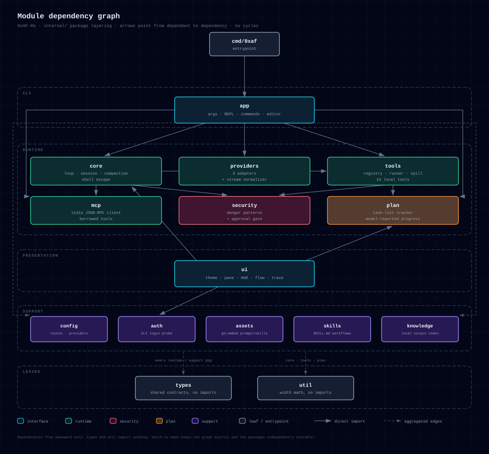
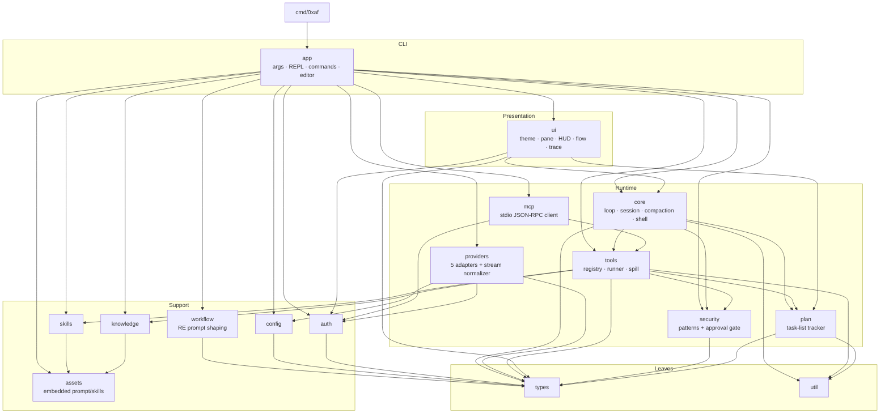
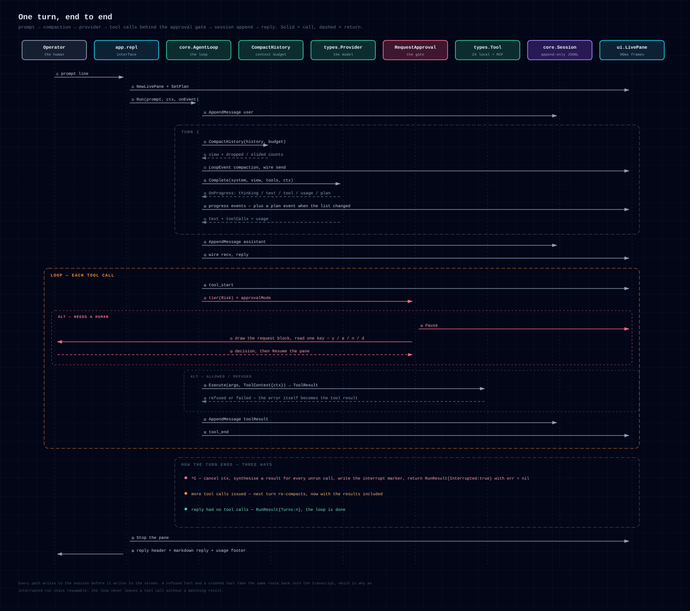
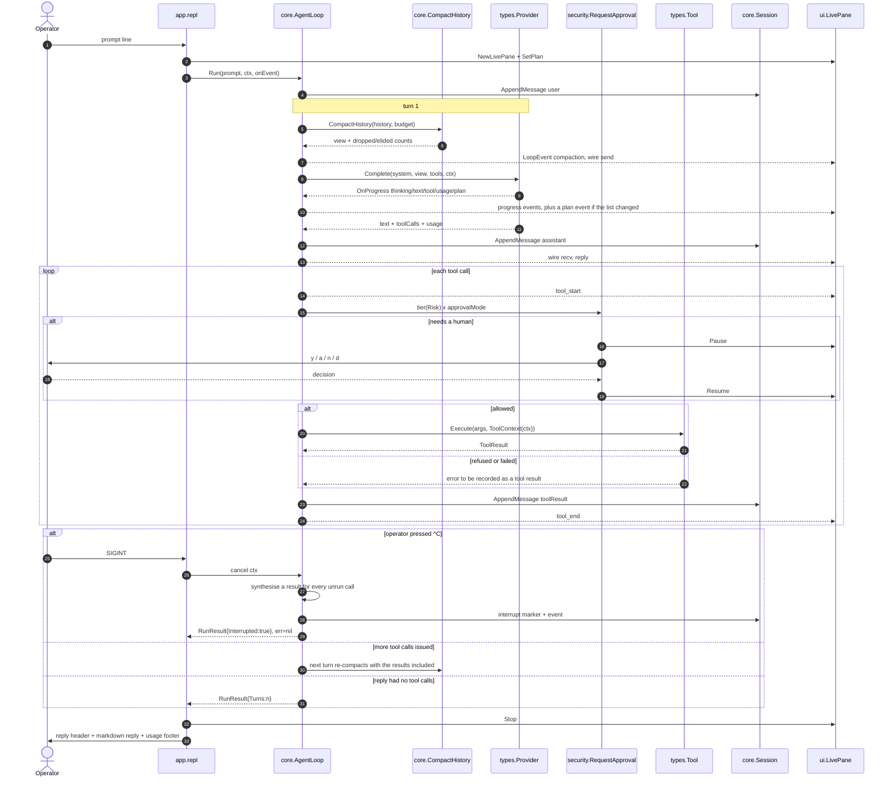
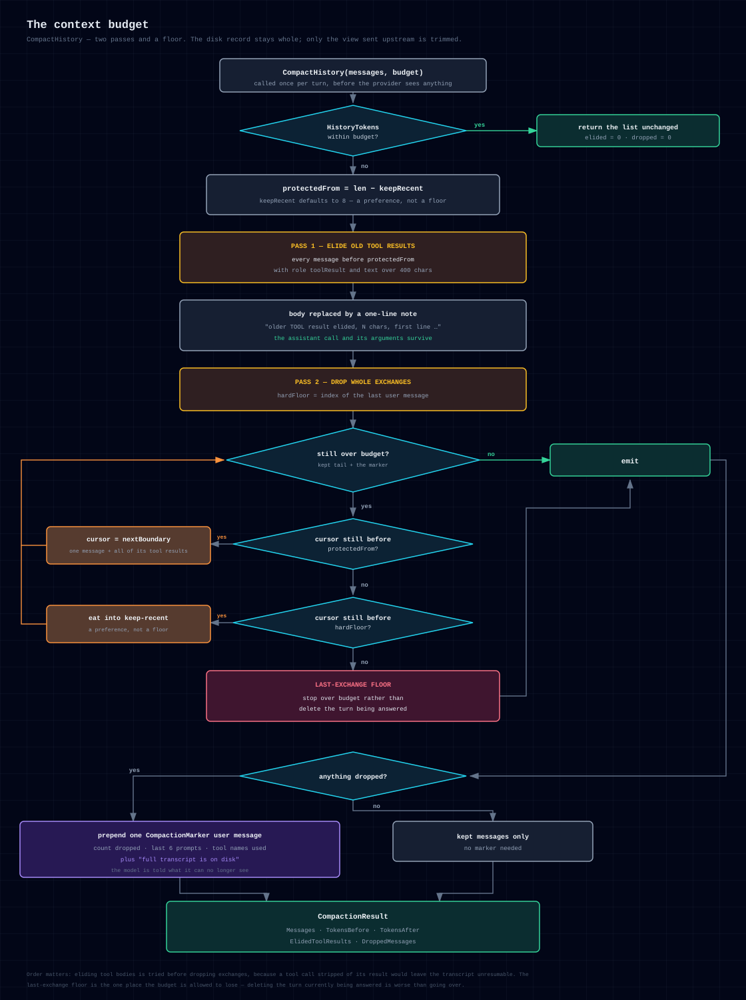
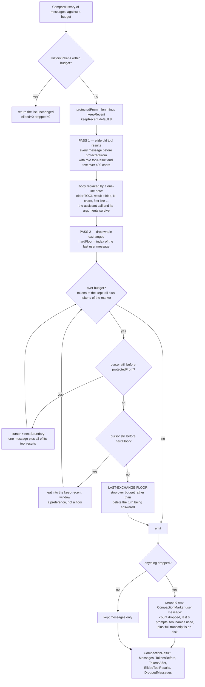
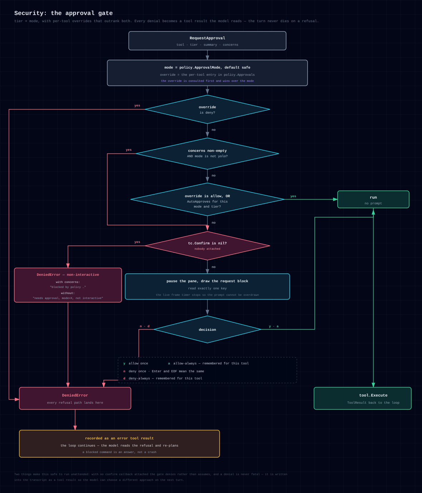
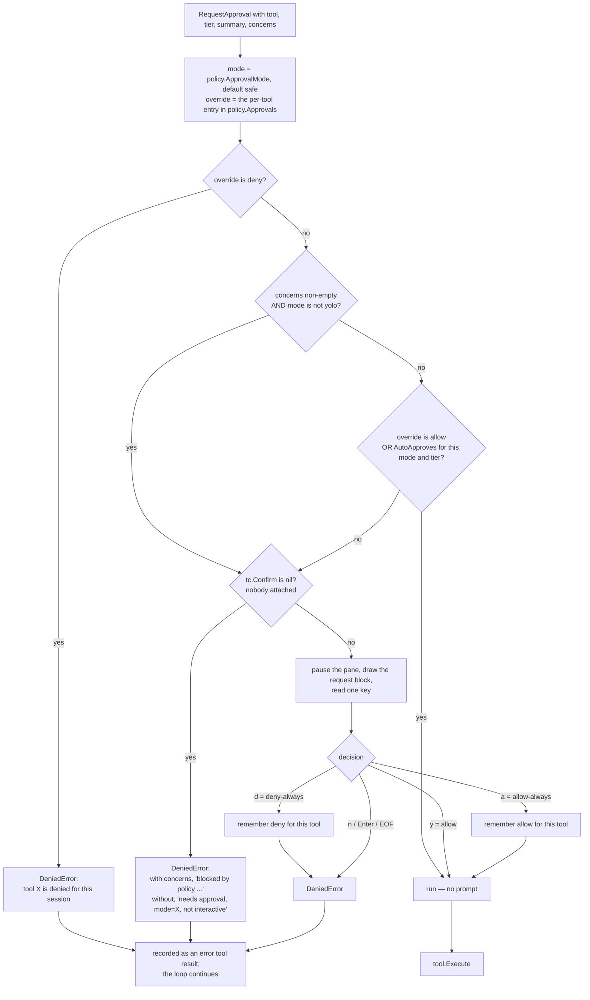
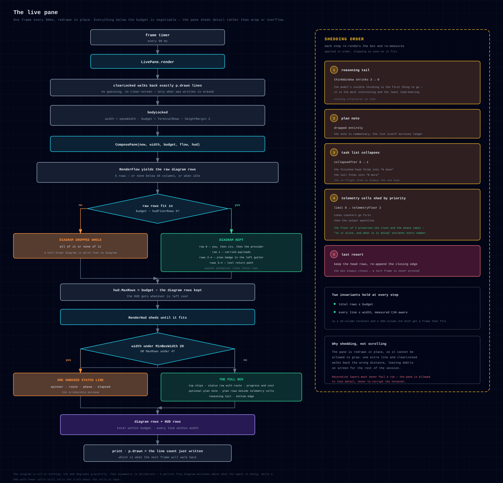

# 0xAF-Re — Architecture

> Audience: someone about to extend or audit this binary. Every claim here should
> be checkable against a file. Anchors are `path:line` against the tree as
> committed.

---

## 1. Orientation

`0xaf` is a single static Go binary (`cmd/0xaf`, module
`github.com/overkazaf/re-agent`) that drives reverse-engineering and CTF work
from a terminal. It talks to five interchangeable model backends — Anthropic
Messages, OpenAI Responses, OpenAI-compatible Chat, a local coding CLI driven
inside a detached tmux session, and an offline mock — exposes a registry of
local file/binary/CTF tools plus any MCP server's tools, records every message
to an append-only JSONL transcript, and narrates the whole thing in an in-place
terminal HUD. Everything hangs off one function: `AgentLoop.Run`
(`internal/core/agentloop.go:245`), a bounded `for turns < maxTurns` loop that on
each pass compacts the transcript to the provider's context budget, sends one
request, records the assistant reply, and — if the reply carried tool calls —
runs each one through the approval gate and appends its result before looping
again. It exits the loop on a reply with no tool calls, on an interrupt, or at
`maxTurns`. Everything else in the tree is a satellite of that loop: providers
feed it, tools are called by it, `ui` renders the `LoopEvent`s it emits, and
`core.Session` is the disk record of what it did.

---

## 2. Package map

| Package | Responsibility | Depends on (internal) |
| --- | --- | --- |
| `internal/types` | The whole data model: `Message`, `Tool`, `Provider`, `PlanStep`, `ExecutionPolicy`, `ApprovalRequest`. JSON wire encoding in `message_json.go`. | — (deliberately nothing) |
| `internal/util` | Argument coercion, `ResolveInside` path containment, `Clip`/`Truncate`, `ErrInterrupted`, `IsAbort`. | — |
| `internal/assets` | `go:embed` of `prompts/system.md` + `skills/`, and project-root resolution (`$OXAF_RE_HOME` → exe dir → cwd, walking up 6 levels). | — |
| `internal/plan` | The task-list tracker: sanitize untrusted steps, carry step timings, suppress no-op updates. | `types`, `util` |
| `internal/security` | Command safety patterns (`policy.go`) and the tier × mode approval gate (`approval.go`). | `types` |
| `internal/config` | `agent.config.json` merged over `Defaults()`; the `~/.0xaf-re-agent/ui.json` preference file; `SetReasoningEffort`. | `types`, `util` |
| `internal/auth` | Credential discovery (process env → `.env` files → `~/.0xaf-re-agent/secrets.json`), CLI auth probing, `FilteredEnv`. | `types`, `util` |
| `internal/knowledge` | Search over the imported RE corpus, context packing, answer parsing/citation checking. | `assets`, `util` |
| `internal/skills` | Loads embedded skills plus `skills/<name>/SKILL.md` overrides, builds the system-prompt catalog. | `assets`, `util` |
| `internal/workflow` | Explicit `off` / `auto` / `specialist` / `caveman` prompt shaping for authorized RE workflows. | `types` |
| `internal/tools` | The 24-tool built-in registry, the subprocess runner (`process.go`), the output-spill budget (`output.go`). | `knowledge`, `plan`, `security`, `skills`, `types`, `util` |
| `internal/mcp` | stdio JSON-RPC 2.0 client (`client.go`) and the wrapper that turns server tools into `types.Tool` (`tools.go`). | `auth`, `tools`, `types` |
| `internal/providers` | The five adapters, the CLI JSONL stream normalizer (`stream.go`), usage extraction. | `auth`, `config`, `types`, `util` |
| `internal/core` | The loop, `LoopEvent`, context budgeting, the append-only session, the `!` shell escape. | `plan`, `security`, `tools`, `types`, `util` |
| `internal/ui` | Theme + width math, the live pane, the HUD, the dataflow diagram, trace lines, plan box, markdown, palette, splash. | `auth`, `core`, `plan`, `types` |
| `internal/app` | Argument parsing, the REPL, slash commands, the queued prompt controller, the raw-mode line editor, one-shot `--print` mode. | everything above |

### Why the arrows point this way

- **`types` imports nothing.** It is the only package every layer may import, so
  it must be a leaf. A helper that needs `os` or a regexp belongs in `util`, not
  here.
- **`ui` imports `core`, never the reverse.** `internal/ui/flow.go:22` and
  `internal/ui/trace.go:14` consume `core.LoopEvent` directly. The loop emits
  events through a `func(LoopEvent)` callback (`agentloop.go:242`) and knows
  nothing about terminals; that is what lets `--print` mode render the same
  events as plain trace lines (`internal/app/app.go:259`) and lets the tests
  drive the loop with no renderer at all.
- **`plan` is its own package because both `core` and `tools` need it.**
  `core.AgentLoop` owns a `plan.Tracker` (`agentloop.go:74`) and the host-side
  `update_plan` tool computes counts with `plan.Counts`
  (`internal/tools/meta.go:317`). If the tracker lived in `core`, `tools` could
  not use it — `core` already imports `tools` (`agentloop.go` dispatches, and
  `core/shell.go:14` uses `tools.Stream`), so `tools → core` would be a cycle.
  `internal/ui/hud.go:19` also imports `plan` for `Counts`.
- **`core` imports `tools`, not the other way round.** Tools receive everything
  they need through `types.ToolContext` (workspace, session dir, policy,
  `context.Context`, `Confirm`, `OnPlan`), so a tool never reaches back into the
  loop. The `update_plan` tool publishes through `ToolContext.OnPlan`, which the
  loop installs in `NewAgentLoop` (`agentloop.go:85`) — an inversion, not an
  import.
- **`mcp` imports `tools`** only for `SpillIfLarge`, so MCP results obey the same
  output budget as built-ins (`internal/mcp/tools.go:112`).
- **`providers` imports `config`** only for `ResolveAPIKey`, and `auth` for the
  credential hints. It does not import `core`: a provider sees
  `types.ProviderInput` and returns `types.ProviderResponse`, nothing more.
- **`app` is the only package allowed to know about all of them.** It is the
  composition root: `app.Run` (`internal/app/app.go:43`) builds the policy, the
  provider map, the registry (built-ins + MCP), the session and the loop, then
  hands control to `repl` or `runOneShot`.



<details>
<summary>Mermaid source for this diagram</summary>



</details>

---

## 3. One turn, end to end

`AgentLoop.Run` is the whole control flow. The pieces in order:

1. **Route.** `RunOptions.ProviderName` wins; otherwise `routeProvider`
   (`agentloop.go:446`) maps role → provider, and under `auto` runs
   `isExecutionPrompt` — a keyword list (English and Chinese) that sends
   "run/read/grep/执行/读取…" prompts to the executor and everything else to the
   planner.
2. **Append the user message** to both the in-memory history and the JSONL.
3. **Per turn:** check `ctx.Err()`, emit `turn`, build the send view with
   `CompactHistory`, emit `wire/send`, call `provider.Complete`.
4. **On reply:** emit `wire/recv` + `reply`, accumulate usage, append the
   assistant message (text blocks and `ToolCalls`). No tool calls → return.
5. **Per tool call:** emit `tool_start`, gate through
   `security.RequestApproval` with the tier derived from the tool's `Risk`, run
   `tool.Execute`, emit `tool_end`, append a tool-result message. Failures and
   refusals become *error tool results*, not returned errors.
6. **On interrupt:** every remaining call in the batch still gets a synthetic
   "Interrupted by operator before this tool ran." result, then
   `noteInterrupted()` appends an `[interrupted by operator]` assistant marker
   and the run returns with `Interrupted: true` and a **nil error**.



<details>
<summary>Mermaid source for this diagram</summary>



</details>

### `LoopEvent`

One struct, not a union — Go has no discriminated unions, and every consumer
switches on `Type` anyway (`agentloop.go:23`).

| `Type` | Emitted at | Fields that matter |
| --- | --- | --- |
| `turn` | top of each turn | `Turn`, `Provider` |
| `compaction` | only when the view was trimmed | `TokensBefore/After`, `DroppedMessages`, `ElidedToolResults` |
| `wire` | `Phase: send` before the request, `Phase: recv` after | `Model`, `Endpoint`, `Messages`, `Tokens`, `Tools`, `Ms`, `OK`, `Usage`, `ToolCalls`, `TextChars`, `Error` |
| `progress` | streamed from a provider mid-turn | `Progress.Kind` ∈ status/thinking/text/tool/usage/plan |
| `plan` | a task list actually changed | `Snapshot` |
| `reply` | once per assistant reply | `Text`, `Usage`, `Reason` (reasoning text) |
| `tool_start` / `tool_end` | around each dispatch | `Name`, `Args`, `OK`, `Ms`, `Preview` |

Two consumers: `ui.TraceEvent` (`internal/ui/trace.go:43`) turns each into a
permanent `t+1.234 ▏` scrollback line, and `ui.FlowModel.Apply`
(`internal/ui/flow.go:180`) folds them into the animated diagram's state.
`app/repl.go:175` is the single `onEvent` closure that feeds both plus the HUD.

---

## 4. The context budget

The transcript on disk and in memory is always complete. What
`CompactHistory` produces is the **view** sent upstream
(`internal/core/compaction.go:94`). Two mechanical passes, cheapest first, both
preserving the assistant-call/tool-result adjacency that strict chat APIs
require.

`EstimateTokens` (`compaction.go:50`) is deliberately crude: ~4 chars/token for
latin, ~1.5 for CJK, plus 4 tokens of envelope per message. Good enough to drive
a budget without a tokenizer, and identical across providers so the numbers in
`/context` mean one thing.

Budget resolution: `ProviderConfig.ContextBudgetTokens`, else
`DefaultContextBudgetTokens = 48_000` (`agentloop.go:18`), sized to fit inside
the smallest context routinely routed to (deepseek-chat, 64k).



<details>
<summary>Mermaid source for this diagram</summary>



</details>

Three details a change can get wrong:

- `nextBoundary` (`compaction.go:175`) advances past a message **plus every
  following tool result**, which is what keeps a surviving tool result from
  losing its assistant parent.
- The marker's own token cost is *measured*, not guessed
  (`compaction.go:143-149`) — it lists earlier prompts, so assuming it is free
  quietly overshoots the budget.
- `lastExchangeStart` scans backwards for the last `user` message. Nothing is
  dropped past it: without the current exchange there is no turn left to answer.

`/compact` is a different, destructive operation: `AgentLoop.Compact`
(`agentloop.go:133`) asks a model for a dense session briefing and replaces the
entire working history with one `[session summary — earlier turns compacted]`
user message. The detail lives on in the JSONL. It refuses to replace anything
if the model returns an empty summary (`agentloop.go:165`).

---

## 5. Providers

`providers.Create` (`internal/providers/providers.go:14`) switches on
`ProviderConfig.Type`. Each adapter satisfies `types.Provider`: `Name()`,
`Config()`, `Complete(ProviderInput) (ProviderResponse, error)`.

| Kind | File | Transport | Notes |
| --- | --- | --- | --- |
| `anthropic` | `http.go:93` | `POST /v1/messages` | `x-api-key` vs `Authorization: Bearer` inferred from the env var name (`OAUTH`/`AUTH_TOKEN` → bearer) or the key prefix (`sk-ant-` → api-key) |
| `openai-responses` | `http.go:239` | `POST /v1/responses` | `reasoning.effort` when set; tool calls are echoed back as `function_call` items so `function_call_output` resolves |
| `openai-chat` | `http.go:361` | `POST /v1/chat/completions` | strict backends (DeepSeek, GLM) reject `tool_calls: []` and a null content with no calls, so both keys are only emitted when meaningful (`http.go:407`) |
| `cli-tmux` | `clitmux.go:50` | detached tmux session running a generated `runner.sh` | tails the child's stdout log; falls back to running the script directly unless interrupted or `cliFallbackDirect:false` |
| `mock` | `providers.go:42` | none | echoes the prompt, or replays `mockScript` one entry per turn (the last repeats). Backs `--smoke` and the loop tests |

Value receivers for the three HTTP adapters (stateless); **pointer** receivers
for `cli-tmux` and `mock`, because they carry per-process state.

### The CLI-tmux provider

Per turn it creates a run directory under
`<sessionDir>/cli-tmux/<stamp>-<provider>-<rand>/` holding `prompt.txt`,
`stdout.log`, `stderr.log`, `output.txt`, `exit.status`, `runner.sh`,
`tmux.sock` (`clitmux.go:441`). `runner.sh` is generated with every argument
shell-quoted, `unset`s the configured env vars (validated against
`^[A-Za-z_][A-Za-z0-9_]*$`), redirects stdout/stderr to files, and writes the
exit status last — which is the completion signal `waitForCompletion` polls for
every 200 ms while also watching `ctx.Done()`.

`cliResumeSession` makes the provider claim a v4 UUID eagerly and pass
`--session-id` on the first turn, `--resume <id>` afterwards
(`clitmux.go:225`). Claiming before the run means a mid-run failure never
re-issues an id the CLI would reject as already in use. On a resumed turn the
prompt is only the **delta** since this provider last spoke
(`deltaSince`, `clitmux.go:249`) — the CLI already holds the earlier turns
natively — plus a re-statement of the task-list instruction, because the system
prompt is only sent on the session's first turn.

### `stream.go` — the JSONL normalizer

`claude -p --output-format stream-json` and `codex exec --json` both emit
newline-delimited JSON events. `StreamParser` (`stream.go:61`) buffers partial
lines, tolerates interleaved non-JSON, and translates into one `StreamEvent`
shape (`status | thinking | text | tool | usage | final | plan`). Unrecognized
shapes yield nothing rather than an error; Codex in particular has iterated its
envelope across versions, so `translateCodex` matches several known layouts
(`msg.type`, top-level `type`, `item.completed` with `item.type`, `todo_list`
under either `items` or `todo_items`).

The subtle part is **`ClaudeTaskTable`** (`stream.go:195`), the ordered task
table rebuilt from Claude's incremental task calls. The problem it solves: a
`TaskCreate` tool call carries a `subject` but **no id** — the CLI mints the id
server-side and reports it back in the result. So there are two sources of
truth, and only one of them is authoritative:

| Source | Method | Semantics |
| --- | --- | --- |
| `assistant` event, `TaskCreate` tool_use | `Create(subject)` | **fallback**. Inserts under a guessed id (`max+1`) so a lost result cannot hide a step. Marked `bound: false`. |
| `user` event, `tool_use_result.task = {id, subject}` | `Bind(id, subject)` | **authoritative**. Claims the matching unbound entry, correcting the guess; otherwise appends. |
| `user` event, result text `Task #N created successfully: <subject>` | `Bind` via `taskCreatedRE` | prose fallback, used only when the structured shape was absent or unrecognized |
| `assistant` event, `TaskUpdate` tool_use | `Update(id, status, subject)` | unknown id is **ignored**, never inserted — a row reading "task 7" in front of the operator is worse than a missing row |
| `user` event, `tool_use_result.taskId + statusChange.to` | `Update` | self-corrects when the `TaskUpdate` tool_use itself was missed |

Two guards worth keeping: every mutator returns whether the *visible* list
changed, so a repeated confirmation does not churn the UI; and
`isSubAgentEvent` (`stream.go:329`) drops any event with a non-empty
`parent_tool_use_id`, because a spawned sub-agent's task list is not the
operator's plan.

The table is owned by the **provider**, not the parser (`clitmux.go:47`,
`stream.go:68`), and `Reset()` is called only when a turn starts a *new* native
session (`clitmux.go:77`). See the invariants below.

---

## 6. Security: the approval gate

Two independent inputs decide whether a call runs, and one veto on top.

**Tier**, from the tool's declared `Risk` (`security/approval.go:60`):
`read → TierRead`, `write → TierWrite`, `execute` and `network` both →
`TierExec` ("can do anything").

**Mode** (`types.ApprovalMode`), from `--approval` / `--yolo` / `/approval`:

| Mode | read | write | exec | on a tripped safety pattern |
| --- | --- | --- | --- | --- |
| `yolo` | run | run | run | run |
| `safe` (default) | run | run | run | ask (refuse if unattended) |
| `write` | run | run | ask | ask |
| `always-ask` | run | ask | ask | ask |

**Concerns**, from `security.CommandConcerns` (`security/policy.go:51`): the
destructive patterns (`rm -rf`, `dd if=`, `mkfs`, `shutdown`, `reboot`,
`launchctl`, `sudo`, `> /dev/sd*`), network tokens matched as whole words when
`--allow-network` is off (`curl`, `wget`, `nc`, `ssh`, `socat`, `dig`, …), and
credential-shaped tokens when `--allow-sensitive` is off (`.ssh`, `.aws`,
`id_rsa`, `keychain`, `password`, `secret`, `token`). A non-empty list **always
asks**, outranking an `allow` override in every mode but `yolo`.

The gate runs **twice**, deliberately:

1. The loop's tier gate (`agentloop.go:402`) — it knows the tool name and its
   risk, but not the command text, so `Concerns` is empty there.
2. The command-level gate inside the tool that actually holds the string:
   `run_command` (`internal/tools/files.go:183`) and the `!` shell escape
   (`core/shell.go:58`). This is the only place a safety pattern can be seen, and
   the reason it is a *question* rather than a refusal is that the operator typed
   the shell escape themselves.



<details>
<summary>Mermaid source for this diagram</summary>



</details>

Note `AutoApproves` returns true for `yolo` **and** `safe` regardless of tier
(`approval.go:72`) — `safe` reacts only to concerns. `DeniedError`
(`approval.go:36`) is what lets the REPL report a refusal as a decision
("not run — …") rather than a crash (`app/repl.go:76`).

Independently of approvals, three hard checks never prompt:
`util.ResolveInside` refuses paths outside the workspace,
`security.ValidatePathRead` refuses sensitive paths, and
`security.ValidateWriteAllowed` refuses every write unless `--write` was passed.

---

## 7. Tools

`tools.CreateReverseTools` (`internal/tools/registry.go:24`) returns the
built-ins in `/tools` display order. 24 tools; all `read` except three:

| Risk | Tools |
| --- | --- |
| `read` | `list_files` `read_file` `grep` `file_info` `strings` `hexdump` `hash_file` `extract_symbols` `ctf_triage` `ctf_decode` `entropy_scan` `binary_mitigations` `find_bytes` `carve_artifacts` `apk_inspect` `frida_hook_template` `list_skills` `read_skill` `knowledge_search` `knowledge_read` `update_plan` |
| `write` | `write_file` |
| `execute` | `run_command` `reverse_toolkit` |

`update_plan` is `RiskRead` on purpose: it mutates nothing but the operator's
view, and prompting for it would be noise.

**The process runner** (`internal/tools/process.go:62`). `Stream` is the single
place a subprocess is born, used by `run_command`, every binary helper, and the
`!` escape. Three things it gets right:

- `SysProcAttr{Setpgid: true}` plus a `cmd.Cancel` that sends `SIGKILL` to
  `-pid` — the whole process group, so a killed `bash -c` takes its children
  with it. Without this, `^C` on an `objdump | grep` leaves the pipeline running.
- Stdout and stderr are pumped by one goroutine each into a buffer *and* an
  optional `OnChunk` callback; a torn-down pipe returns whatever was already
  decoded rather than discarding it.
- A context that fired *before* the child existed is reported as an outcome
  (`Code: 130, Aborted: true`), not an error (`process.go:98`).

`TimedOut` and `Aborted` are distinguished, because the transcript entry the
model sees says which happened (`core/shell.go:130`).

**The output budget** (`internal/tools/output.go`). RE commands emit megabytes
(`objdump -d`, `strings` on a fat binary), and a raw dump costs the whole context
window. `SpillIfLarge` caps at `policy.MaxToolOutputChars` (default 24 000,
`app/app.go:115`; `--max-output` to change, minimum 500), keeps 60 % head and
40 % tail with an `… [N chars elided] …` seam, writes the full text to
`<sessionDir>/artifacts/<stamp>-<slug>.txt`, and tells the model the path so it
can `read_file`/`grep` the rest deliberately. If the artifact write fails the
preview still returns, with a note that no copy was kept.

---

## 8. The live pane

`internal/ui/live.go` owns the redraw and the state; `hud.go` owns the pixels
(pure `HudModel → []string`, no timers, no I/O, no cursor moves).

**The redraw contract.** `clearLocked` (`live.go:361`) emits `\r`, then
`\x1b[2K` followed by `p.drawn - 1` repetitions of `\x1b[1A\x1b[2K` — it walks
back *exactly* the number of lines last written. Anything that makes the real
row count differ from `p.drawn` — a soft-wrapped line (too wide) or a scroll (too
tall) — corrupts the terminal for the rest of the session. `RenderHud` and
`ComposePane` between them guarantee both halves; see §12.4 and §12.5 for the
consequences and the tests. Two supporting details: `paneWidth()` leaves the
last column empty, because some terminals wrap eagerly when written into, and it
never clamps *up* — a terminal narrower than the box gets `oneLiner`, not a box
that wraps.

```mermaid
flowchart TD
  A["frame timer, every 90ms"] --> B["LivePane.render"]
  B --> C["clearLocked walks back exactly p.drawn lines"]
  C --> D["bodyLocked: width = paneWidth<br/>budget = TerminalRows minus heightMargin 2"]
  D --> E["ComposePane with now, width, budget, flow, hud"]

  E --> F["RenderFlow yields the raw diagram rows:<br/>5 rows, or none below 46 columns or when idle"]
  F --> G{"raw rows fit in budget minus hudFloorRows 6?"}
  G -- yes --> H["diagram kept: you, then ctx, then the provider on row 0<br/>carried payloads on row 1<br/>plan badge in the left gutter, rows 2 to 4<br/>tool return path on rows 3 and 4"]
  G -- no --> I["diagram dropped whole<br/>all of it or none of it"]

  H --> J["hud.MaxRows = budget minus the diagram rows kept"]
  I --> J
  J --> K["RenderHud sheds until it fits"]

  K --> L{"width under MinBoxWidth 20<br/>OR MaxRows under 4?"}
  L -- yes --> M["one unboxed status line:<br/>spinner · route · phase · elapsed"]
  L -- no --> N["box: top chips, status row with route,<br/>progress and cost, optional plan note,<br/>plan rows beside telemetry cells,<br/>reasoning tail, bottom edge"]

  N --> O["SHEDDING ORDER — each step re-renders the box"]
  O --> O1["1. reasoning tail: thinkWindow 3 down to 0"]
  O1 --> O2["2. plan note dropped"]
  O2 --> O3["3. task list collapses: collapseAfter 8 down to 1<br/>finished head folds to 'N done', tail to 'N more'"]
  O3 --> O4["4. telemetry cells shed by priority, limit 8 down to<br/>telemetryFloor 2: token counters go first, then the<br/>output sparkline. The clock and the phase label<br/>are what the floor of 2 preserves."]
  O4 --> O5["5. last resort: keep the head rows<br/>and re-append the closing edge"]

  M --> Z["diagram rows plus HUD rows:<br/>total within budget, every line within width"]
  O5 --> Z
  Z --> P["print, p.drawn = the line count just written"]
```



<details>
<summary>Mermaid source for this diagram</summary>



</details>

`hudFloorRows = 6` is measured, not guessed (`live.go:46`): `RenderHud`
collapses to a one-liner below 4 rows, shows only a completed step at 4, adds a
`… N more` marker at 5, and first reveals the **in-progress** step at 6. The
task list is the point of the box, so 6 is what the diagram must leave behind.
The floor is spent above, deciding whether the diagram fits at all — it is not
imposed on `hud.MaxRows`, because a terminal with 3 usable rows must still get
the one-line fallback rather than a 4-row box it cannot hold.

Two more pane behaviours worth knowing:

- `Commit(line)` clears the pane, prints the line permanently, and repaints —
  that is how tool activity and trace lines accumulate above a dashboard that
  never scrolls away.
- `Pause()` / `Resume()` hand the terminal back (cursor visible, timer stopped)
  so an approval prompt can own the screen (`app/repl.go:379`).

The **trace** layer (`internal/ui/trace.go`) is the permanent half: one
`t+%6.3f ▏` line per event, with duration bars scaled against the slowest
request seen so far in the turn. Plan events are rendered as *transitions*, never
dumps: a pure append of `pending` steps is silent (Claude sends one `TaskCreate`
per step, which is list construction, not a timeline event), a prefix that no
longer lines up by text is reported as "rewritten", and more than three
simultaneous changes collapse to "N steps advanced" (`trace.go:164`).

The **plan box** (`internal/ui/plan.go`) is the archived snapshot printed into
the scrollback once the pane stops, and by `/plan`. It reuses `hud.go`'s box and
row primitives so the live and archived views cannot drift, and defaults
`Live: false` — a running elapsed on a frame that was captured once would be a
lie the reader cannot see.

`internal/ui/canvas.go` is the character grid the diagram is drawn on:
out-of-bounds `Put`s are dropped rather than wrapped, double-width glyphs occupy
two cells with the second marked `wideTail`, and styles are emitted as runs so a
row costs a handful of escape sequences rather than one per cell.

---

## 9. The plan tracker

`plan.Tracker` (`internal/plan/plan.go:25`) is mutex-guarded state with one
public mutator. Three jobs:

- **Sanitize.** Plans arrive from external CLIs, so every field is untrusted:
  strip ANSI and control characters (they would corrupt the in-place redraw),
  collapse whitespace, truncate at 200 chars, drop blank steps, clamp at 64 —
  and when the clamp fires, append a `… N more steps not shown` row so a
  truncated plan never *looks* complete.
- **Carry timings.** Sources re-send the whole list on every change and carry no
  timestamps, so the tracker is the only thing that knows when a step started or
  finished. Steps are matched by provider id when there is one, else by text
  (`carryTimings`, `plan.go:127`). `elapsedLabel` refuses to print a duration of
  0 ms — a step created and completed by the same update never actually ran.
- **Suppress no-ops.** `Update` returns `nil` when nothing visible changed
  (`plan.go:50`), and timings are excluded from the comparison because they are
  derived state. The same list arriving from a different source updates
  `Source` in place — so the snapshot never reports a stale origin — but still
  returns `nil`.

Both sources feed it: `progress.Kind == "plan"` from the CLI streams, and the
host-side `update_plan` tool via `ToolContext.OnPlan`. Both land in
`AgentLoop.publishPlan` (`agentloop.go:218`), so they dedupe and persist
identically.

---

## 10. MCP

`internal/mcp/client.go` is a from-scratch JSON-RPC 2.0 client over stdio,
newline-delimited — enough to borrow another process's tools (`ida-pro-mcp`
being the one that matters here) without an SDK. Protocol version
`2024-11-05`. `Connect` spawns the server with `auth.FilteredEnv(nil)` plus the
configured `env`, starts a `pump` goroutine reading frames and a `watchExit`
goroutine capturing stderr, then does `initialize` →
`notifications/initialized` → `tools/list`, filtered by the optional
`tools` allowlist.

`internal/mcp/tools.go` wraps each into a `types.Tool` named
`mcp__<server>__<tool>`, clipped to 64 chars ("`[A-Za-z0-9_-]{1,64}`", the
OpenAI-compatible limit) by trimming the *server* half first — the tool name is
what the model reasons about. MCP servers do not declare a tier, so every
wrapped tool is `RiskWrite`, which is what the approval modes assume for
anything that is not a read. Results go through `SpillIfLarge` like any
built-in, with image blocks passed through untouched.

`ConnectAll` starts every server **in parallel** and reports failures without
being fatal (`mcp/tools.go:56`): an IDA plugin that is not running should not
stop a session. `app.Run` prints a notice and skips the failed one
(`app/app.go:134`).

---

## 11. Data formats

### The session JSONL

One JSON object per line, appended under a mutex, `O_APPEND|O_CREATE|O_WRONLY`
(`internal/core/session.go:73`). The file name is a UTC ISO timestamp with `:`
and `.` replaced by `-`, then `-0xaf.jsonl` — e.g.
`2026-07-28T09-14-22-031Z-0xaf.jsonl` — so the directory sorts
lexicographically by time (`session.go:53`, pinned by
`TestSessionFileNameIsSortable`).

**The envelope** (`session.go:19`):

```json
{"type":"session|message|event","timestamp":"2026-07-28T09:14:22.031Z","data":{...}}
```

**`type: "session"`** — one line, first, written by `Session.Init`. `data` is
free-form metadata; `app.Run` writes `agent`, `version`, `workspace`,
`configPath`, `plannerProvider`, `executorProvider`, `policy`.

**`type: "message"`** — a `types.Message`, encoded by the hand-written
marshaller in `internal/types/message_json.go`:

```json
{"role":"user","content":[{"type":"text","text":"triage ./chall"}],"timestamp":1769...}
{"role":"assistant","content":[{"type":"text","text":"Running file(1)."}],
 "toolCalls":[{"id":"call_0","name":"file_info","arguments":{"path":"./chall"}}],
 "provider":"codex","model":"codex-cli","timestamp":1769...}
{"role":"toolResult","content":[{"type":"text","text":"ELF 64-bit LSB pie"}],
 "toolCallId":"call_0","toolName":"file_info","isError":false,
 "details":{"exit":0},"timestamp":1769...}
```

`content` is a **plain string** for `system` messages and a **block array** for
every other role. That asymmetry is not an accident: **the format is shared with
the original TypeScript implementation**, and a log written by either loads in
the other (`message_json.go:5`, README "Differences"). `Message` keeps both
shapes in typed fields (`Blocks []ContentBlock` and `System string`) and
reconciles them in `MarshalJSON`/`UnmarshalJSON`; the unmarshaller tries both
encodings regardless of role, because a hand-edited log may disagree with
itself.

**`type: "event"`** — everything else. All six shapes currently written:

| `data.type` | Written at | Payload |
| --- | --- | --- |
| `compaction` | mechanical pass trimmed the view (`agentloop.go:306`) | `tokensBefore`, `tokensAfter`, `dropped`, `elided` |
| `compaction` + `"mode":"summary"` | `/compact` (`agentloop.go:174`) | `provider`, `tokensBefore`, `tokensAfter` |
| `plan` | a task list actually changed (`agentloop.go:225`) | `source`, `note`, `steps[]` |
| `interrupted` | `noteInterrupted` (`agentloop.go:214`) | — |
| `max_turns_reached` | the loop hit its ceiling (`agentloop.go:439`) | `maxTurns` |
| `resumed_from` | `--resume` / `/resume` (`app/app.go:187`, `commands.go:225`) | `file`, `messages` |
| `knowledge` | a `/know` lookup (`commands.go:479`) | `query`, `matched[]`, `used[]`, `citations[]`, `inventedCitations`, `parsed` |

### Loading and repair

`LoadSession` (`session.go:154`) replays the file: `session` lines merge into
`Meta`, `message` lines that fail to parse are skipped, and the **last**
`plan` event becomes `Loaded.Plan` so a resumed session picks the task list back
up. `readEntries` silently skips unparseable lines — a truncated final line is
expected when a session was killed mid-write.

Then `repair()` runs, pruning in **both** directions, because providers reject a
dangling call and an orphan result equally hard:

- it indexes every call id an assistant message issued, and every result whose id
  matches one of them;
- an assistant message keeps only its answered calls — left with no calls and no
  text it is dropped, with text it keeps the text;
- a `toolResult` whose id nobody issued is dropped outright.

The second direction matters because `readEntries` skips *any* unparseable line,
not only a truncated last one: a corrupt line in the middle of a log can take an
assistant turn with it and strand the results it asked for. Without this pass a
session killed mid-tool — or nicked in the middle — is permanently unresumable.

`ListSessions`/`ResolveSession` back `--resume`, `--sessions`, `/sessions` and
`/resume`: newest first, resolvable by full id, id prefix, or path. The picker's
"opened with" column skips `[operator shell]` and `[context compacted]`
messages, since those are not what makes a session recognizable.

### Other on-disk state

| Path | Written by | Contents |
| --- | --- | --- |
| `<sessionDir>/*.jsonl` | `core.Session` | transcripts |
| `<sessionDir>/artifacts/` | `tools.SpillIfLarge` | full text of over-budget tool output |
| `<sessionDir>/cli-tmux/<run>/` | `providers.CLITmuxProvider` | prompt, stdout/stderr logs, exit status, runner script, tmux socket |
| `agent.config.json` (cwd) or `~/.0xaf-re-agent/config.json` | operator | merged over `config.Defaults()` |
| `~/.0xaf-re-agent/ui.json` | `config.SaveUIPrefs` | `{theme, flow}`, merged on save |
| `~/.0xaf-re-agent/secrets.json` | `auth.Login` | per-provider API keys |
| `~/.0xaf-re-agent/repl-history` | `app.Editor` | one prompt line per row, last 1000 loaded |
| `knowledge/reverse-index.json` | `cmd/import-knowledge` | the searchable RE corpus |

---

## 12. Invariants worth knowing

These are the things a change can break without any test going red *unless* you
know to look. Each row lists the consequence and the test that pins it where one
exists.

### 12.1 Every issued tool call ends up with a tool result

**Where:** `agentloop.go:376-436`.
**Why:** strict chat APIs (Anthropic Messages, OpenAI Responses, DeepSeek/GLM
chat) reject a history where an assistant `tool_use` has no matching result.
The loop therefore synthesises a result for *every* remaining call in the batch
when the context fires — "Interrupted by operator before this tool ran." — and
for a call whose tool does not exist ("Tool not found: X"), and for a refusal or
an execution error. Nothing takes a path that skips `pushToolResult`.
**Break it and:** the *next* turn (or a resumed session, or a `/compact`) fails
upstream with a validation error, and the transcript is permanently unusable.
Note the pair with `repair()` (§11): the loop keeps live histories valid, and
`repair()` fixes histories that a crash left invalid.
**Pinned by:** `TestRunInterruptedKeepsHistoryValid`
(`internal/core/agentloop_test.go:132`) cancels between two calls in one batch
and asserts no call dangles, plus the interrupt marker is last;
`TestRunReportsMissingTool` (`:109`);
`TestLoadSessionRepairsDanglingToolCalls`
(`internal/core/session_test.go:65`).

### 12.2 Compaction never separates an assistant tool call from its results

**Where:** `compaction.go:175` (`nextBoundary`), and the elision pass, which
replaces a tool result's *body* while leaving the message — and the assistant
call that produced it — in place.
**Break it and:** the same upstream rejection as §12.1, but only on long
sessions, which makes it look intermittent.
**Pinned by:** `TestCompactHistoryElidesOldToolResults`
(`internal/core/compaction_test.go:43`) and
`TestCompactHistoryKeepsTheLastExchange` (`:67`), which also assert the budget
is not overshot and that the marker is prepended.

### 12.3 The last exchange always survives

**Where:** `hardFloor := lastExchangeStart(working)` (`compaction.go:138`).
**Why:** dropping the turn currently being answered leaves nothing to answer.
The keep-recent window is a *preference* — pass 2 will eat into it — but the
last user message is a floor, and going over budget is the correct failure.
**Break it and:** long sessions start replying to the compaction marker instead
of to the operator's prompt.
**Pinned by:** `TestCompactHistoryKeepsTheLastExchange`.

### 12.4 Every HUD/diagram/plan line measures at most `width` columns

**Where:** `ui.DisplayWidth` (`internal/ui/theme.go:373`) is the only measuring
function; `BoxRow` clips as a last-resort safety valve (`hud.go:132`);
`Canvas.Put` drops out-of-bounds glyphs rather than wrapping
(`canvas.go:42`).
**Why:** one soft-wrapped line permanently desynchronises `clearLocked`'s erase
walk, and the pane starts consuming the scrollback above it. This is why width
math runs on *plain* text and paint is applied afterwards (the `Chip` type
carries `Plain` and `Painted` side by side, `hud.go:24`), and why `HudTitle` is
`0xAF·RE` rather than something with `Emoji_Presentation=Yes` — terminals render
those double-width while this codebase's width table calls them narrow, costing
one column per glyph (`hud.go:59`).
**Break it and:** the terminal is corrupted for the rest of the session, and it
only reproduces at particular widths or with CJK content.
**Pinned by:** the `hudFits` helper (`internal/ui/ui_test.go:43`), asserted
across the width × rows matrix `{120,80,61,59,40,24} × {40,8,6,4,3}` in
`TestHudRespectsWidthAndHeight`; `TestRenderPlanBoxIsBounded` (`:123`);
`TestWrapAnsiBreaksCJKWithoutSpaces` (`:29`);
`TestFlowDiagramFitsAndReactsToEvents` (`:204`);
`TestMarkdownRendering` (`:274`). The line editor has the same contract and its
own test: `TestLayoutCountsNewlinesAndWrapping`
(`internal/app/editor_test.go:8`).

### 12.5 The pane body fits the height budget, and the diagram is all-or-nothing

**Where:** `ComposePane` (`live.go:95`), `RenderHud`'s shedding loop
(`hud.go:818`).
**Why:** a body taller than the screen scrolls, which shifts rows out from under
the cursor — same corruption as §12.4. Half a diagram is worse than no diagram,
so `flowLines` is either all of `raw` or empty.
**Break it and:** the pane desynchronises on short terminals only.
**Pinned by:** `TestComposePaneKeepsTheHudFloor` (`ui_test.go:252`) — checks
both that a tight budget is respected and that no partial `[you]` row survives;
`TestHudShowsTheActiveStepAtSixRows` (`:86`) pins `hudFloorRows = 6` from the
other side.

### 12.6 The plan tracker suppresses no-op updates

**Where:** `plan.Tracker.Update` returns `nil` (`plan.go:50`); every
`ClaudeTaskTable` mutator returns whether the *visible* list changed
(`stream.go:213-267`); `publishPlan` skips the emit and the session write on
`nil` (`agentloop.go:220`).
**Why:** the CLI streams re-send the whole list on every touch, and Claude sends
one `TaskCreate` per step plus a confirming result for each. Publishing every
one of those would repaint the pane and write a session event per step, and the
trace would print a line per step.
**Break it and:** the HUD churns, the JSONL fills with duplicate plan events,
and `planTouched` (`app/repl.go:190`) starts archiving an unchanged plan box
after every turn.
**Pinned by:** `TestUpdateReportsOnlyRealChanges`
(`internal/plan/plan_test.go:18`), `TestUpdateCarriesTimingsAcrossUpdates`
(`:40`), and `TestTracePlanTransitionsOnly` (`internal/ui/ui_test.go:171`) for
the trace half. Note the deliberate asymmetry: timings are excluded from the
comparison because they are derived, so only text/status/id changes cause a
redraw (`plan.go:179`).

### 12.7 `ClaudeTaskTable` must outlive a turn

**Where:** owned by `CLITmuxProvider` (`clitmux.go:47`), passed into each
per-turn `NewStreamParser` (`clitmux.go:113`), `Reset()` only when the turn
starts a *new* native session (`clitmux.go:77`).
**Why:** with `cliResumeSession` the CLI's native session outlives the turn, so
a turn that only sends `TaskUpdate` would find an empty table and publish
nothing. Conversely, a non-resuming turn starts a CLI session whose task ids
restart at 1, and keeping the old table would let those ids collide with the
previous session's steps.
**Break it and:** moving the table into `StreamParser` makes plan progress
vanish on any turn that only updates existing steps; dropping the `Reset` makes
a fresh session's step 1 silently mutate the previous session's step 1.
**Pinned by:** `TestTaskTableResetScopesToSession`
(`internal/providers/stream_test.go:164`) covers the reset half;
`TestClaudeTaskListFromCreateAndUpdate` (`:54`) covers create/update.
The lifetime coupling itself is only documented, not tested.

### 12.8 Task ids are only authoritative from a `tool_use_result`

**Where:** `Bind` (`stream.go:213`) vs `Create` (`stream.go:234`);
`applyStructuredResult` (`stream.go:300`) is tried *before* the prose fallback.
**Why:** `TaskCreate`'s arguments carry no id — the CLI mints it server-side.
`Create` therefore inserts under a *guessed* id (`nextID()` = one past the max)
with `bound: false`, purely so a lost result cannot hide a step; `Bind` claims
that provisional entry by matching subject text and corrects the id.
`Update` ignores an unknown id rather than synthesising an entry, because a row
reading "task 7" tells the operator nothing.
**Break it and:** treating `TaskCreate` as authoritative double-inserts every
step once its result lands; treating an unknown `TaskUpdate` id as an insert
fills the plan with meaningless rows; skipping the structured result in favour
of the prose means a `TaskUpdate` whose tool_use was missed strands its step
forever.
**Pinned by:** `TestClaudeBindsTaskIDFromResultText`
(`internal/providers/stream_test.go:70`);
`TestClaudeIgnoresSubAgentTasks` (`:82`) pins the related rule that a
non-empty `parent_tool_use_id` keeps a sub-agent's list out of the operator's
plan.

### 12.9 Also true, and cheaper to state

| Invariant | Where | Break it and | Pinned by |
| --- | --- | --- | --- |
| An interrupt is an outcome, not an error: `Run` returns `Interrupted: true` with `err == nil` | `agentloop.go:334-348` | `^C` reads as a crash, and the interrupt marker that keeps user/assistant alternation intact is never appended | `TestRunInterruptedKeepsHistoryValid` |
| The transcript on disk is complete; only the *view* is trimmed — `CompactHistory` returns a copy and never mutates `l.messages` | `compaction.go:114` | `/context`, `/compact` and `--resume` work from a silently pruned history, and the artifact paths the model was told about stop resolving | `TestCompactHistoryLeavesSmallHistoryAlone` |
| Plans are decorative and must never fail a run: unrecognized shapes yield `nil`, session writes are `_ =`, `sanitize` clamps rather than rejects, `coercePlanSteps` accepts bare strings | `stream.go:159`, `agentloop.go:225`, `plan.go:86`, `tools/meta.go:339` | an upstream CLI changing its plan event shape starts killing turns | `TestSanitizeDropsJunkAndClamps`, `TestUpdatePlanRejectsAnEmptyList` |
| The tier gate and the command gate are separate passes — the loop knows the tool, only the tool knows the command text | `agentloop.go:402` vs `files.go:183` / `shell.go:58` | concern-checking moves somewhere that cannot see the command, so either `rm -rf /` runs unasked or `run_command` only works under `--yolo` | `TestConcernsOutrankAnAllowOverride`, `TestSafeModeRunsToolsButStopsForConcerns` |
| `tc.Confirm == nil` means refuse, never assume yes; a failed read and a bare Enter are both "no" | `approval.go:108`, `app/repl.go:374`, `repl.go:385` | `--print` in CI silently runs whatever the model asked for | `TestAssertShellCommandAllowedRefusesWithoutAnOperator` |
| Paths are contained before anything else happens: `util.ResolveInside` refuses to leave the workspace, and no approval mode can override it | `util/util.go:112` | a `../../etc/shadow` argument reads outside the workspace under `--yolo` | `TestReadFileRefusesToEscapeTheWorkspace` |

---

## 13. Extension points

### Add a provider

1. Implement `types.Provider` in `internal/providers/` — `Name()`, `Config()`,
   `Complete(types.ProviderInput) (types.ProviderResponse, error)`. Embed
   `baseProvider` for the first two. Use a **pointer** receiver if the adapter
   carries state across turns (session ids, task tables); a value receiver
   otherwise.
2. Add a `types.ProviderKind` constant in `internal/types/types.go:13` and a
   case in `providers.Create` (`providers.go:16`).
3. Add a default block to `config.Defaults()` (`internal/config/config.go:27`)
   so it appears in `/providers` and can be selected by name. Add any new
   `ProviderConfig` field to `mergeProvider` (`config.go:198`) — a field not
   listed there cannot be overridden from `agent.config.json`.
4. Add a case to `core.DescribeEndpoint` (`agentloop.go:470`) so the trace and
   the diagram say where a turn is going. `TestDescribeEndpoint` will remind you.
5. Map usage onto `types.TokenUsage` in `internal/providers/usage.go`. Report
   `OnProgress` if the transport can stream; it costs nothing if it cannot.
6. If it needs credentials, list `apiKeyEnv` and use
   `config.ResolveAPIKey` + `auth.MissingCredentialHint` /
   `auth.InvalidCredentialHint` so `/status` and 401s say something useful.

### Add a tool

1. Write a constructor returning a `types.Tool` in `internal/tools/`. Build
   `Parameters` with the local `objectSchema` helper (`registry.go:10`) — it
   emits the `{type:object, additionalProperties:false, properties, required}`
   shape all three HTTP adapters expect.
2. Pick a `Risk` honestly: `read`, `write`, `execute`, or `network`. The tier
   the operator is gated on is derived from it, and `execute`/`network` both map
   to `TierExec`. A tool that only changes what the operator sees (like
   `update_plan`) is legitimately `read`.
3. Append it to `tools.CreateReverseTools` (`registry.go:24`) — the slice order
   is the `/tools` display order. `TestRegistryIsComplete`
   (`internal/tools/tools_test.go:39`) asserts the expected set, so update it.
4. **Mind the output budget.** Anything that can emit more than a few KB must
   pass through `SpillIfLarge` (`output.go:57`) with a `Label`; anything that
   reads a file must clamp to `tc.Policy.MaxReadBytes`. Run subprocesses through
   `tools.Run` / `tools.Stream` with `Ctx: tc.Context()` so `^C` reaches the
   child's process group.
5. Resolve every path with `util.ResolveInside(tc.Workspace, …)`, gate reads
   with `security.ValidatePathRead` and writes with
   `security.ValidateWriteAllowed`. If the tool takes a command string, do the
   command-level `CommandConcerns` + `RequestApproval` pass yourself
   (`files.go:179`).
6. Return `errorResult(...)` for an expected failure the model should see and
   recover from; return a Go `error` only for something it cannot act on. Both
   end up as a tool result, but the error path loses `Details`.

### Add an MCP server

Config only — no code. In `agent.config.json`:

```json
{
  "mcpServers": {
    "ida": {
      "command": "uv",
      "args": ["run", "ida-pro-mcp"],
      "cwd": "/opt/ida-pro-mcp",
      "env": { "IDA_PATH": "/opt/ida" },
      "timeoutMs": 180000,
      "tools": ["decompile_function", "list_functions"],
      "disabled": false
    }
  }
}
```

Tools arrive as `mcp__ida__decompile_function`, at `RiskWrite`, with results
spilled like any built-in. `timeoutMs` defaults to 60 000 — raise it, because
decompiling a large function is not instant. `tools` is an allowlist; omit it to
take everything the server offers. A server that fails to start prints a notice
and is skipped. Check state with `/mcp`.

### Add a skill

Create `skills/<name>/SKILL.md` with YAML-ish frontmatter:

```markdown
---
name: unpack-upx
description: Identify and unstub UPX-packed ELF binaries.
tags: packer, upx, elf
---

# Unpack UPX

1. `file` and section-header sanity check
...
```

`skills.Load` (`internal/skills/skills.go:27`) reads every directory under the
resolved skills dir; `parse` falls back to the directory name for `name`, and to
the first `# heading` for `description`. The catalog is appended to the system
prompt (`SystemPrompt`, `skills.go:101`), so the model knows the skill exists and
can pull the body with `read_skill`. `/skills` lists them, `/skill <name> <task>`
forces one workflow for a turn (body clipped to 20 000 chars).

Embedded skills are loaded first; on-disk skills with the same `name` override
them whenever `assets.Root()` resolves — `$OXAF_RE_HOME`, else the executable's
directory or a parent, else the cwd or a parent, looking for a directory
containing both `prompts/system.md` and `skills/` (`internal/assets/assets.go:75`).
So editing a skill in a checkout needs no rebuild, but a partial or stale local
`skills/` directory cannot hide newly shipped embedded skills. Shipping a new
built-in one still requires rebuilding because
`//go:embed embedded/prompts/system.md embedded/skills` is baked in at compile
time.

### Add or tune a workflow mode

Workflow modes live in `internal/workflow`. They are explicit: empty / `off`
returns the user's prompt unchanged. `auto` checks the pinned provider, planner,
and executor config for GPT Cyber / CVP-style markers and resolves to
`specialist` when found, otherwise to `caveman`. `specialist` asks the model to
plan then run authorized RE work through the existing skills and local tools.
`caveman` asks for smaller local evidence packets and explicitly forbids
translation, ciphering, euphemism, or prompt laundering as a policy bypass.

`app.ParseArgs` accepts `--workflow`, `/workflow` changes it at runtime, and
both the REPL and one-shot path call `workflow.WrapPrompt` immediately before
`AgentLoop.Run`.

### Change models at runtime

Provider selection and model selection are separate. `--planner`, `--executor`,
`/planner`, `/executor`, and `/agent` choose the route; `--model provider=model`
and `/model <provider|planner|executor|active> <model>` override only the
provider's `Model` field for the current process.

`config.SetProviderModel` is the single mutation point. HTTP providers read the
new model from the request body. CLI providers record it for UI/session
attribution and can pass it through argv: custom configs use `{model}`, while
the built-in `codex` and `claude` routes get a `--model` flag inserted or
updated.

### Queue prompts while a turn runs

`internal/app/queue.go` is an in-memory FIFO for prompts that have not run yet.
The normal REPL path drains it after a successful turn. While the live pane is
running, `liveInputController` puts stdin in raw mode, captures a line without
terminal echo, and either queues it as the next prompt or handles the safe
control commands `/queue`, `/tasks`, and `/model`. Approval prompts pause that
controller and restore the terminal first, so a `y`/`n` decision cannot be
swallowed by background input capture.

`/tasks collapse|expand|auto|toggle` changes `State.PlanDisplay`, which is
copied into `ui.LivePaneOptions` and then into `HudModel.PlanDisplay`; terminal
height still wins if the user asks for an expanded list that cannot fit.

### Change the palette or add a theme

Everything colour lives in `internal/ui/theme.go`. A `palette` is 11 `tone`s
(`accent`, `accentDim`, `violet`, `violetDim`, `ok`, `warn`, `err`, `text`,
`muted`, `faint`, `rule`), each carrying a truecolor RGB triple, a 256-colour
index, and a basic ANSI code, so the same theme degrades on a 16-colour
terminal.

To add one: define the `palette` var, register it in `themes`
(`theme.go:103`), append the name to `ThemeNames` and add a one-line
`ThemeBlurbs` entry. That is all — `--theme`/`/theme` validate against
`ThemeNames`, `ui.ThemePicker` paints each row in the theme it describes by
temporarily calling `SetTheme` (and restoring), and `config.SaveUIPrefs`
persists the choice to `~/.0xaf-re-agent/ui.json`.

To change existing colours, edit the tone triples only. Do **not** reach for
different glyphs while you are in there without checking `isWide`
(`theme.go:338`): a glyph the terminal draws double-width while `CharWidth`
calls it narrow breaks every box by one column per occurrence (§12.4).

---

## 14. Concurrency and cancellation

The design is deliberately single-threaded where correctness lives (the loop,
the history, the session) and concurrent only at the edges.

### Goroutines

| Goroutine | Started by | Lifetime | Purpose |
| --- | --- | --- | --- |
| Live-pane frame timer | `LivePane.startTimer` (`live.go:156`) | until `Pause`/`Stop` close that generation's `paneTimer.done`; joined via its own `WaitGroup` | 90 ms ticker: bump `tick`, call `OnFrame` (`flow.Tick`), sample throughput, redraw |
| CLI stdout tail | `stdoutTail.start` (`clitmux.go:392`) | one turn; `stop()` closes, joins, then drains once more so trailing events are not lost | 100 ms poll of the growing `stdout.log`, feeding `StreamParser` |
| MCP frame pump | `Connect` (`mcp/client.go:89`) | until the server's stdout closes | reads newline-delimited JSON-RPC, resolves pending calls |
| MCP exit watchdog | `Connect` (`client.go:90`) | until the process exits | captures stderr, records `exitReason`, calls `Close()` so in-flight calls fail instead of hanging |
| Parallel MCP connect | `ConnectAll` (`mcp/tools.go:70`) | joined by `wg.Wait()` before the registry is built | one goroutine per configured server; results written to a pre-sized slice by index, so no shared mutation |
| Tool output pumps | `tools.Stream` (`process.go:139`) | joined by `wg.Wait()` before `cmd.Wait()` | one per stream, into a private buffer + `OnChunk` |
| SIGINT watcher | `app/repl.go:279`, `runShellEscape` (`repl.go:421`), `interruptContext` (`app/app.go:296`) | one turn / one command | cancels the turn's context on the first signal (`aborting.CompareAndSwap`) |
| Auth probe | `app/repl.go:29` | until the splash animation reads the channel | `auth.Statuses` runs concurrently with the logo reveal so boot costs ~nothing extra |

### Mutex-guarded state

| State | Lock | Read/written by |
| --- | --- | --- |
| `ui.FlowModel.state` | `m.mu` (`flow.go:115`) | written by `Apply`/`Begin`/`End`/`SeedPlan` from the event callback, `Tick` from the frame timer; read via `Snapshot()`, which deep-copies the packet slices so a frame is never drawn from a half-applied event |
| `ui.LivePane` fields (`stats`, `phase`, `thinking`, `plan`, `drawn`, `tick`, `spark`, …) | `p.mu` (`live.go:66`) | setters from the main goroutine, `render`/`sampleThroughput` from the timer. `render` takes the lock for the whole clear-and-draw so two frames cannot interleave escape sequences |
| `plan.Tracker.snapshot` | `t.mu` (`plan.go:26`) | `Update` from the loop, `Current` from the REPL and `/plan` |
| `mcp.Client.calls` / `nextID` / `closed` / `exitReason` | `c.mu` (`client.go:53`) | `request` allocates the id and registers the pending entry; `pump` claims and deletes it; `Close` swaps the whole map out so a pending call is failed exactly once |
| `core.Session` file handle | `s.mu` (`session.go:50`) | every `append`; the write is open-append-close per line, so an external `tail -f` always sees whole lines |
| `ui` active theme | `themeMu` (`theme.go:115`) | `SetTheme` / `CurrentTheme` |
| `tools.Stream` `timedOut` flag | local `mu` (`process.go:105`) | set by the `time.AfterFunc` timer, read after `cmd.Wait()` |

`AgentLoop` itself has **no lock**: `l.messages`, `l.emit` and
`l.lastProviderName` are only touched from the goroutine running `Run`. That is
load-bearing — adding a concurrent caller would need a redesign, not a mutex.

### How cancellation reaches a subprocess

One `context.Context` per turn, created in the REPL
(`app/repl.go:273`) or from `interruptContext` in one-shot mode, cancelled by
the first SIGINT. It threads through:

```
ctx  →  RunOptions.Ctx
     →  ProviderInput.Ctx      →  http.NewRequestWithContext            (http.go:50)
                               →  waitForCompletion polls ctx.Err(),
                                  then `tmux kill-session`              (clitmux.go:501)
                               →  runDirect: exec.CommandContext        (clitmux.go:280)
     →  ToolContext.Ctx        →  tools.Stream                          (process.go:66)
                                    exec.CommandContext(ctx, …)
                                    SysProcAttr{Setpgid: true}
                                    cmd.Cancel = kill(-pid, SIGKILL)    (process.go:80)
                               →  mcp Client.CallTool → request(…, ctx) (client.go:220)
```

Three points worth keeping:

- **Process groups.** `Setpgid` plus a `cmd.Cancel` that signals the *negative*
  pid is what makes `^C` kill a whole `bash -c` pipeline rather than just the
  shell (`process.go:78`). A timeout uses the same path: the `AfterFunc` calls
  the same `cancel`.
- **A detached tmux session must be killed explicitly.** It is not a child of
  this process, so cancelling the context does nothing to it —
  `waitForCompletion` runs `tmux kill-session` before returning
  `util.ErrInterrupted` (`clitmux.go:504`), otherwise the CLI keeps burning
  tokens after the operator walked away.
- **An interrupt must not fall back.** The tmux→direct fallback is skipped
  whenever `util.IsAbort(err)` or `input.Context().Err() != nil`
  (`clitmux.go:147`), or the same prompt would run a second time.

`util.ErrInterrupted` wraps `context.Canceled`, and `util.IsAbort` also matches
on message text, because the CLIs and HTTP stack report cancellation in several
shapes (`internal/util/util.go:20`).

---

## 15. Testing

`make test` → `go test ./...`. Ten packages carry tests; no network, no tmux,
no API keys, no TTY required. `make vet` runs `go vet ./...`.

| Package | Tests | What is actually pinned |
| --- | --- | --- |
| `internal/core` (agentloop) | 5 | tool dispatch and turn counting, the tool result reaching the next request, missing-tool recovery, **interrupt leaves no dangling call**, auto-routing (including the Chinese keywords), `DescribeEndpoint` |
| `internal/core` (compaction) | 5 | CJK token weighting, small histories untouched, tool-result elision inside the budget, **the last exchange survives and the marker is prepended**, marker content |
| `internal/core` (session) | 3 | JSONL round-trip through the shared wire format, listing/prefix resolution, **`repair()` on a truncated log**, sortable file names |
| `internal/core` (shell) | 5 | `!` parsing, streamed capture, cancellation, timeout reporting, refusal with no operator attached |
| `internal/providers` (stream) | 10 | format detection, partial-line buffering, `ClaudeTaskTable` create/update/bind, **sub-agent events ignored**, **`Reset` scopes to a session**, redacted thinking still reports a phase, Codex plan/reasoning and both envelope generations |
| `internal/providers` (http) | 8 | request shapes for all three HTTP adapters, **tool calls echoed back in Responses input**, response parsing including malformed tool arguments, the mock script, `deltaSince` |
| `internal/security` | 10 | concern detection, **whole-word network matching** (so `concat` is not `nc`), path/write validation, the full mode × tier matrix, **concerns outrank an allow override**, `always`/`never` memory |
| `internal/plan` | 5 | no-op suppression, timing carry-over, sanitize/clamp, control-character stripping, counts |
| `internal/tools` | 16 | registry completeness, workspace escape refused, `--write` enforced, decode/carve/find-bytes/triage/entropy behaviour, `update_plan` publishing through `ToolContext`, frida templates, command exit capture and policy enforcement, **`SpillIfLarge` writes an artifact** |
| `internal/config` | 6 | partial-block merge over defaults, defaults with no file, **`SetReasoningEffort` and `SetProviderModel` rewriting CLI argv per tool**, key resolution order |
| `internal/knowledge` | 10 | answer parsing, invented-citation flagging, aliases/bullets, raw fallback, markdown links are not citations, byte-budget packing, prompt construction, ranking |
| `internal/workflow` | 5 | default-off behaviour, auto choosing specialist vs caveman, and both prompt wrappers |
| `internal/ui` | 22 | **the width and height contract** across a width × rows matrix, plan-row collapse and display mode, bounded plan box, sparkline, trace shapes, **trace plan transitions only**, flow diagram fits and reacts, **`ComposePane` keeps the HUD floor**, markdown, completions, palette width, shell stream buffering, formatting |
| `internal/app` | 13 | `layout` newline + soft-wrap accounting (the editor's half of the redraw contract), `commonPrefix`, frame redraw, `--workflow` / `--model` parsing, queued task edit/cancel |

Useful invocations:

```bash
go test ./internal/ui/ -run TestHud -v            # the redraw contract
go test ./internal/core/ -run Interrupted -v      # the tool-result invariant
go test ./internal/providers/ -run Claude -v      # the task-table state machine
go test -race ./internal/core/ ./internal/ui/     # pane/model locking
./bin/0xaf --smoke                                # end-to-end with the mock provider
./bin/0xaf --print --flow trace "…"               # the loop with no pane, trace only
```

`--smoke` is the cheapest full-stack check: it pins both providers to `mock`,
runs one real turn through the loop, writes a real session file, and prints
`smoke: ok` (`app/app.go:210`). A provider config with a `mockScript` turns the
mock into a scripted actor, which is how tool flows are exercised offline
without a network or an API key.

---

## Appendix — reading paths

- **"I need to change what the model sees."** `internal/core/compaction.go`,
  then the `to*Messages` functions in `internal/providers/http.go`, then
  `buildPrompt`/`buildResumePrompt` in `clitmux.go`.
- **"I need to change what the operator sees."** `internal/ui/live.go` (state and
  redraw) → `hud.go` (composition) → `flow.go` / `trace.go` / `plan.go`
  (the three renderers) → `theme.go` (palette and width math).
- **"I need to audit what can run."** `internal/security/policy.go` +
  `approval.go`, then the two call sites (`core/agentloop.go:402`,
  `tools/files.go:183`), then `tools/process.go` and `util.ResolveInside`.
- **"I need to understand a broken session."** `internal/core/session.go`
  (`LoadSession`, `repair`) and `internal/types/message_json.go`.
- **"I need to add a backend."** §13, then `internal/providers/providers.go` and
  `internal/config/config.go`.
