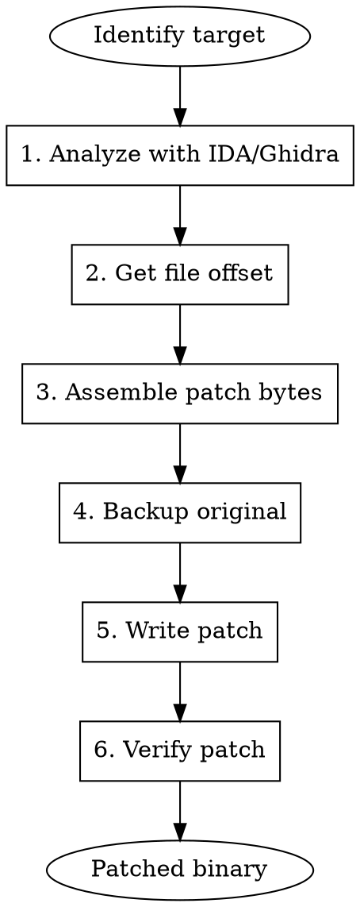

# Binary Patching

Techniques for modifying binary files using Keystone assembler and other tools for security research and reverse engineering.

## When to Use

- Bypassing anti-tampering/root detection at binary level
- Patching conditional jumps to skip checks
- Injecting inline hooks or trampolines
- Modifying hardcoded values (URLs, keys, configs)
- Creating binary patches for distribution
- NOP-ing out unwanted functionality

## Tools Overview

| Tool | Purpose | Use Case |
|------|---------|----------|
| **Keystone** | Assemble instructions | Generate patch bytes |
| **LIEF** | Parse/modify ELF/PE | Structural changes |
| **radare2** | Analysis + patching | Quick inline patches |
| **patchelf** | ELF manipulation | Change interpreter/rpath |

## Basic Keystone Usage

```python
from keystone import *

# Initialize assembler
ks = Ks(KS_ARCH_ARM64, KS_MODE_LITTLE_ENDIAN)

# Assemble single instruction
code, count = ks.asm("mov x0, #0")
print(f"Bytes: {bytes(code).hex()}")  # e00080d2

# Assemble multiple instructions
code, count = ks.asm("""
    mov x0, #1
    ret
""")
print(f"Assembled {count} instructions: {bytes(code).hex()}")
```

## Architecture Reference

| Arch | Keystone Constant | Mode |
|------|-------------------|------|
| ARM32 | `KS_ARCH_ARM` | `KS_MODE_ARM` / `KS_MODE_THUMB` |
| ARM64 | `KS_ARCH_ARM64` | `KS_MODE_LITTLE_ENDIAN` |
| x86 | `KS_ARCH_X86` | `KS_MODE_32` |
| x86-64 | `KS_ARCH_X86` | `KS_MODE_64` |
| MIPS | `KS_ARCH_MIPS` | `KS_MODE_MIPS32` |

## Patching Workflow



## Complete Patcher Script

```python
#!/usr/bin/env python3
# binary_patcher.py - Universal binary patcher
from keystone import *
import lief
import shutil
import sys

class BinaryPatcher:
    ARCH_MAP = {
        'arm': (KS_ARCH_ARM, KS_MODE_ARM),
        'thumb': (KS_ARCH_ARM, KS_MODE_THUMB),
        'arm64': (KS_ARCH_ARM64, KS_MODE_LITTLE_ENDIAN),
        'x86': (KS_ARCH_X86, KS_MODE_32),
        'x64': (KS_ARCH_X86, KS_MODE_64),
    }

    def __init__(self, filepath, arch='arm64'):
        self.filepath = filepath
        self.arch = arch
        self.ks = Ks(*self.ARCH_MAP[arch])
        self.binary = lief.parse(filepath)
        self.patches = []

    def va_to_offset(self, va):
        """Convert virtual address to file offset"""
        for section in self.binary.sections:
            if section.virtual_address <= va < section.virtual_address + section.size:
                return va - section.virtual_address + section.offset
        # Try segments if sections don't work
        for segment in self.binary.segments:
            if segment.virtual_address <= va < segment.virtual_address + segment.virtual_size:
                return va - segment.virtual_address + segment.file_offset
        raise ValueError(f"VA 0x{va:x} not found in any section/segment")

    def assemble(self, asm_code, address=0):
        """Assemble instructions to bytes"""
        try:
            code, count = self.ks.asm(asm_code, address)
            return bytes(code)
        except KsError as e:
            print(f"Keystone error: {e}")
            return None

    def add_patch(self, va, asm_code):
        """Add a patch at virtual address"""
        patch_bytes = self.assemble(asm_code, va)
        if patch_bytes:
            offset = self.va_to_offset(va)
            self.patches.append({
                'va': va,
                'offset': offset,
                'asm': asm_code,
                'bytes': patch_bytes
            })
            print(f"[+] Patch at VA 0x{va:x} (offset 0x{offset:x}): {patch_bytes.hex()}")
            return True
        return False

    def add_nop(self, va, count=1):
        """Add NOP instructions"""
        if self.arch in ['arm64']:
            nop = "nop"
        elif self.arch in ['arm', 'thumb']:
            nop = "nop" if self.arch == 'arm' else "nop.w"
        else:
            nop = "nop"

        asm = "\n".join([nop] * count)
        return self.add_patch(va, asm)

    def patch_jump(self, va, condition='always'):
        """Patch conditional jump to unconditional or NOP"""
        if self.arch == 'arm64':
            if condition == 'always':
                return self.add_patch(va, "b #0")  # Will be adjusted
            elif condition == 'never':
                return self.add_nop(va)
        elif self.arch in ['x86', 'x64']:
            if condition == 'always':
                return self.add_patch(va, "jmp short $")
            elif condition == 'never':
                return self.add_nop(va, 2)
        return False

    def patch_return(self, va, value=0):
        """Patch function to return immediately"""
        if self.arch == 'arm64':
            return self.add_patch(va, f"mov x0, #{value}\nret")
        elif self.arch == 'arm':
            return self.add_patch(va, f"mov r0, #{value}\nbx lr")
        elif self.arch in ['x86', 'x64']:
            reg = 'eax' if self.arch == 'x86' else 'rax'
            return self.add_patch(va, f"mov {reg}, {value}\nret")
        return False

    def apply_patches(self, output_path=None):
        """Apply all patches and save"""
        if not output_path:
            output_path = self.filepath + ".patched"

        # Backup and copy
        shutil.copy(self.filepath, output_path)

        with open(output_path, 'r+b') as f:
            for patch in self.patches:
                f.seek(patch['offset'])
                original = f.read(len(patch['bytes']))
                f.seek(patch['offset'])
                f.write(patch['bytes'])
                print(f"[*] Applied patch at 0x{patch['offset']:x}")
                print(f"    Original: {original.hex()}")
                print(f"    Patched:  {patch['bytes'].hex()}")

        print(f"\n[+] Saved patched binary to: {output_path}")
        return output_path

    def show_patches(self):
        """Display pending patches"""
        print("\n=== Pending Patches ===")
        for i, p in enumerate(self.patches):
            print(f"{i+1}. VA 0x{p['va']:x} -> {p['bytes'].hex()}")
            print(f"   ASM: {p['asm'].strip()}")


# Common patch patterns
class PatchPatterns:
    """Pre-built patch patterns for common bypass scenarios"""

    @staticmethod
    def bypass_root_check(patcher, func_va):
        """Make root check return false (not rooted)"""
        return patcher.patch_return(func_va, 0)

    @staticmethod
    def bypass_signature_check(patcher, func_va):
        """Make signature verification return true"""
        return patcher.patch_return(func_va, 1)

    @staticmethod
    def bypass_ssl_pinning(patcher, func_va):
        """Make SSL pinning check pass"""
        return patcher.patch_return(func_va, 1)

    @staticmethod
    def disable_anti_debug(patcher, func_va):
        """Disable anti-debugging function"""
        return patcher.patch_return(func_va, 0)

    @staticmethod
    def force_branch(patcher, branch_va, taken=True):
        """Force conditional branch to always/never taken"""
        return patcher.patch_jump(branch_va, 'always' if taken else 'never')


# Usage example
if __name__ == "__main__":
    # Example: Patch libfoo.so
    patcher = BinaryPatcher("libfoo.so", arch='arm64')

    # Bypass isRooted() at 0x1234
    patcher.patch_return(0x1234, 0)

    # NOP out frida detection at 0x5678
    patcher.add_nop(0x5678, 4)

    # Force jump at 0x9ABC
    patcher.add_patch(0x9ABC, "b #0x9B00")

    # Show and apply
    patcher.show_patches()
    patcher.apply_patches("libfoo_patched.so")
```

## Common Patch Patterns

### 1. Return True/False Immediately

```python
# ARM64: Return 0 (false)
ks = Ks(KS_ARCH_ARM64, KS_MODE_LITTLE_ENDIAN)
patch_false = ks.asm("mov x0, #0; ret")[0]  # e00080d2 c0035fd6

# ARM64: Return 1 (true)
patch_true = ks.asm("mov x0, #1; ret")[0]   # 200080d2 c0035fd6

# x64: Return 0
ks = Ks(KS_ARCH_X86, KS_MODE_64)
patch_false = ks.asm("xor eax, eax; ret")[0]  # 31c0 c3
```

### 2. NOP Slide

```python
# ARM64: NOP (4 bytes)
nop_arm64 = bytes([0x1f, 0x20, 0x03, 0xd5])

# ARM Thumb: NOP (2 bytes)
nop_thumb = bytes([0x00, 0xbf])

# x86/x64: NOP (1 byte)
nop_x86 = bytes([0x90])

# Multi-byte NOP (x86/x64)
nop_2 = bytes([0x66, 0x90])
nop_3 = bytes([0x0f, 0x1f, 0x00])
```

### 3. Unconditional Jump

```python
# ARM64: B (unconditional branch)
# Note: Offset is calculated relative to PC
def arm64_branch(target_offset):
    # B instruction: 0x14000000 | (offset >> 2)
    offset = (target_offset >> 2) & 0x03FFFFFF
    return (0x14000000 | offset).to_bytes(4, 'little')

# x86/x64: JMP short (2 bytes, -128 to +127)
def x86_jmp_short(offset):
    return bytes([0xEB, offset & 0xFF])

# x86/x64: JMP near (5 bytes)
def x86_jmp_near(offset):
    return b'\xE9' + (offset - 5).to_bytes(4, 'little', signed=True)
```

### 4. Patch Conditional to Unconditional

```python
# ARM64: CBZ/CBNZ -> B
# Original: CBZ X0, #offset (b4000000)
# Patched:  B #offset (14000000)

# x86: JZ/JNZ -> JMP
# Original: 74 XX (JZ short)
# Patched:  EB XX (JMP short)
```

## Using LIEF for Structural Changes

```python
import lief

# Parse binary
binary = lief.parse("libfoo.so")

# Modify exported function
for func in binary.exported_functions:
    if "isRooted" in func.name:
        print(f"Found: {func.name} at 0x{func.address:x}")

# Add new section for code cave
section = lief.ELF.Section(".patch")
section.content = [0x90] * 0x1000  # NOP sled
section.type = lief.ELF.SECTION_TYPES.PROGBITS
section.flags = lief.ELF.SECTION_FLAGS.EXECINSTR | lief.ELF.SECTION_FLAGS.ALLOC
binary.add(section)

# Save modified binary
binary.write("libfoo_modified.so")
```

## radare2 Quick Patches

```bash
# Open in write mode
r2 -w libfoo.so

# Seek to address
[0x00000000]> s 0x1234

# Write bytes directly
[0x00001234]> wx e00080d2c0035fd6  # mov x0, #0; ret

# Assemble and write
[0x00001234]> wa mov x0, 0; ret

# NOP out bytes
[0x00001234]> wao nop

# Patch conditional jump
[0x00001234]> wao jmp  # Convert to unconditional

# Save and quit
[0x00001234]> q
```

## Inline Hook Injection

```python
from keystone import *

def create_inline_hook_arm64(original_func, hook_func, trampoline_addr):
    """
    Create inline hook:
    1. Original function jumps to hook
    2. Hook can call trampoline (original code)
    """
    ks = Ks(KS_ARCH_ARM64, KS_MODE_LITTLE_ENDIAN)

    # Calculate branch offset
    hook_offset = hook_func - original_func

    # Patch for original function (jump to hook)
    patch_code = f"""
        ldr x16, #8
        br x16
        .quad {hook_func}
    """

    # Trampoline (execute original instructions then jump back)
    # First, copy original instructions to trampoline
    # Then add jump back
    trampoline_code = f"""
        // Original instructions go here (copied)
        ldr x16, #8
        br x16
        .quad {original_func + 16}  // Return after hook patch
    """

    hook_patch = bytes(ks.asm(patch_code)[0])
    trampoline_patch = bytes(ks.asm(trampoline_code)[0])

    return {
        'original_patch': (original_func, hook_patch),
        'trampoline': (trampoline_addr, trampoline_patch)
    }
```

## Batch Patching Script

```python
#!/usr/bin/env python3
# batch_patch.py - Apply patches from config file

import json
from binary_patcher import BinaryPatcher

def apply_patches_from_config(config_file, binary_path):
    """
    Config format:
    {
        "arch": "arm64",
        "patches": [
            {"type": "return", "va": "0x1234", "value": 0},
            {"type": "nop", "va": "0x5678", "count": 4},
            {"type": "asm", "va": "0x9ABC", "code": "b #0x100"}
        ]
    }
    """
    with open(config_file) as f:
        config = json.load(f)

    patcher = BinaryPatcher(binary_path, config['arch'])

    for patch in config['patches']:
        va = int(patch['va'], 16)

        if patch['type'] == 'return':
            patcher.patch_return(va, patch.get('value', 0))
        elif patch['type'] == 'nop':
            patcher.add_nop(va, patch.get('count', 1))
        elif patch['type'] == 'asm':
            patcher.add_patch(va, patch['code'])
        elif patch['type'] == 'bytes':
            # Direct byte patch
            offset = patcher.va_to_offset(va)
            patcher.patches.append({
                'va': va,
                'offset': offset,
                'asm': 'raw bytes',
                'bytes': bytes.fromhex(patch['bytes'])
            })

    patcher.show_patches()
    return patcher.apply_patches()

# Usage
if __name__ == "__main__":
    apply_patches_from_config("patches.json", "libfoo.so")
```

## Verifying Patches

```python
from capstone import *

def verify_patch(filepath, va, expected_asm, arch='arm64'):
    """Verify patch was applied correctly"""
    with open(filepath, 'rb') as f:
        # Read patched bytes (simplified - use proper VA->offset)
        f.seek(va)  # Should use va_to_offset
        code = f.read(16)

    md = Cs(CS_ARCH_ARM64 if arch == 'arm64' else CS_ARCH_X86,
            CS_MODE_ARM if arch == 'arm64' else CS_MODE_64)

    for insn in md.disasm(code, va):
        actual = f"{insn.mnemonic} {insn.op_str}".strip()
        print(f"0x{insn.address:x}: {actual}")
        if expected_asm.lower() in actual.lower():
            print("[+] Patch verified!")
            return True

    print("[-] Patch verification failed")
    return False
```

## Common Mistakes

| Mistake | Fix |
|---------|-----|
| Wrong endianness | ARM64 is little-endian |
| VA vs file offset confusion | Always convert VA to offset |
| Patch size mismatch | Ensure patch fits original space |
| Thumb mode on ARM | Check instruction alignment |
| Breaking relocations | Avoid patching relocated instructions |
| Missing backup | Always backup before patching |

## Dependencies

```bash
pip install keystone-engine lief capstone
```
