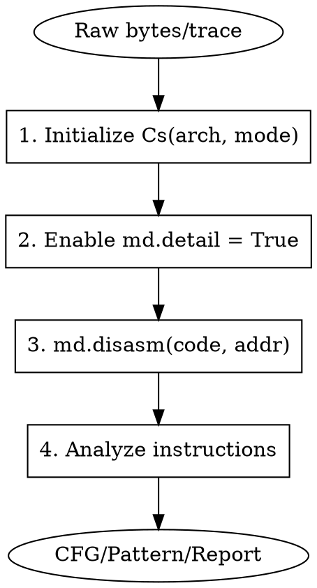

# Capstone Disassembler

Techniques for using Capstone disassembly engine to analyze binary code, parse instruction traces, and build analysis tools.

## When to Use

- Analyzing raw machine code or shellcode
- Parsing Frida/Unicorn instruction traces
- Building control flow graphs from binary
- Identifying instruction patterns (crypto, obfuscation)
- Creating custom disassembly tools
- Analyzing binary patches or modifications

## Quick Reference

| Architecture | Capstone Constant | Mode |
|--------------|-------------------|------|
| ARM32 | `CS_ARCH_ARM` | `CS_MODE_ARM` / `CS_MODE_THUMB` |
| ARM64 | `CS_ARCH_ARM64` | `CS_MODE_ARM` |
| x86 | `CS_ARCH_X86` | `CS_MODE_32` |
| x86-64 | `CS_ARCH_X86` | `CS_MODE_64` |
| MIPS32 | `CS_ARCH_MIPS` | `CS_MODE_MIPS32` |

## Basic Usage

```python
from capstone import *

# Initialize disassembler
md = Cs(CS_ARCH_ARM64, CS_MODE_ARM)
md.detail = True  # Enable detailed instruction info

# Disassemble bytes
code = bytes.fromhex("ff4300d1f44fbea9")
for insn in md.disasm(code, 0x1000):
    print(f"0x{insn.address:x}: {insn.mnemonic} {insn.op_str}")
```

## Workflow



## Complete Disassembler Script

```python
#!/usr/bin/env python3
# capstone_analyzer.py - Multi-arch disassembler with analysis
from capstone import *
from capstone.arm64 import *
from capstone.arm import *
from capstone.x86 import *
import sys

class Disassembler:
    ARCH_MAP = {
        'arm': (CS_ARCH_ARM, CS_MODE_ARM),
        'thumb': (CS_ARCH_ARM, CS_MODE_THUMB),
        'arm64': (CS_ARCH_ARM64, CS_MODE_ARM),
        'x86': (CS_ARCH_X86, CS_MODE_32),
        'x64': (CS_ARCH_X86, CS_MODE_64),
    }

    def __init__(self, arch='arm64'):
        arch_info = self.ARCH_MAP.get(arch)
        if not arch_info:
            raise ValueError(f"Unknown arch: {arch}")
        self.md = Cs(*arch_info)
        self.md.detail = True
        self.arch = arch

    def disasm(self, code, base_addr=0):
        """Disassemble and return instruction list"""
        instructions = []
        for insn in self.md.disasm(code, base_addr):
            instructions.append({
                'address': insn.address,
                'size': insn.size,
                'mnemonic': insn.mnemonic,
                'op_str': insn.op_str,
                'bytes': insn.bytes,
                'groups': insn.groups if insn.detail else [],
                'regs_read': insn.regs_read if insn.detail else [],
                'regs_write': insn.regs_write if insn.detail else [],
            })
        return instructions

    def print_disasm(self, code, base_addr=0):
        """Pretty print disassembly"""
        for insn in self.disasm(code, base_addr):
            hex_bytes = insn['bytes'].hex()
            print(f"0x{insn['address']:08x}:  {hex_bytes:<16}  {insn['mnemonic']:<8} {insn['op_str']}")

    def find_calls(self, code, base_addr=0):
        """Find all call/branch instructions"""
        calls = []
        for insn in self.md.disasm(code, base_addr):
            if insn.group(CS_GRP_CALL) or insn.group(CS_GRP_JUMP):
                target = None
                if insn.operands:
                    op = insn.operands[0]
                    if op.type == CS_OP_IMM:
                        target = op.imm
                calls.append({
                    'address': insn.address,
                    'mnemonic': insn.mnemonic,
                    'target': target
                })
        return calls

    def find_strings_refs(self, code, base_addr=0):
        """Find potential string/data references"""
        refs = []
        for insn in self.md.disasm(code, base_addr):
            # Look for ADR, ADRP, LEA patterns
            if insn.mnemonic in ['adr', 'adrp', 'lea', 'ldr']:
                for op in insn.operands:
                    if hasattr(op, 'imm') and op.imm > 0x1000:
                        refs.append({
                            'address': insn.address,
                            'ref': op.imm,
                            'insn': f"{insn.mnemonic} {insn.op_str}"
                        })
        return refs

# Usage
if __name__ == "__main__":
    # Example: Disassemble ARM64 code
    code = bytes.fromhex("ff4300d1f44fbea9fd7b01a9fd430091")

    d = Disassembler('arm64')
    print("=== Disassembly ===")
    d.print_disasm(code, 0x1000)

    print("\n=== Calls/Branches ===")
    for call in d.find_calls(code, 0x1000):
        print(f"  0x{call['address']:x}: {call['mnemonic']} -> {call['target']}")
```

## Parsing Frida Traces

```python
# Parse Frida Stalker trace output
import re
from capstone import *

def parse_frida_trace(trace_file, arch='arm64'):
    """Parse Frida trace and disassemble"""
    md = Cs(CS_ARCH_ARM64 if arch == 'arm64' else CS_ARCH_ARM,
            CS_MODE_ARM if arch == 'arm64' else CS_MODE_THUMB)
    md.detail = True

    # Frida trace format: address|bytes or JSON
    pattern = re.compile(r'0x([0-9a-fA-F]+)[:\s]+([0-9a-fA-F\s]+)')

    with open(trace_file, 'r') as f:
        for line in f:
            match = pattern.search(line)
            if match:
                addr = int(match.group(1), 16)
                code = bytes.fromhex(match.group(2).replace(' ', ''))

                for insn in md.disasm(code, addr):
                    print(f"0x{insn.address:x}: {insn.mnemonic} {insn.op_str}")

# Frida script to generate trace
FRIDA_TRACE_SCRIPT = '''
Stalker.follow(Process.getCurrentThreadId(), {
    transform: function(iterator) {
        var instruction;
        while ((instruction = iterator.next()) !== null) {
            console.log(instruction.address + ": " +
                        instruction.address.readByteArray(instruction.size).map(
                            b => ('0' + b.toString(16)).slice(-2)).join(''));
            iterator.keep();
        }
    }
});
'''
```

## Control Flow Graph Builder

```python
from capstone import *
from collections import defaultdict

class CFGBuilder:
    def __init__(self, arch='arm64'):
        arch_map = {
            'arm64': (CS_ARCH_ARM64, CS_MODE_ARM),
            'arm': (CS_ARCH_ARM, CS_MODE_ARM),
            'x64': (CS_ARCH_X86, CS_MODE_64),
        }
        self.md = Cs(*arch_map[arch])
        self.md.detail = True

    def build_cfg(self, code, base_addr=0):
        """Build control flow graph"""
        blocks = {}  # addr -> BasicBlock
        edges = defaultdict(list)  # src -> [dst, ...]

        # First pass: identify block boundaries
        leaders = {base_addr}  # Start of function

        for insn in self.md.disasm(code, base_addr):
            # Branch targets are leaders
            if insn.group(CS_GRP_JUMP) or insn.group(CS_GRP_CALL):
                for op in insn.operands:
                    if hasattr(op, 'imm'):
                        leaders.add(op.imm)
                # Instruction after branch is leader
                leaders.add(insn.address + insn.size)

        # Second pass: build blocks
        leaders = sorted(leaders)
        current_block = []
        current_start = base_addr

        for insn in self.md.disasm(code, base_addr):
            if insn.address in leaders and current_block:
                blocks[current_start] = current_block
                current_block = []
                current_start = insn.address

            current_block.append(insn)

            # Add edges
            if insn.group(CS_GRP_JUMP):
                for op in insn.operands:
                    if hasattr(op, 'imm'):
                        edges[current_start].append(op.imm)
                # Conditional jumps fall through
                if insn.mnemonic.startswith('b') and insn.mnemonic != 'b':
                    edges[current_start].append(insn.address + insn.size)
            elif not insn.group(CS_GRP_RET):
                # Sequential flow
                next_addr = insn.address + insn.size
                if next_addr in leaders:
                    edges[current_start].append(next_addr)

        if current_block:
            blocks[current_start] = current_block

        return blocks, dict(edges)

    def print_cfg(self, blocks, edges):
        """Print CFG in text format"""
        for addr, block in sorted(blocks.items()):
            print(f"\n=== Block 0x{addr:x} ===")
            for insn in block:
                print(f"  0x{insn.address:x}: {insn.mnemonic} {insn.op_str}")
            if addr in edges:
                print(f"  -> {', '.join(f'0x{e:x}' for e in edges[addr])}")

    def to_dot(self, blocks, edges):
        """Export CFG as DOT format"""
        dot = ["digraph CFG {", "  node [shape=box];"]

        for addr, block in blocks.items():
            label = "\\l".join(
                f"0x{i.address:x}: {i.mnemonic} {i.op_str}"
                for i in block
            )
            dot.append(f'  n{addr:x} [label="{label}\\l"];')

        for src, dsts in edges.items():
            for dst in dsts:
                dot.append(f"  n{src:x} -> n{dst:x};")

        dot.append("}")
        return "\n".join(dot)
```

## Instruction Pattern Matching

```python
from capstone import *

class PatternMatcher:
    """Find instruction patterns in code"""

    def __init__(self, arch='arm64'):
        self.md = Cs(CS_ARCH_ARM64 if arch == 'arm64' else CS_ARCH_X86,
                     CS_MODE_ARM if arch == 'arm64' else CS_MODE_64)
        self.md.detail = True

    def find_crypto_patterns(self, code, base_addr=0):
        """Detect potential crypto operations"""
        patterns = []
        insns = list(self.md.disasm(code, base_addr))

        for i, insn in enumerate(insns):
            # XOR patterns (common in crypto)
            if insn.mnemonic == 'eor' or insn.mnemonic == 'xor':
                patterns.append({
                    'type': 'xor',
                    'address': insn.address,
                    'insn': f"{insn.mnemonic} {insn.op_str}"
                })

            # Rotation patterns (ROL, ROR, ROTATE)
            if insn.mnemonic in ['ror', 'rol', 'extr']:
                patterns.append({
                    'type': 'rotate',
                    'address': insn.address,
                    'insn': f"{insn.mnemonic} {insn.op_str}"
                })

            # S-box access pattern (table lookup)
            if insn.mnemonic in ['ldrb', 'movzx'] and i > 0:
                prev = insns[i-1]
                if prev.mnemonic in ['and', 'ubfx']:  # Index masking
                    patterns.append({
                        'type': 'sbox_lookup',
                        'address': insn.address,
                        'insn': f"{insn.mnemonic} {insn.op_str}"
                    })

        return patterns

    def find_string_ops(self, code, base_addr=0):
        """Find string operation patterns"""
        patterns = []

        for insn in self.md.disasm(code, base_addr):
            # String compare patterns
            if insn.mnemonic in ['cmp', 'cmn'] and 'strb' in str(insn.operands):
                patterns.append({
                    'type': 'strcmp',
                    'address': insn.address
                })

            # Memory copy patterns
            if insn.mnemonic in ['ldp', 'stp', 'ldr', 'str']:
                patterns.append({
                    'type': 'memcpy',
                    'address': insn.address,
                    'insn': f"{insn.mnemonic} {insn.op_str}"
                })

        return patterns
```

## Integration with Frida

```javascript
// Frida script: disassemble at runtime
var capstoneModule = null;

// Load capstone (requires frida-compile with capstone.js)
function disasmAt(addr, size) {
    var code = addr.readByteArray(size);
    // Send to Python for disassembly
    send({type: 'disasm', addr: addr.toString(), code: Array.from(new Uint8Array(code))});
}

// Hook and disassemble
Interceptor.attach(targetAddr, {
    onEnter: function(args) {
        console.log("[*] Disassembling function at " + this.context.pc);
        disasmAt(this.context.pc, 64);
    }
});
```

```python
# Python receiver
import frida
from capstone import *

md = Cs(CS_ARCH_ARM64, CS_MODE_ARM)

def on_message(message, data):
    if message['type'] == 'send':
        payload = message['payload']
        if payload.get('type') == 'disasm':
            addr = int(payload['addr'], 16)
            code = bytes(payload['code'])
            print(f"\n=== Disassembly at 0x{addr:x} ===")
            for insn in md.disasm(code, addr):
                print(f"0x{insn.address:x}: {insn.mnemonic} {insn.op_str}")

# Setup Frida session...
```

## Common Instruction Groups

| Group | Constant | Description |
|-------|----------|-------------|
| Jump | `CS_GRP_JUMP` | All branch/jump instructions |
| Call | `CS_GRP_CALL` | Function calls |
| Return | `CS_GRP_RET` | Return instructions |
| Interrupt | `CS_GRP_INT` | Interrupts/syscalls |
| Privilege | `CS_GRP_PRIVILEGE` | Privileged instructions |

## Common Mistakes

| Mistake | Fix |
|---------|-----|
| Not enabling detail mode | Set `md.detail = True` |
| Wrong architecture/mode | Check binary with `file` command |
| Ignoring Thumb mode | ARM can switch modes dynamically |
| Missing alignment | Ensure code is properly aligned |
| Not handling errors | Wrap disasm in try/except |

## Dependencies

```bash
pip install capstone
```
