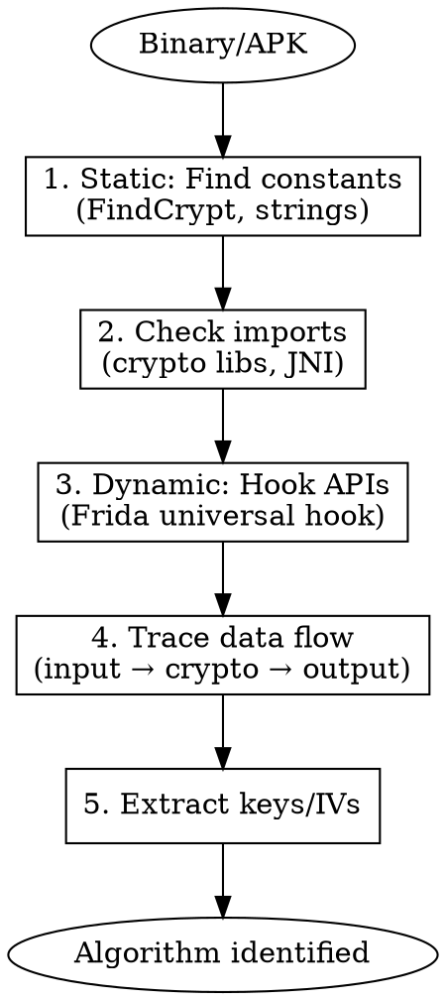

# Crypto Algorithm Identification

Quick reference for identifying and analyzing cryptographic algorithms in reverse engineering, including signatures, constants, and protection bypass techniques.

## When to Use

- Identifying unknown encryption in binaries
- Recognizing crypto by constants/S-boxes
- Analyzing app signature/encryption protection
- Reverse engineering custom crypto
- Finding hardcoded keys and IVs

## Algorithm Quick Reference

| Algorithm | Type | Key Size | Block/Output | Identifying Feature |
|-----------|------|----------|--------------|---------------------|
| AES | Symmetric | 128/192/256 bit | 128 bit block | S-box: `0x63, 0x7c, 0x77, 0x7b...` |
| DES | Symmetric | 56 bit | 64 bit block | IP/FP permutation tables |
| 3DES | Symmetric | 112/168 bit | 64 bit block | 3x DES operations |
| RC4 | Stream | 40-2048 bit | Stream | KSA + PRGA, no S-box constant |
| ChaCha20 | Stream | 256 bit | Stream | "expand 32-byte k" constant |
| RSA | Asymmetric | 1024-4096 bit | Variable | Large number operations, 0x10001 |
| MD5 | Hash | N/A | 128 bit | Init: `0x67452301, 0xefcdab89...` |
| SHA-1 | Hash | N/A | 160 bit | Init: `0x67452301, 0xefcdab89...` |
| SHA-256 | Hash | N/A | 256 bit | Init: `0x6a09e667, 0xbb67ae85...` |
| HMAC | MAC | Variable | Hash size | Hash(key ⊕ opad \|\| Hash(key ⊕ ipad \|\| msg)) |
| Base64 | Encoding | N/A | 4:3 ratio | Alphabet: `A-Za-z0-9+/=` |

## AES Identification

### S-Box (256 bytes)
```
63 7c 77 7b f2 6b 6f c5 30 01 67 2b fe d7 ab 76
ca 82 c9 7d fa 59 47 f0 ad d4 a2 af 9c a4 72 c0
b7 fd 93 26 36 3f f7 cc 34 a5 e5 f1 71 d8 31 15
04 c7 23 c3 18 96 05 9a 07 12 80 e2 eb 27 b2 75
...
```

### Rcon (Round Constants)
```
01 02 04 08 10 20 40 80 1b 36
```

### Detection Patterns
```python
# AES S-box signature (first 16 bytes)
AES_SBOX = bytes([0x63, 0x7c, 0x77, 0x7b, 0xf2, 0x6b, 0x6f, 0xc5,
                  0x30, 0x01, 0x67, 0x2b, 0xfe, 0xd7, 0xab, 0x76])

# Inverse S-box (first 16 bytes)
AES_INV_SBOX = bytes([0x52, 0x09, 0x6a, 0xd5, 0x30, 0x36, 0xa5, 0x38,
                      0xbf, 0x40, 0xa3, 0x9e, 0x81, 0xf3, 0xd7, 0xfb])
```

### Frida Hook - AES Key Extraction
```javascript
// Hook Android Cipher
Java.perform(function() {
    var Cipher = Java.use("javax.crypto.Cipher");
    var SecretKeySpec = Java.use("javax.crypto.spec.SecretKeySpec");

    Cipher.init.overload('int', 'java.security.Key').implementation = function(mode, key) {
        console.log("[AES] Mode: " + (mode == 1 ? "ENCRYPT" : "DECRYPT"));
        if (key.$className.includes("SecretKeySpec")) {
            var keyBytes = Java.cast(key, SecretKeySpec).getEncoded();
            console.log("[AES] Key: " + bytesToHex(keyBytes));
        }
        return this.init(mode, key);
    };

    Cipher.init.overload('int', 'java.security.Key', 'java.security.spec.AlgorithmParameterSpec').implementation = function(mode, key, params) {
        console.log("[AES] Mode: " + (mode == 1 ? "ENCRYPT" : "DECRYPT"));
        var keyBytes = Java.cast(key, SecretKeySpec).getEncoded();
        console.log("[AES] Key: " + bytesToHex(keyBytes));

        // Extract IV
        if (params.$className.includes("IvParameterSpec")) {
            var IvParameterSpec = Java.use("javax.crypto.spec.IvParameterSpec");
            var iv = Java.cast(params, IvParameterSpec).getIV();
            console.log("[AES] IV: " + bytesToHex(iv));
        }
        return this.init(mode, key, params);
    };
});

function bytesToHex(bytes) {
    var hex = [];
    for (var i = 0; i < bytes.length; i++) {
        hex.push(('0' + (bytes[i] & 0xFF).toString(16)).slice(-2));
    }
    return hex.join('');
}
```

## DES/3DES Identification

### Initial Permutation (IP) Table
```
58 50 42 34 26 18 10 02
60 52 44 36 28 20 12 04
62 54 46 38 30 22 14 06
64 56 48 40 32 24 16 08
57 49 41 33 25 17 09 01
59 51 43 35 27 19 11 03
61 53 45 37 29 21 13 05
63 55 47 39 31 23 15 07
```

### S-Boxes (8 boxes, 64 values each)
```
# S-box 1 (first row)
14 04 13 01 02 15 11 08 03 10 06 12 05 09 00 07
```

### Detection
```python
# DES IP table signature
DES_IP = bytes([58, 50, 42, 34, 26, 18, 10, 2,
                60, 52, 44, 36, 28, 20, 12, 4])

# DES S-box 1 signature
DES_SBOX1 = bytes([14, 4, 13, 1, 2, 15, 11, 8, 3, 10, 6, 12, 5, 9, 0, 7])
```

## RC4 Identification

### Characteristics
- No fixed constants (harder to detect)
- KSA: 256-iteration loop with swap
- PRGA: stream generation with swap
- Look for: `i = (i + 1) % 256; j = (j + S[i]) % 256; swap`

### Detection Pattern
```python
# RC4 pattern in assembly
# - Array of 256 bytes initialized 0-255
# - Two nested loops (KSA)
# - Continuous swap operations

def detect_rc4(code):
    """Look for RC4 patterns"""
    patterns = [
        b'\x00\x01\x02\x03\x04\x05\x06\x07',  # Sequential init
        # Look for mod 256 (AND 0xFF)
    ]
```

### Frida RC4 Hook
```javascript
// Hook common RC4 implementations
Interceptor.attach(Module.findExportByName(null, "RC4"), {
    onEnter: function(args) {
        console.log("[RC4] Key length: " + args[0].toInt32());
        console.log("[RC4] Key: " + hexdump(args[1], {length: args[0].toInt32()}));
    }
});
```

## MD5 Identification

### Initial Values (Little Endian)
```
A = 0x67452301
B = 0xEFCDAB89
C = 0x98BADCFE
D = 0x10325476
```

### Round Constants (K array, first 16)
```
d76aa478 e8c7b756 242070db c1bdceee
f57c0faf 4787c62a a8304613 fd469501
698098d8 8b44f7af ffff5bb1 895cd7be
```

### Detection
```python
MD5_INIT = [0x67452301, 0xEFCDAB89, 0x98BADCFE, 0x10325476]
MD5_K = [0xd76aa478, 0xe8c7b756, 0x242070db, 0xc1bdceee]
```

## SHA Family Identification

### SHA-1 Initial Values
```
H0 = 0x67452301
H1 = 0xEFCDAB89
H2 = 0x98BADCFE
H3 = 0x10325476
H4 = 0xC3D2E1F0
```

### SHA-256 Initial Values
```
H0 = 0x6a09e667    H4 = 0x510e527f
H1 = 0xbb67ae85    H5 = 0x9b05688c
H2 = 0x3c6ef372    H6 = 0x1f83d9ab
H3 = 0xa54ff53a    H7 = 0x5be0cd19
```

### SHA-256 Round Constants (K, first 16)
```
428a2f98 71374491 b5c0fbcf e9b5dba5
3956c25b 59f111f1 923f82a4 ab1c5ed5
d807aa98 12835b01 243185be 550c7dc3
72be5d74 80deb1fe 9bdc06a7 c19bf174
```

### Frida Hook - MessageDigest
```javascript
Java.perform(function() {
    var MessageDigest = Java.use("java.security.MessageDigest");

    MessageDigest.getInstance.overload('java.lang.String').implementation = function(algo) {
        console.log("[Hash] Algorithm: " + algo);
        return this.getInstance(algo);
    };

    MessageDigest.update.overload('[B').implementation = function(data) {
        console.log("[Hash] Input: " + bytesToHex(data));
        console.log("[Hash] Input (ASCII): " + bytesToAscii(data));
        return this.update(data);
    };

    MessageDigest.digest.overload().implementation = function() {
        var result = this.digest();
        console.log("[Hash] Output: " + bytesToHex(result));
        return result;
    };
});
```

## RSA Identification

### Characteristics
- Large prime numbers (p, q)
- Public exponent: commonly `0x10001` (65537)
- Operations: modular exponentiation
- Look for: BigInteger operations, Montgomery multiplication

### Common Constants
```
0x10001 = 65537 (common public exponent e)
```

### Frida RSA Hook
```javascript
Java.perform(function() {
    var RSAPublicKeySpec = Java.use("java.security.spec.RSAPublicKeySpec");
    var BigInteger = Java.use("java.math.BigInteger");

    RSAPublicKeySpec.$init.overload('java.math.BigInteger', 'java.math.BigInteger').implementation = function(modulus, exponent) {
        console.log("[RSA] Modulus (n): " + modulus.toString(16));
        console.log("[RSA] Exponent (e): " + exponent.toString(16));
        return this.$init(modulus, exponent);
    };
});
```

## HMAC Identification

### Structure
```
HMAC(K, m) = H((K' ⊕ opad) || H((K' ⊕ ipad) || m))

ipad = 0x36 repeated
opad = 0x5c repeated
```

### Detection
```python
HMAC_IPAD = 0x36  # Inner padding
HMAC_OPAD = 0x5c  # Outer padding
```

### Frida HMAC Hook
```javascript
Java.perform(function() {
    var Mac = Java.use("javax.crypto.Mac");

    Mac.getInstance.overload('java.lang.String').implementation = function(algo) {
        console.log("[HMAC] Algorithm: " + algo);
        return this.getInstance(algo);
    };

    Mac.init.overload('java.security.Key').implementation = function(key) {
        var SecretKeySpec = Java.use("javax.crypto.spec.SecretKeySpec");
        var keyBytes = Java.cast(key, SecretKeySpec).getEncoded();
        console.log("[HMAC] Key: " + bytesToHex(keyBytes));
        return this.init(key);
    };
});
```

## Base64 Identification

### Standard Alphabet
```
ABCDEFGHIJKLMNOPQRSTUVWXYZabcdefghijklmnopqrstuvwxyz0123456789+/
Padding: =
```

### URL-Safe Variant
```
ABCDEFGHIJKLMNOPQRSTUVWXYZabcdefghijklmnopqrstuvwxyz0123456789-_
```

### Custom Base64 Detection
```python
def detect_base64_table(binary):
    """Find custom Base64 alphabet"""
    # Look for 64-byte printable sequences
    import re
    pattern = rb'[A-Za-z0-9+/=\-_]{64}'
    matches = re.findall(pattern, binary)
    return matches
```

## ChaCha20/Salsa20 Identification

### ChaCha20 Constants
```
"expand 32-byte k" = 0x61707865, 0x3320646e, 0x79622d32, 0x6b206574
```

### Salsa20 Constants
```
"expand 32-byte k" (same ASCII, different arrangement)
```

## App Protection Patterns

### 1. Signature Verification
```java
// Common pattern
public boolean verifySignature(byte[] data, byte[] signature, PublicKey key) {
    Signature sig = Signature.getInstance("SHA256withRSA");
    sig.initVerify(key);
    sig.update(data);
    return sig.verify(signature);
}
```

**Bypass Hook:**
```javascript
Java.perform(function() {
    var Signature = Java.use("java.security.Signature");

    Signature.verify.overload('[B').implementation = function(sig) {
        console.log("[Signature] Bypassing verification");
        return true;  // Always return true
    };
});
```

### 2. Certificate Pinning
```javascript
// Bypass SSL Pinning (multiple methods)
Java.perform(function() {
    // TrustManager bypass
    var TrustManager = Java.use('javax.net.ssl.X509TrustManager');
    var SSLContext = Java.use('javax.net.ssl.SSLContext');

    var TrustManagerImpl = Java.registerClass({
        name: 'com.bypass.TrustManager',
        implements: [TrustManager],
        methods: {
            checkClientTrusted: function(chain, authType) {},
            checkServerTrusted: function(chain, authType) {},
            getAcceptedIssuers: function() { return []; }
        }
    });

    // OkHttp CertificatePinner
    try {
        var CertificatePinner = Java.use('okhttp3.CertificatePinner');
        CertificatePinner.check.overload('java.lang.String', 'java.util.List').implementation = function() {};
    } catch(e) {}
});
```

### 3. Request Signing
```
Common flow:
1. Collect parameters
2. Sort parameters
3. Concatenate with separator
4. Add timestamp/nonce
5. HMAC-SHA256 with secret key
6. Base64 encode result
```

**Analysis Hook:**
```javascript
// Hook to capture signing process
Java.perform(function() {
    // Find the signing method by class name pattern
    Java.enumerateLoadedClasses({
        onMatch: function(className) {
            if (className.includes("Sign") || className.includes("Crypto")) {
                console.log("Found: " + className);
                try {
                    var cls = Java.use(className);
                    var methods = cls.class.getDeclaredMethods();
                    methods.forEach(function(m) {
                        console.log("  Method: " + m.getName());
                    });
                } catch(e) {}
            }
        },
        onComplete: function() {}
    });
});
```

### 4. Data Encryption at Rest
```javascript
// Hook SharedPreferences encryption
Java.perform(function() {
    var SharedPreferences = Java.use("android.content.SharedPreferences");
    var Editor = Java.use("android.content.SharedPreferences$Editor");

    Editor.putString.implementation = function(key, value) {
        console.log("[SharedPref] Key: " + key + ", Value: " + value);
        return this.putString(key, value);
    };
});
```

### 5. Anti-Tampering (Hash Check)
```javascript
// Common: App calculates hash of DEX/SO and compares
Java.perform(function() {
    // Hook file reading to detect integrity checks
    var FileInputStream = Java.use("java.io.FileInputStream");

    FileInputStream.$init.overload('java.lang.String').implementation = function(path) {
        if (path.includes(".dex") || path.includes(".so")) {
            console.log("[Integrity] Reading: " + path);
        }
        return this.$init(path);
    };
});
```

## Native Crypto Detection

### radare2 Commands
```bash
# Find crypto constants
r2 -A binary
[0x00000000]> /x 637c777b      # AES S-box
[0x00000000]> /x 67452301      # MD5/SHA init
[0x00000000]> /x 6a09e667      # SHA-256 init
[0x00000000]> /x 01000100      # 0x10001 (RSA e)

# Find crypto functions
[0x00000000]> afl~aes,des,md5,sha,rsa,encrypt,decrypt,hash

# Analyze crypto library
[0x00000000]> ii~crypto,ssl,boringssl
```

### IDA/Ghidra Signatures
```
FindCrypt plugin - automatically identifies crypto constants
Signsrch - signature search tool
```

## Crypto Detection Script

```python
#!/usr/bin/env python3
"""Crypto algorithm detector for binaries"""

import re
import sys

SIGNATURES = {
    'AES': {
        'sbox': bytes([0x63, 0x7c, 0x77, 0x7b, 0xf2, 0x6b, 0x6f, 0xc5]),
        'inv_sbox': bytes([0x52, 0x09, 0x6a, 0xd5, 0x30, 0x36, 0xa5, 0x38]),
        'rcon': bytes([0x01, 0x02, 0x04, 0x08, 0x10, 0x20, 0x40, 0x80, 0x1b, 0x36]),
    },
    'DES': {
        'ip': bytes([58, 50, 42, 34, 26, 18, 10, 2]),
        'sbox1': bytes([14, 4, 13, 1, 2, 15, 11, 8]),
    },
    'MD5': {
        'init': b'\x01\x23\x45\x67\x89\xab\xcd\xef\xfe\xdc\xba\x98\x76\x54\x32\x10',
        'k': b'\x78\xa4\x6a\xd7\x56\xb7\xc7\xe8',
    },
    'SHA256': {
        'init': b'\x67\xe6\x09\x6a\x85\xae\x67\xbb',
        'k': b'\x98\x2f\x8a\x42\x91\x44\x37\x71',
    },
    'ChaCha20': {
        'sigma': b'expand 32-byte k',
    },
    'Base64': {
        'std': b'ABCDEFGHIJKLMNOPQRSTUVWXYZabcdefghijklmnopqrstuvwxyz0123456789+/',
        'url': b'ABCDEFGHIJKLMNOPQRSTUVWXYZabcdefghijklmnopqrstuvwxyz0123456789-_',
    },
    'RSA': {
        'e_65537': b'\x01\x00\x01',  # 0x10001 in big endian
    },
}

def scan_binary(filepath):
    """Scan binary for crypto signatures"""
    with open(filepath, 'rb') as f:
        data = f.read()

    results = []
    for algo, sigs in SIGNATURES.items():
        for name, sig in sigs.items():
            offset = data.find(sig)
            if offset != -1:
                results.append({
                    'algorithm': algo,
                    'signature': name,
                    'offset': hex(offset),
                })

    return results

if __name__ == '__main__':
    if len(sys.argv) < 2:
        print(f"Usage: {sys.argv[0]} <binary>")
        sys.exit(1)

    results = scan_binary(sys.argv[1])
    for r in results:
        print(f"[{r['algorithm']}] {r['signature']} found at {r['offset']}")
```

## Universal Crypto Hook

```javascript
// Universal crypto monitoring hook
Java.perform(function() {
    console.log("=== Crypto Monitor Active ===");

    // Cipher operations
    var Cipher = Java.use("javax.crypto.Cipher");
    Cipher.doFinal.overload('[B').implementation = function(data) {
        var algo = this.getAlgorithm();
        console.log("\n[Cipher." + algo + "]");
        console.log("  Input: " + bytesToHex(data));
        var result = this.doFinal(data);
        console.log("  Output: " + bytesToHex(result));
        return result;
    };

    // Hash operations
    var MessageDigest = Java.use("java.security.MessageDigest");
    MessageDigest.digest.overload('[B').implementation = function(data) {
        var algo = this.getAlgorithm();
        console.log("\n[Hash." + algo + "]");
        console.log("  Input: " + bytesToHex(data));
        var result = this.digest(data);
        console.log("  Output: " + bytesToHex(result));
        return result;
    };

    // MAC operations
    var Mac = Java.use("javax.crypto.Mac");
    Mac.doFinal.overload('[B').implementation = function(data) {
        var algo = this.getAlgorithm();
        console.log("\n[MAC." + algo + "]");
        console.log("  Input: " + bytesToHex(data));
        var result = this.doFinal(data);
        console.log("  Output: " + bytesToHex(result));
        return result;
    };

    // Signature operations
    var Signature = Java.use("java.security.Signature");
    Signature.update.overload('[B').implementation = function(data) {
        console.log("\n[Signature." + this.getAlgorithm() + "]");
        console.log("  Data: " + bytesToHex(data));
        return this.update(data);
    };
});

function bytesToHex(bytes) {
    if (!bytes) return "null";
    var hex = [];
    for (var i = 0; i < bytes.length; i++) {
        hex.push(('0' + (bytes[i] & 0xFF).toString(16)).slice(-2));
    }
    return hex.join('');
}
```

## Common Mistakes

| Mistake | Reality |
|---------|---------|
| Confusing MD5/SHA-1 init values | MD5 and SHA-1 share first 4 init values |
| Missing endianness | Constants may be little/big endian |
| Custom implementations | Apps may modify standard algorithms |
| White-box crypto | Keys embedded in lookup tables |
| Only hooking Java | Native crypto in SO files needs native hooks |

## Analysis Workflow



## Dependencies

```bash
# Frida
pip install frida-tools

# radare2 with crypto plugins
r2pm -ci r2findcrypt

# Python crypto detection
pip install pycryptodome yara-python
```
