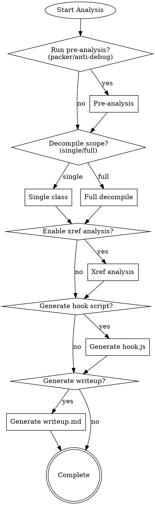
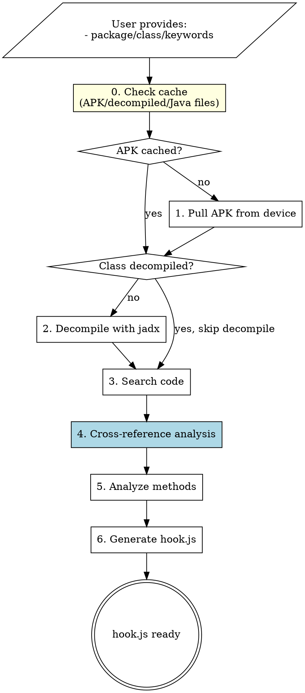

# Frida Hook Workflow

End-to-end workflow for Android app analysis: APK extraction → decompilation → code search → Frida hook generation.

## Input Requirements

Before starting, gather these from user:

| Info Type | Example | Purpose |
|-----------|---------|---------|
| Package name | `com.example.app` | Pull APK, attach Frida |
| Target class | `com.example.Crypto` | jadx single-class extraction |
| Keywords | `encrypt`, `sign`, `token` | Grep search in decompiled code |
| Method names | `doLogin`, `verify` | Generate specific hooks |
| Parameter types | `String`, `byte[]` | Method signature matching |

## Interactive Options (ASK USER)

**IMPORTANT**: Before executing, ask user which features to enable:

### Feature Selection Questions

```
1. Pre-analysis options:
   [ ] Packer/Protector detection (check for jiagu, DexGuard, etc.)
   [ ] Anti-debug detection analysis
   [ ] Native library security check

2. Decompilation scope:
   ( ) Single class only (fast)
   ( ) Full decompile (for comprehensive search)

3. Analysis features:
   [ ] Cross-reference analysis (find callers/callees)
   [ ] Generate call graph diagram
   [ ] Search for related strings/constants

4. Output options:
   [ ] Generate Frida hook script
   [ ] Generate analysis report (writeup)
   [ ] Export call graph as image
```

### Question Flow



### Pre-Analysis Details

#### Packer/Protector Detection

```bash
# Check for common packers
rg -l "com.secneo|com.stub|com.qihoo|com.tencent.StubShell" ./jadx_output/sources/
rg -l "jiagu|360|bangcle|ijiami" ./jadx_output/sources/ -i

# Check native libs
ls ./apk_output/lib/*/lib*.so | xargs -I{} sh -c 'echo "=== {} ===" && file {}'

# Look for encrypted dex
unzip -l ./apk_output/app.apk | grep -E "\.dex|assets/"
```

#### Anti-Debug Detection

```bash
# Search for anti-debug patterns
rg -n "Debug.isDebuggerConnected|android.os.Debug" ./jadx_output/sources/
rg -n "TracerPid|/proc/self/status" ./jadx_output/sources/
rg -n "ptrace|PTRACE_TRACEME" ./jadx_output/sources/
rg -n "frida|xposed|substrate" ./jadx_output/sources/ -i
```

#### Security Features Summary

| Check | Pattern | Found | Risk |
|-------|---------|-------|------|
| Packer | `com.stub.*` | Yes/No | Increases complexity |
| Anti-Debug | `isDebuggerConnected` | Yes/No | May block Frida |
| Root Detection | `su`, `/system/app/Superuser` | Yes/No | May need bypass |
| Frida Detection | `frida`, `gum-js-loop` | Yes/No | Need stealth mode |

## Workflow



## Step 0: Cache Check (ALWAYS DO FIRST)

Before any operation, check existing cache to avoid redundant work:

```bash
# Define cache paths (adjust to your project)
PROJECT_DIR="."
APK_CACHE="$PROJECT_DIR/apk_output"
JADX_CACHE="$PROJECT_DIR/jadx_output"
CLASS_CACHE="$PROJECT_DIR"  # for single-class .java files
```

### Cache Check Commands

| Check | Command | If exists |
|-------|---------|-----------|
| APK file | `ls $APK_CACHE/*.apk 2>/dev/null` | Skip pull |
| Full decompile | `ls $JADX_CACHE/sources/ 2>/dev/null` | Skip jadx full |
| Single class | `ls $CLASS_CACHE/<ClassName>.java 2>/dev/null` | Skip jadx single-class |
| hook.js | `ls $PROJECT_DIR/hook.js 2>/dev/null` | Ask user: append or overwrite? |

### Cache Decision Logic

```bash
# 1. Check APK
if ls ./apk_output/*.apk 1>/dev/null 2>&1; then
    echo "[CACHE HIT] APK exists, skipping pull"
    APK_PATH=$(ls ./apk_output/*.apk | head -1)
else
    echo "[CACHE MISS] Need to pull APK"
    # ... pull APK
fi

# 2. Check decompiled class
CLASS_FILE="./$(echo $CLASS_NAME | sed 's/.*\.//')".java
if [ -f "$CLASS_FILE" ]; then
    echo "[CACHE HIT] $CLASS_FILE exists, skipping decompile"
else
    echo "[CACHE MISS] Need to decompile $CLASS_NAME"
    # ... run jadx
fi

# 3. Check full jadx output
if [ -d "./jadx_output/sources" ]; then
    echo "[CACHE HIT] Full decompile exists"
else
    echo "[CACHE MISS] Need full decompile for search"
fi
```

### When to Invalidate Cache

| Scenario | Action |
|----------|--------|
| App updated on device | Delete APK, re-pull |
| Need different class | Keep APK, decompile new class |
| Search across all code | Need full jadx output |
| User requests fresh | `rm -rf ./apk_output ./jadx_output *.java` |

## Step 1: Pull APK

```bash
# Find package
frida-ps -U -a | grep -i <keyword>

# Get APK path
adb shell pm path <package>

# Pull
mkdir -p ./apk_output
adb pull <path> ./apk_output/app.apk
```

## Step 2: Decompile

**Single class (fast):**
```bash
export JAVA_HOME=/path/to/java11+
jadx --single-class <full.class.name> \
     --single-class-output ./ClassName.java \
     ./apk_output/app.apk
```

**Full decompile (for search):**
```bash
jadx -d ./jadx_output -r ./apk_output/app.apk  # -r skips resources
```

## Step 3: Search Code

**By keyword:**
```bash
# In full decompile output
rg -n "encrypt|decrypt|sign" ./jadx_output/sources/
rg -n "api[_-]?key|secret|token" ./jadx_output/sources/ -i
```

**By class pattern:**
```bash
rg -l "class.*Crypto|class.*Cipher" ./jadx_output/sources/
```

**By method call:**
```bash
rg -n "\.doFinal\(|\.update\(" ./jadx_output/sources/
```

**Find strings:**
```bash
rg -n '"https://|"http://' ./jadx_output/sources/
rg -n "password|secret" ./jadx_output/sources/ -i
```

## Step 4: Cross-Reference Analysis (IMPORTANT)

Find all callers and callees of target methods to understand the complete call chain.

### 4.1 Find Who Calls Target Method

```bash
# Search for method invocations in decompiled code
rg -n "\.targetMethod\(" ./jadx_output/sources/
rg -n "ClassName\.staticMethod\(" ./jadx_output/sources/

# Find class instantiation
rg -n "new TargetClass\(" ./jadx_output/sources/
```

### 4.2 Find What Target Method Calls

```bash
# Read the target class and identify called methods
# Look for:
# - Other class method calls
# - Native library calls (System.loadLibrary)
# - Framework API calls
```

### 4.3 Build Call Graph

| Caller | Target | Callee | Notes |
|--------|--------|--------|-------|
| `MainActivity.onClick()` | `Crypto.sign()` | `native signImpl()` | User triggered |
| `NetworkManager.request()` | `Crypto.sign()` | `native signImpl()` | API request |
| `Crypto.sign()` | - | `Base64.encode()` | Output encoding |

### 4.4 Cross-Reference Summary Template

```markdown
## Cross-Reference Analysis

### Target: `com.example.Crypto.sign()`

#### Callers (Who calls this method)

| Caller Class | Caller Method | Context |
|--------------|---------------|---------|
| `MainActivity` | `onLoginClick()` | User login |
| `ApiClient` | `makeRequest()` | Every API call |
| `TokenManager` | `refreshToken()` | Token refresh |

#### Callees (What this method calls)

| Called Class | Called Method | Purpose |
|--------------|---------------|---------|
| `NativeLib` | `signNative()` | Core signing |
| `Base64` | `encodeToString()` | Output encoding |
| `System` | `currentTimeMillis()` | Timestamp |

#### Call Flow Diagram

```
┌──────────────┐     ┌─────────────┐     ┌────────────┐
│ MainActivity │────>│ Crypto.sign │────>│ NativeLib  │
│ onLoginClick │     │             │     │ signNative │
└──────────────┘     └─────────────┘     └────────────┘
                            │
                            v
                     ┌─────────────┐
                     │   Base64    │
                     │ encode      │
                     └─────────────┘
```

#### Entry Points Identified

1. **User Action**: `MainActivity.onLoginClick()` → triggered by UI
2. **Background**: `TokenManager.refreshToken()` → triggered by timer
3. **Network**: `ApiClient.makeRequest()` → all API calls

#### Hook Strategy Based on Xref

| Priority | Method to Hook | Reason |
|----------|----------------|--------|
| P1 | `Crypto.sign()` | Central point, all paths converge |
| P2 | `NativeLib.signNative()` | Core algorithm |
| P3 | `ApiClient.makeRequest()` | See complete request context |
```

### 4.5 jadx-gui for Interactive Xref (Optional)

```bash
# Launch jadx-gui for interactive analysis
jadx-gui ./apk_output/app.apk

# In jadx-gui:
# 1. Navigate to target class
# 2. Right-click method → "Find Usage" (Ctrl+U)
# 3. See all callers
# 4. Double-click to navigate
```

## Step 5: Analyze Methods

### Identify Method Types

| Pattern | Type | Hook Approach |
|---------|------|---------------|
| `native void foo()` | JNI native | Java.use + implementation |
| `public void bar()` | Java method | Java.use + implementation |
| `static int baz()` | Static Java | Java.use + implementation |
| Constructor | `$init` | Java.use + `$init.overload()` |

### Extract Signatures

From decompiled Java:
```java
public native int[] compute(long handle, byte[] data, boolean flag);
//     ^^^^^^ ^^^ ^^^^^^^ ^^^^^^^^^^^^^^^^^^^^^^^^^^^^^^^^^^^^^^^^^^^
//     native ret method  parameters
```

## Step 6: Generate Hook Script

### Template for Java/Native Methods

```javascript
Java.perform(() => {
    // === Utilities ===
    function bytesToHex(bytes) {
        if (!bytes) return "null";
        var hex = [];
        for (var i = 0; i < bytes.length; i++) {
            hex.push(('0' + (bytes[i] & 0xFF).toString(16)).slice(-2));
        }
        return hex.join(' ');
    }

    function log(msg) {
        console.log("[" + new Date().toISOString() + "] " + msg);
    }

    // === Target Class ===
    var TargetClass = Java.use("{{FULL_CLASS_NAME}}");

    // === Hook: methodName ===
    TargetClass["{{METHOD_NAME}}"].implementation = function({{PARAMS}}) {
        log("{{METHOD_NAME}}() called");
        {{LOG_EACH_PARAM}}

        var result = this["{{METHOD_NAME}}"]({{PARAMS}});

        log("{{METHOD_NAME}}() result: " + result);
        return result;
    };
});
```

### Parameter Logging Templates

| Type | Template |
|------|----------|
| `int/long/boolean` | `log("  param=" + param);` |
| `String` | `log("  str=" + str);` |
| `byte[]` | `log("  bytes.len=" + (bytes ? bytes.length : "null"));` |
| `byte[]` preview | `log("  preview=" + bytesToHex(bytes.slice(0,32)));` |
| `int[]` | `log("  arr=" + JSON.stringify(Java.array('int', arr)));` |
| `Object` | `log("  obj=" + obj.toString());` |

### Overloaded Methods

```javascript
// Hook specific overload
TargetClass["method"].overload("java.lang.String", "int").implementation = ...

// Hook ALL overloads
TargetClass["method"].overloads.forEach(function(overload) {
    overload.implementation = function() {
        log("method called with " + arguments.length + " args");
        return overload.apply(this, arguments);
    };
});
```

### Constructor Hook

```javascript
TargetClass["$init"].overload("java.lang.String").implementation = function(arg) {
    log("Constructor called: " + arg);
    this["$init"](arg);
};
```

### Static Method Hook

```javascript
// Same syntax - just use Java.use
TargetClass["staticMethod"].implementation = function() {
    log("Static method called");
    return this["staticMethod"]();
};
```

## Advanced Patterns

### Save Data to File

```javascript
function saveToFile(filename, data) {
    var File = Java.use("java.io.File");
    var FileOutputStream = Java.use("java.io.FileOutputStream");
    var file = File.$new("/data/local/tmp/" + filename);
    var fos = FileOutputStream.$new(file);
    fos.write(data);
    fos.close();
    log("Saved: /data/local/tmp/" + filename);
}
```

### Print Stack Trace

```javascript
function printStackTrace() {
    var Log = Java.use("android.util.Log");
    var Exception = Java.use("java.lang.Exception");
    log(Log.getStackTraceString(Exception.$new()));
}
```

### Find Existing Instances

```javascript
Java.choose("com.example.TargetClass", {
    onMatch: function(instance) {
        log("Found instance: " + instance);
        log("Field value: " + instance.someField.value);
    },
    onComplete: function() { log("Search complete"); }
});
```

### Spawn Mode Stability

```javascript
function hookMain() {
    // All hooks here
}

if (Java.available) {
    setTimeout(function() {
        Java.perform(hookMain);
    }, 1000);
} else {
    Java.deoptimizeEverything();
    var checkJava = setInterval(function() {
        if (Java.available) {
            clearInterval(checkJava);
            Java.perform(hookMain);
        }
    }, 500);
}
```

## Run Hook

```bash
# Spawn mode (recommended)
frida -U -f <package> -l hook.js

# Attach mode
frida -U <package> -l hook.js

# With script reload on change
frida -U -f <package> -l hook.js --runtime=v8
```

## Quick Checklist

- [ ] **Cache check**: `ls ./apk_output/*.apk ./jadx_output/sources/ *.java 2>/dev/null`
- [ ] Get package name: `frida-ps -U -a` (if unknown)
- [ ] Pull APK (if not cached): `adb pull $(adb shell pm path <pkg> | sed 's/package://') ./apk_output/`
- [ ] Decompile (if not cached): `jadx --single-class <class> --single-class-output ./Class.java <apk>`
- [ ] **Cross-reference analysis**:
  - [ ] Find callers: `rg -n "\.methodName\(" ./jadx_output/sources/`
  - [ ] Find callees: Read target method body
  - [ ] Build call graph table
  - [ ] Identify entry points
- [ ] Find methods: `grep -E "(public|private|native).*\(" Class.java`
- [ ] Determine hook strategy based on xref analysis
- [ ] Check existing hook.js: append new hooks or overwrite?
- [ ] Generate hooks for each method
- [ ] Test: `frida -U -f <pkg> -l hook.js`

## Common Issues

| Issue | Solution |
|-------|----------|
| jadx needs newer Java | `export JAVA_HOME=/path/to/java17` |
| Hook not triggering | Use spawn mode `-f`, add setTimeout delay |
| Can't find class | Check full package path, use `Java.enumerateLoadedClasses()` |
| byte[].slice error | Check null: `bytes ? bytes.slice(0,32) : null` |
| Multiple overloads | Use `.overload(types...)` or hook all `.overloads` |
