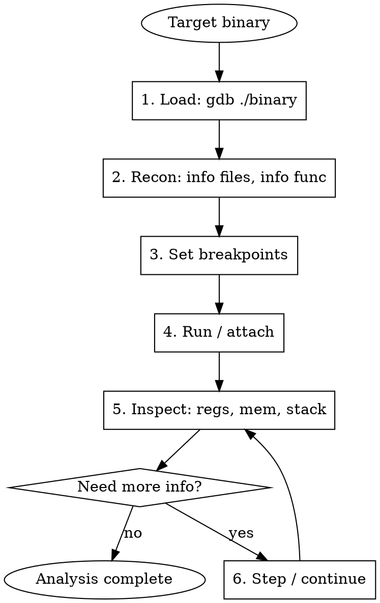

# GDB Reverse Engineering

Comprehensive guide for using GDB (GNU Debugger) in reverse engineering, vulnerability research, and binary analysis.

## When to Use

- Dynamic analysis of ELF/Mach-O binaries
- Debugging crashes, segfaults, memory corruption
- Setting breakpoints on functions/addresses to inspect state
- Examining registers, stack, heap at runtime
- Remote debugging via gdbserver (Android, embedded)
- Scripting automated analysis with GDB Python API
- CTF challenges requiring runtime debugging
- Anti-debug bypass and binary patching at runtime

## Quick Reference - Essential Commands

| Command | Description |
|---------|-------------|
| `r` / `run` | Start program |
| `c` / `continue` | Continue execution |
| `b *0x401234` | Breakpoint at address |
| `b main` | Breakpoint at symbol |
| `ni` / `si` | Step over / step into (instruction) |
| `n` / `s` | Step over / step into (source line) |
| `info reg` | Show all registers |
| `x/20gx $rsp` | Examine 20 qwords at RSP |
| `x/s addr` | Print string at address |
| `disas func` | Disassemble function |
| `bt` | Backtrace |
| `info proc mappings` | Memory map |
| `set $rax=0x1` | Modify register |
| `set {int}0x601000=42` | Write memory |
| `watch *0x601000` | Hardware watchpoint |

## Workflow



## Starting GDB

```bash
# Local binary
gdb ./binary
gdb -q ./binary                  # Quiet mode (no banner)
gdb --args ./binary arg1 arg2    # With arguments

# Attach to running process
gdb -p <pid>
gdb -q -p $(pidof target)

# Core dump analysis
gdb ./binary core

# Remote debugging
gdb -q ./binary -ex "target remote host:port"

# With init commands
gdb -q -ex "b main" -ex "r" ./binary

# Batch mode (non-interactive)
gdb -batch -x commands.gdb ./binary
```

## Breakpoints and Watchpoints

```
# Function breakpoints
(gdb) b main                     # Break at main
(gdb) b *0x401234                # Break at address
(gdb) b *main+42                 # Break at offset from symbol
(gdb) b file.c:123               # Break at source line

# Conditional breakpoints
(gdb) b *0x401234 if $rax==0x41  # Break when RAX=0x41
(gdb) b *0x401234 if $rdi!=0     # Break when RDI nonzero
(gdb) b strcmp if *(char*)$rdi=='f'  # Break on specific arg

# Temporary breakpoints (hit once)
(gdb) tb *0x401234               # One-shot breakpoint

# Hardware watchpoints
(gdb) watch *0x601000            # Break on write
(gdb) rwatch *0x601000           # Break on read
(gdb) awatch *0x601000           # Break on read/write
(gdb) watch *(int*)$rbp-0x10     # Watch stack variable

# Catchpoints
(gdb) catch syscall              # Break on any syscall
(gdb) catch syscall open read    # Break on specific syscalls
(gdb) catch signal SIGSEGV       # Break on signal

# Manage breakpoints
(gdb) info break                 # List breakpoints
(gdb) delete 3                   # Delete breakpoint #3
(gdb) disable 2                  # Disable breakpoint #2
(gdb) enable 2                   # Enable breakpoint #2
(gdb) ignore 1 100               # Skip bp#1 next 100 hits

# Breakpoint commands (execute on hit)
(gdb) b *0x401234
(gdb) commands
> silent
> printf "RAX=0x%lx RDI=0x%lx\n", $rax, $rdi
> x/s $rdi
> continue
> end
```

## Execution Control

```
# Run
(gdb) r                          # Run from start
(gdb) r < input.txt              # Run with stdin
(gdb) r arg1 arg2                # Run with args
(gdb) set args arg1 arg2         # Set args for next run

# Stepping
(gdb) si                         # Step instruction (into calls)
(gdb) ni                         # Next instruction (over calls)
(gdb) s                          # Step source line (into)
(gdb) n                          # Next source line (over)
(gdb) si 10                      # Step 10 instructions
(gdb) fin                        # Finish current function
(gdb) advance *0x401300          # Run until address
(gdb) until *0x401300            # Run until address (no loop)

# Continue
(gdb) c                          # Continue
(gdb) c 5                        # Continue, skip next 5 bp hits
(gdb) signal 0                   # Continue suppressing signal

# Return from function
(gdb) return                     # Return from current function
(gdb) return 0x1                 # Return with value
```

## Registers

```
# View registers
(gdb) info reg                   # All general registers
(gdb) info all-reg               # All registers (incl. FP/SIMD)
(gdb) p $rax                     # Print RAX
(gdb) p/x $rax                   # Print RAX in hex
(gdb) p/t $rax                   # Print RAX in binary
(gdb) p $eflags                  # Flags register

# Modify registers
(gdb) set $rax=0x1337
(gdb) set $rip=0x401234          # Jump to address
(gdb) set $eflags|=0x40          # Set ZF (zero flag)
(gdb) set $eflags&=~0x40         # Clear ZF

# ARM64 registers
(gdb) info reg x0 x1 x2          # Function args
(gdb) p $x0                      # First argument
(gdb) p $pc                      # Program counter
(gdb) p $sp                      # Stack pointer
(gdb) p $lr                      # Link register
```

## Memory Examination

The `x` command format: `x/NFU addr` — N=count, F=format, U=unit size.

| Format (F) | Meaning | Unit (U) | Size |
|------------|---------|----------|------|
| `x` | Hex | `b` | Byte (1) |
| `d` | Decimal | `h` | Halfword (2) |
| `u` | Unsigned | `w` | Word (4) |
| `o` | Octal | `g` | Giant/Qword (8) |
| `s` | String | | |
| `i` | Instruction | | |
| `c` | Char | | |

```
# Hex dump
(gdb) x/32xb 0x601000           # 32 bytes
(gdb) x/8xw 0x601000            # 8 dwords
(gdb) x/4xg $rsp                # 4 qwords at stack top

# Strings
(gdb) x/s 0x402000              # Print C string
(gdb) x/10s 0x402000            # Print 10 strings
(gdb) p (char*)$rdi             # Print arg as string

# Instructions
(gdb) x/10i $pc                 # Next 10 instructions
(gdb) x/20i 0x401000            # 20 insns at address

# Stack
(gdb) x/20gx $rsp               # Stack contents
(gdb) x/40xb $rsp               # Stack raw bytes

# Write memory
(gdb) set {int}0x601000 = 42
(gdb) set {long}0x601000 = 0x1337
(gdb) set {char[4]}0x601000 = "AAAA"

# Search memory
(gdb) find 0x400000, 0x500000, "flag{"
(gdb) find /b 0x400000, +0x1000, 0x90, 0x90, 0x90
(gdb) find /w 0x601000, +0x100, 0xdeadbeef
```

## Disassembly

```
# Disassemble
(gdb) disas main                 # Disassemble function
(gdb) disas 0x401000, 0x401100   # Disassemble range
(gdb) disas /r main              # Show raw bytes too
(gdb) disas /m main              # Mix source and asm

# Set flavor
(gdb) set disassembly-flavor intel   # Intel syntax (recommended)
(gdb) set disassembly-flavor att     # AT&T syntax (default)

# Disassemble at current position
(gdb) x/10i $pc
(gdb) display/5i $pc             # Auto-show on each stop
```

## Stack and Backtrace

```
(gdb) bt                        # Backtrace
(gdb) bt full                   # Backtrace with locals
(gdb) frame 2                   # Select frame #2
(gdb) info frame                # Current frame info
(gdb) info locals               # Local variables
(gdb) info args                 # Function arguments
(gdb) up / down                 # Navigate frames
```

## Process and Memory Map

```
(gdb) info proc mappings        # Memory map (like /proc/pid/maps)
(gdb) info sharedlibrary        # Loaded shared libraries
(gdb) info files                # Sections and entry point
(gdb) info functions            # All known functions
(gdb) info functions ^str       # Functions matching pattern
(gdb) info symbol 0x401234      # What's at this address?
(gdb) info address main         # Address of symbol
(gdb) maintenance info sections # Detailed section info
```

## Remote Debugging

### gdbserver (Linux / Android)

```bash
# On target
gdbserver :1234 ./binary              # Start and debug
gdbserver --attach :1234 <pid>        # Attach to process

# On host
gdb -q ./binary
(gdb) target remote <target-ip>:1234
(gdb) continue
```

### Android Native Debugging

```bash
# Push gdbserver to device
adb push gdbserver /data/local/tmp/
adb shell chmod +x /data/local/tmp/gdbserver

# Attach to app's native process
adb shell /data/local/tmp/gdbserver --attach :5039 $(adb shell pidof com.target.app)

# Forward port
adb forward tcp:5039 tcp:5039

# Connect from host (use NDK's GDB or gdb-multiarch)
gdb-multiarch -q
(gdb) set sysroot /path/to/symbols    # Optional: for symbol resolution
(gdb) file ./libfoo.so                # Load symbols from local copy
(gdb) target remote :5039
(gdb) info sharedlibrary              # Check loaded libs
(gdb) b Java_com_app_Native_check     # Break on JNI function

# Load symbols for specific SO at its base address
(gdb) add-symbol-file libfoo.so 0x7a12340000
```

### QEMU User Mode

```bash
# Start binary under QEMU with GDB stub
qemu-aarch64 -g 1234 ./arm64_binary

# Connect
gdb-multiarch -q
(gdb) set architecture aarch64
(gdb) target remote :1234
```

## GDB Python Scripting

### Basic Python in GDB

```python
# Run inline
(gdb) python print(gdb.execute("info reg rax", to_string=True))

# Run script file
(gdb) source script.py
```

### Useful GDB Python Scripts

```python
#!/usr/bin/env python3
# gdb_helpers.py - Load with: (gdb) source gdb_helpers.py

import gdb

class HexDump(gdb.Command):
    """Hexdump memory: hexdump <addr> <size>"""
    def __init__(self):
        super().__init__("hexdump", gdb.COMMAND_USER)

    def invoke(self, arg, from_tty):
        args = arg.split()
        addr = int(gdb.parse_and_eval(args[0]))
        size = int(args[1]) if len(args) > 1 else 256
        inferior = gdb.selected_inferior()
        data = inferior.read_memory(addr, size)

        for i in range(0, size, 16):
            chunk = bytes(data[i:i+16])
            hex_str = ' '.join(f'{b:02x}' for b in chunk)
            ascii_str = ''.join(chr(b) if 32 <= b < 127 else '.' for b in chunk)
            print(f'0x{addr+i:08x}  {hex_str:<48}  {ascii_str}')

HexDump()


class TraceFunction(gdb.Command):
    """Trace function calls with args: trace-func <func> [count]"""
    def __init__(self):
        super().__init__("trace-func", gdb.COMMAND_USER)

    def invoke(self, arg, from_tty):
        args = arg.split()
        func = args[0]
        count = int(args[1]) if len(args) > 1 else 10

        bp = gdb.Breakpoint(func, internal=True)
        bp.silent = True
        bp.commands = f"""
silent
printf "[trace] {func}("
info reg rdi rsi rdx rcx
printf ")\\n"
continue
"""
        print(f"[*] Tracing {func} for {count} calls")
        gdb.execute("continue")

TraceFunction()


class DumpOnHit(gdb.Breakpoint):
    """Breakpoint that dumps context and continues"""
    def __init__(self, addr, regs=None, mem=None):
        super().__init__(f"*{addr}", internal=True)
        self.silent = True
        self.regs = regs or ['rax', 'rdi', 'rsi', 'rdx']
        self.mem = mem  # list of (addr_expr, size)
        self.hit_count = 0

    def stop(self):
        self.hit_count += 1
        frame = gdb.selected_frame()
        print(f"\n=== Hit #{self.hit_count} at {self.location} ===")

        for reg in self.regs:
            val = frame.read_register(reg)
            print(f"  {reg} = {val}")

        if self.mem:
            inferior = gdb.selected_inferior()
            for expr, size in self.mem:
                addr = int(gdb.parse_and_eval(expr))
                data = bytes(inferior.read_memory(addr, size))
                print(f"  [{expr}] = {data.hex()}")

        return False  # Don't stop, continue execution


class SearchPattern(gdb.Command):
    """Search memory for pattern: search-mem <start> <end> <hex_pattern>"""
    def __init__(self):
        super().__init__("search-mem", gdb.COMMAND_USER)

    def invoke(self, arg, from_tty):
        args = arg.split()
        start = int(gdb.parse_and_eval(args[0]))
        end = int(gdb.parse_and_eval(args[1]))
        pattern = bytes.fromhex(args[2])

        inferior = gdb.selected_inferior()
        data = bytes(inferior.read_memory(start, end - start))

        offset = 0
        while True:
            idx = data.find(pattern, offset)
            if idx == -1:
                break
            print(f"  Found at 0x{start + idx:x}")
            offset = idx + 1

SearchPattern()

print("[+] GDB helpers loaded: hexdump, trace-func, search-mem")
```

### Automated Analysis Script

```python
#!/usr/bin/env python3
# auto_analyze.py - Automated function tracing
# Usage: gdb -q -x auto_analyze.py ./binary

import gdb
import json

results = []

class FuncLogger(gdb.Breakpoint):
    def __init__(self, name):
        super().__init__(name, internal=True)
        self.silent = True
        self.func_name = name

    def stop(self):
        frame = gdb.selected_frame()
        entry = {
            'func': self.func_name,
            'rdi': str(frame.read_register('rdi')),
            'rsi': str(frame.read_register('rsi')),
            'rdx': str(frame.read_register('rdx')),
        }
        # Try to read RDI as string
        try:
            rdi = int(frame.read_register('rdi'))
            if rdi > 0x1000:
                s = gdb.selected_inferior().read_memory(rdi, 64)
                s = bytes(s).split(b'\x00')[0].decode('utf-8', errors='replace')
                entry['rdi_str'] = s
        except:
            pass
        results.append(entry)
        return False

# Set breakpoints on interesting functions
for func in ['strcmp', 'memcmp', 'strlen', 'strcpy', 'malloc', 'free']:
    try:
        FuncLogger(func)
    except:
        pass

gdb.execute("run")

# Dump results
with open('/tmp/gdb_trace.json', 'w') as f:
    json.dump(results, f, indent=2)
print(f"[+] Logged {len(results)} function calls to /tmp/gdb_trace.json")
```

## GDB Enhanced Extensions

### GEF (GDB Enhanced Features)

```bash
# Install
bash -c "$(curl -fsSL https://gef.blah.cat/sh)"

# Key commands
gef> checksec                    # Security mitigations
gef> vmmap                       # Memory map (colored)
gef> heap chunks                 # Heap analysis
gef> heap bins                   # Heap bin state
gef> xinfo 0x601000             # What section is this in?
gef> pattern create 200          # De Bruijn pattern
gef> pattern offset 0x41414141   # Find offset
gef> search-pattern "flag{"      # Search memory
gef> got                         # GOT table
gef> canary                      # Stack canary value
gef> aslr                        # ASLR status
gef> registers                   # Colored register display
gef> context                     # Full context display
```

### pwndbg

```bash
# Install
git clone https://github.com/pwndbg/pwndbg && cd pwndbg && ./setup.sh

# Key commands
pwndbg> checksec
pwndbg> vmmap
pwndbg> telescope $rsp 20       # Smart stack view
pwndbg> cyclic 200              # Pattern generation
pwndbg> cyclic -l 0x6161616c    # Find offset
pwndbg> got                     # GOT entries
pwndbg> plt                     # PLT entries
pwndbg> heap                    # Heap overview
pwndbg> bins                    # All bins
pwndbg> retaddr                 # Return addresses on stack
pwndbg> rop                     # ROP gadget search
pwndbg> nextcall                # Run to next call
pwndbg> nearpc                  # Disassembly around PC
```

## Common RE Scenarios

### Scenario 1: Finding Password/Key

```
(gdb) b strcmp
(gdb) b memcmp
(gdb) r
# When it hits:
(gdb) x/s $rdi
(gdb) x/s $rsi
(gdb) x/32xb $rdi              # If binary data
```

### Scenario 2: Bypassing a Check at Runtime

```
(gdb) b *0x401234               # Break at conditional branch
(gdb) r
# When it hits:
(gdb) set $eflags^=0x40         # Toggle ZF to invert branch
(gdb) c
# OR
(gdb) set $rax=1                # Force return value
(gdb) jump *0x401250            # Skip to success path
```

### Scenario 3: Tracing Encryption

```
# Break at crypto function entry/exit
(gdb) b *encrypt_func
(gdb) commands
> silent
> printf "=== encrypt called ===\n"
> printf "input:  "
> x/32xb $rdi
> printf "key:    "
> x/16xb $rsi
> printf "len=%d\n", $rdx
> finish
> printf "output: "
> x/32xb $rax
> continue
> end
(gdb) r
```

### Scenario 4: Heap Analysis

```
(gdb) b malloc
(gdb) commands
> silent
> printf "malloc(%d) ", $rdi
> finish
> printf "= %p\n", $rax
> continue
> end
(gdb) b free
(gdb) commands
> silent
> printf "free(%p)\n", $rdi
> continue
> end
(gdb) r
```

### Scenario 5: Anti-Debug Bypass

```
# Bypass ptrace anti-debug
(gdb) catch syscall ptrace
(gdb) commands
> silent
> set $rax=0
> continue
> end

# Bypass /proc/self/status check
(gdb) b open
(gdb) commands
> silent
> if $_regex((char*)$rdi, ".*status.*")
>   set $rdi="/dev/null"
> end
> continue
> end

# Bypass time-based checks
(gdb) b gettimeofday
(gdb) commands
> silent
> finish
> set {long}$rdi=1000
> continue
> end
```

## Useful .gdbinit Settings

```
# ~/.gdbinit
set disassembly-flavor intel
set pagination off
set confirm off
set verbose off
set print pretty on
set print array on
set follow-fork-mode child
set detach-on-fork off

# Auto-load safe path (for project .gdbinit)
add-auto-load-safe-path /home/user/projects

# Disable ASLR for reproducible debugging
set disable-randomization on

# History
set history save on
set history size 10000
set history filename ~/.gdb_history
```

## Common Mistakes

| Mistake | Fix |
|---------|-----|
| ASLR makes addresses change | `set disable-randomization on` or find offset from base |
| PIE binary, symbols don't match | `info proc mappings` → `add-symbol-file lib.so <base>` |
| Can't attach (ptrace denied) | `echo 0 > /proc/sys/kernel/yama/ptrace_scope` (as root) |
| No symbols, can't break on func | Use `b *0xADDRESS` instead of symbol names |
| ARM/AArch64 wrong mode | Use `gdb-multiarch` and `set architecture aarch64` |
| Breakpoint not hit in SO | `set breakpoint pending on`, break after library loads |
| Process forks, lose debugging | `set follow-fork-mode child` or `set detach-on-fork off` |

## Dependencies

```bash
# Linux
sudo apt install gdb gdb-multiarch

# macOS (lldb is default, gdb needs signing)
brew install gdb
# Then codesign: https://sourceware.org/gdb/wiki/PermissionsDarwin

# Extensions
bash -c "$(curl -fsSL https://gef.blah.cat/sh)"          # GEF
# OR
git clone https://github.com/pwndbg/pwndbg && cd pwndbg && ./setup.sh

# Android NDK gdbserver
# Included in Android NDK: $NDK/prebuilt/android-arm64/gdbserver/gdbserver
```
