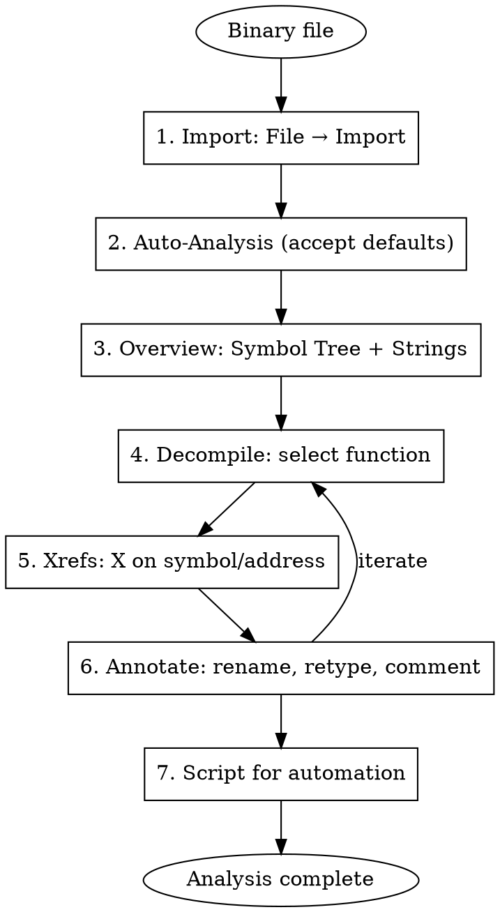

# Ghidra Reverse Engineering

Comprehensive guide for using Ghidra (NSA's Software Reverse Engineering suite) for static binary analysis, decompilation, scripting, and automation.

## When to Use

- Static analysis and decompilation of binaries (ELF, PE, Mach-O, DEX, raw)
- Writing Ghidra scripts (Java or Python/Jython) for automated analysis
- Headless/batch analysis of multiple binaries
- Recovering C/C++ pseudocode from stripped binaries
- Cross-reference analysis and call graph exploration
- Diffing/comparing binary versions (Version Tracking)
- Firmware and embedded binary analysis
- Android native SO library analysis
- Collaborative RE with shared Ghidra Server projects

## Quick Reference - GUI Shortcuts

| Shortcut | Action |
|----------|--------|
| `G` | Go to address |
| `L` | Rename symbol/label |
| `T` | Set data type |
| `;` | Set comment (EOL) |
| `Ctrl+Shift+;` | Set pre-comment |
| `/` | Set plate comment |
| `Ctrl+E` | Edit function signature |
| `Ctrl+L` | Retype variable |
| `N` | Rename variable |
| `D` | Disassemble |
| `C` | Clear code/data |
| `P` | Create function |
| `F` | Create function (auto-detect) |
| `Ctrl+Shift+F` | Search for strings |
| `Ctrl+Shift+E` | Search for bytes |
| `X` | Show xrefs to |
| `Ctrl+Shift+G` | Show xrefs from |

## Workflow



## Headless Analysis (analyzeHeadless)

The most important Ghidra feature for automation — run analysis and scripts without the GUI.

```bash
# Location
GHIDRA_HOME=/path/to/ghidra
HEADLESS="$GHIDRA_HOME/support/analyzeHeadless"

# Basic: Import and analyze a binary
$HEADLESS /tmp/ghidra_projects MyProject \
  -import ./binary \
  -postScript MyScript.java

# Analyze existing project
$HEADLESS /tmp/ghidra_projects MyProject \
  -process binary \
  -postScript MyScript.java

# Import with options
$HEADLESS /tmp/ghidra_projects MyProject \
  -import ./libfoo.so \
  -processor AARCH64:LE:64:v8A \
  -postScript DecompileAll.py \
  -scriptPath /path/to/scripts \
  -deleteProject  # Clean up after

# Batch import multiple files
$HEADLESS /tmp/ghidra_projects BatchProject \
  -import /path/to/binaries/ \
  -recursive \
  -postScript AnalyzeAll.py

# With script arguments
$HEADLESS /tmp/ghidra_projects MyProject \
  -import ./binary \
  -postScript ExportFunctions.py "output.json"

# Common processors
# x86:LE:64:default       — x86-64
# x86:LE:32:default       — x86-32
# AARCH64:LE:64:v8A       — ARM64
# ARM:LE:32:v8            — ARM32
# MIPS:BE:32:default      — MIPS big-endian
# Dalvik:LE:32:default    — Android DEX
```

## Ghidra Scripting (Java)

Scripts run in the Ghidra Script Manager or via headless mode. Java scripts extend `GhidraScript`.

### Script Template

```java
// MyScript.java
// @category Analysis
// @description Example analysis script

import ghidra.app.script.GhidraScript;
import ghidra.program.model.listing.*;
import ghidra.program.model.symbol.*;
import ghidra.program.model.address.*;
import ghidra.app.decompiler.*;

public class MyScript extends GhidraScript {
    @Override
    protected void run() throws Exception {
        // currentProgram, currentAddress, monitor available

        println("Analyzing: " + currentProgram.getName());
        println("Image Base: " + currentProgram.getImageBase());
        println("Language: " + currentProgram.getLanguageID());
    }
}
```

### List Functions

```java
import ghidra.app.script.GhidraScript;
import ghidra.program.model.listing.*;

public class ListFunctions extends GhidraScript {
    @Override
    protected void run() throws Exception {
        FunctionManager fm = currentProgram.getFunctionManager();
        FunctionIterator funcs = fm.getFunctions(true); // forward

        int count = 0;
        for (Function f : funcs) {
            printf("0x%s  %s  (%d bytes)\n",
                f.getEntryPoint().toString(),
                f.getName(),
                f.getBody().getNumAddresses());
            count++;
        }
        println("Total functions: " + count);
    }
}
```

### Decompile a Function

```java
import ghidra.app.script.GhidraScript;
import ghidra.app.decompiler.*;
import ghidra.program.model.listing.*;

public class DecompileFunction extends GhidraScript {
    @Override
    protected void run() throws Exception {
        DecompInterface decomp = new DecompInterface();
        decomp.openProgram(currentProgram);

        Function func = getFunctionAt(currentAddress);
        if (func == null) {
            func = currentProgram.getFunctionManager()
                .getFunctionContaining(currentAddress);
        }
        if (func == null) {
            printerr("No function at current address");
            return;
        }

        DecompileResults result = decomp.decompileFunction(func, 30, monitor);
        if (result.decompileCompleted()) {
            println(result.getDecompiledFunction().getC());
        } else {
            printerr("Decompilation failed: " + result.getErrorMessage());
        }
        decomp.dispose();
    }
}
```

### Find Cross-References

```java
import ghidra.app.script.GhidraScript;
import ghidra.program.model.symbol.*;

public class FindXrefs extends GhidraScript {
    @Override
    protected void run() throws Exception {
        ReferenceManager refMgr = currentProgram.getReferenceManager();

        // Xrefs TO current address
        Reference[] refs = getReferencesTo(currentAddress);
        println("=== Xrefs TO " + currentAddress + " ===");
        for (Reference ref : refs) {
            printf("  %s → %s (%s)\n",
                ref.getFromAddress(),
                ref.getToAddress(),
                ref.getReferenceType());
        }

        // Xrefs FROM current address
        Reference[] refsFrom = getReferencesFrom(currentAddress);
        println("=== Xrefs FROM " + currentAddress + " ===");
        for (Reference ref : refsFrom) {
            printf("  %s → %s (%s)\n",
                ref.getFromAddress(),
                ref.getToAddress(),
                ref.getReferenceType());
        }
    }
}
```

### Search Strings

```java
import ghidra.app.script.GhidraScript;
import ghidra.program.model.data.*;
import ghidra.program.model.listing.*;
import ghidra.program.util.*;

public class SearchStrings extends GhidraScript {
    @Override
    protected void run() throws Exception {
        String target = askString("Search", "Enter string to find:");

        DataIterator dataIter = currentProgram.getListing().getDefinedData(true);
        for (Data data : dataIter) {
            if (data.hasStringValue()) {
                String val = (String) data.getValue();
                if (val.contains(target)) {
                    printf("0x%s: %s\n", data.getAddress(), val);
                    // Show xrefs to this string
                    for (var ref : getReferencesTo(data.getAddress())) {
                        printf("  ← ref from 0x%s\n", ref.getFromAddress());
                    }
                }
            }
        }
    }
}
```

### Export Decompilation to File

```java
import ghidra.app.script.GhidraScript;
import ghidra.app.decompiler.*;
import ghidra.program.model.listing.*;
import java.io.*;

public class ExportDecomp extends GhidraScript {
    @Override
    protected void run() throws Exception {
        String outPath = "/tmp/decomp_" + currentProgram.getName() + ".c";
        DecompInterface decomp = new DecompInterface();
        decomp.openProgram(currentProgram);

        try (PrintWriter pw = new PrintWriter(new FileWriter(outPath))) {
            FunctionIterator funcs = currentProgram.getFunctionManager().getFunctions(true);
            for (Function func : funcs) {
                if (monitor.isCancelled()) break;
                DecompileResults result = decomp.decompileFunction(func, 30, monitor);
                if (result.decompileCompleted()) {
                    pw.println("// === " + func.getName() + " @ " +
                        func.getEntryPoint() + " ===");
                    pw.println(result.getDecompiledFunction().getC());
                    pw.println();
                }
            }
        }
        decomp.dispose();
        println("Exported to: " + outPath);
    }
}
```

## Ghidra Scripting (Python/Jython)

Ghidra uses Jython (Python 2.7) for its built-in Python scripting. Same API as Java but Python syntax.

### Basic Python Script

```python
# ListFuncs.py
# @category Analysis
# @description List all functions with their sizes

fm = currentProgram.getFunctionManager()
funcs = fm.getFunctions(True)

for f in funcs:
    print("0x{} {} ({} bytes)".format(
        f.getEntryPoint(),
        f.getName(),
        f.getBody().getNumAddresses()))
```

### Decompile in Python

```python
# DecompAll.py
# @category Analysis

from ghidra.app.decompiler import DecompInterface

decomp = DecompInterface()
decomp.openProgram(currentProgram)

fm = currentProgram.getFunctionManager()
for func in fm.getFunctions(True):
    result = decomp.decompileFunction(func, 30, monitor)
    if result.decompileCompleted():
        code = result.getDecompiledFunction().getC()
        if "encrypt" in func.getName().lower() or "decrypt" in func.getName().lower():
            print("=== {} @ {} ===".format(func.getName(), func.getEntryPoint()))
            print(code)

decomp.dispose()
```

### Rename Functions by Pattern

```python
# RenameJNI.py
# @category Analysis
# @description Auto-rename JNI_OnLoad and Java_ exports

from ghidra.program.model.symbol import SourceType

sm = currentProgram.getSymbolTable()
fm = currentProgram.getFunctionManager()

for func in fm.getFunctions(True):
    name = func.getName()
    # Fix mangled JNI names
    if name.startswith("Java_"):
        parts = name.split("_")
        if len(parts) >= 4:
            short_name = parts[-1]
            cls = parts[-2]
            new_name = "{}::{}".format(cls, short_name)
            print("Renaming {} -> {}".format(name, new_name))
            func.setName(new_name, SourceType.USER_DEFINED)
```

### Patch Bytes

```python
# PatchBytes.py
# @category Patching

from ghidra.program.model.address import AddressFactory

addr = askAddress("Patch", "Address to patch:")
hexbytes = askString("Patch", "Hex bytes (e.g. 9090):")

data = hexbytes.decode("hex")

txn = currentProgram.startTransaction("Patch bytes")
try:
    mem = currentProgram.getMemory()
    mem.setBytes(addr, data)
    print("Patched {} bytes at {}".format(len(data), addr))
finally:
    currentProgram.endTransaction(txn, True)
```

## Ghidra Bridge (Python 3 Remote API)

For Python 3 scripting, use `ghidra_bridge` — a remote bridge to a running Ghidra instance.

```bash
# Install
pip install ghidra_bridge

# In Ghidra Script Manager, run:
#   ghidra_bridge_server.py (from ghidra_bridge package)
```

```python
#!/usr/bin/env python3
# analyze_with_bridge.py — Python 3 + Ghidra Bridge
import ghidra_bridge

b = ghidra_bridge.GhidraBridge(namespace=globals())

# Now use Ghidra API directly in Python 3
print(f"Program: {currentProgram.getName()}")
print(f"Base: {currentProgram.getImageBase()}")

fm = currentProgram.getFunctionManager()
for func in fm.getFunctions(True):
    print(f"0x{func.getEntryPoint()} {func.getName()}")
```

## pyhidra (Python 3 Native)

Alternative to ghidra_bridge — runs Ghidra natively via jpype.

```bash
pip install pyhidra
```

```python
#!/usr/bin/env python3
import pyhidra

pyhidra.start()

with pyhidra.open_program("/path/to/binary") as flat_api:
    from ghidra.app.decompiler import DecompInterface
    program = flat_api.getCurrentProgram()
    print(f"Analyzing: {program.getName()}")

    fm = program.getFunctionManager()
    decomp = DecompInterface()
    decomp.openProgram(program)

    for func in fm.getFunctions(True):
        result = decomp.decompileFunction(func, 30, flat_api.getMonitor())
        if result.decompileCompleted():
            code = result.getDecompiledFunction().getC()
            if "key" in code.lower() or "encrypt" in code.lower():
                print(f"\n=== {func.getName()} @ {func.getEntryPoint()} ===")
                print(code)

    decomp.dispose()
```

## Common Analysis Patterns

### Android SO Analysis

```java
// AnalyzeAndroidSO.java
// @category Android

import ghidra.app.script.GhidraScript;
import ghidra.app.decompiler.*;
import ghidra.program.model.listing.*;
import ghidra.program.model.symbol.*;

public class AnalyzeAndroidSO extends GhidraScript {
    @Override
    protected void run() throws Exception {
        FunctionManager fm = currentProgram.getFunctionManager();
        DecompInterface decomp = new DecompInterface();
        decomp.openProgram(currentProgram);

        println("=== JNI Exports ===");
        for (Function f : fm.getFunctions(true)) {
            String name = f.getName();
            if (name.startsWith("Java_") || name.equals("JNI_OnLoad")) {
                printf("0x%s  %s\n", f.getEntryPoint(), name);
                DecompileResults r = decomp.decompileFunction(f, 30, monitor);
                if (r.decompileCompleted()) {
                    println(r.getDecompiledFunction().getC());
                }
            }
        }

        // Check for anti-debug strings
        println("\n=== Suspicious Strings ===");
        String[] patterns = {"frida", "xposed", "magisk", "su", "root",
                             "TracerPid", "ptrace", "debug"};
        DataIterator data = currentProgram.getListing().getDefinedData(true);
        for (Data d : data) {
            if (d.hasStringValue()) {
                String val = ((String) d.getValue()).toLowerCase();
                for (String pat : patterns) {
                    if (val.contains(pat)) {
                        printf("  0x%s: %s\n", d.getAddress(), d.getValue());
                        break;
                    }
                }
            }
        }
        decomp.dispose();
    }
}
```

### Find Crypto Constants

```python
# FindCryptoConstants.py
# @category Analysis
# @description Detect common crypto constants (AES S-box, MD5 init, etc.)

import struct

mem = currentProgram.getMemory()

CRYPTO_SIGS = {
    "AES S-Box": bytes(bytearray([0x63, 0x7c, 0x77, 0x7b, 0xf2, 0x6b, 0x6f, 0xc5])),
    "AES Inv S-Box": bytes(bytearray([0x52, 0x09, 0x6a, 0xd5, 0x30, 0x36, 0xa5, 0x38])),
    "MD5 Init A": struct.pack("<I", 0x67452301),
    "SHA256 Init": struct.pack(">I", 0x6a09e667),
    "RC4 typical": bytes(bytearray([0x00, 0x01, 0x02, 0x03, 0x04, 0x05, 0x06, 0x07])),
}

blocks = mem.getBlocks()
for block in blocks:
    if not block.isInitialized():
        continue
    start = block.getStart()
    size = block.getSize()
    if size > 0x1000000:  # skip huge blocks
        continue
    data = bytearray(size)
    mem.getBytes(start, data)
    data = bytes(data)

    for name, sig in CRYPTO_SIGS.items():
        offset = 0
        while True:
            idx = data.find(sig, offset)
            if idx == -1:
                break
            addr = start.add(idx)
            print("  [{}] Found {} at 0x{}".format(block.getName(), name, addr))
            offset = idx + 1
```

### Batch Export All Decompiled Functions (Headless)

```bash
# Export entire binary to pseudocode
$HEADLESS /tmp/ghidra_projects ExportProject \
  -import ./libfoo.so \
  -processor AARCH64:LE:64:v8A \
  -postScript ExportDecomp.java \
  -deleteProject \
  -noanalysis false \
  2>&1 | tail -20
```

## Ghidra vs IDA Pro

| Feature | Ghidra | IDA Pro |
|---------|--------|---------|
| Cost | Free (open source) | Commercial |
| Decompiler | Built-in (all archs) | Hex-Rays (paid add-on) |
| Scripting | Java + Jython | IDAPython + IDC |
| Headless | analyzeHeadless | idat/idat64 |
| Collaboration | Ghidra Server | Lumina / TeamIDA |
| Plugin ecosystem | Growing | Mature |
| OLLVM/obfuscation | Manual or plugins | Better auto-detection |
| Speed | Slower on large binaries | Faster analysis |

## Key API Classes

| Class | Purpose |
|-------|---------|
| `GhidraScript` | Base class for scripts |
| `FunctionManager` | List/create/delete functions |
| `Function` | Function object (name, entry, params) |
| `SymbolTable` | Manage symbols and labels |
| `ReferenceManager` | Cross-references |
| `Memory` | Read/write memory blocks |
| `Listing` | Instructions, data, comments |
| `DecompInterface` | Decompiler access |
| `DataTypeManager` | Type system |
| `ProgramDB` | Main program database |
| `Address` | Address representation |
| `AddressFactory` | Create Address objects |
| `FlatProgramAPI` | Simplified API (used in scripts) |

## Useful GhidraScript Methods (FlatAPI)

```java
// Navigation
toAddr(long)              // Create address from long
toAddr("0x401000")        // Create address from string
currentAddress            // Current cursor address
currentProgram            // Current program

// Functions
getFunctionAt(addr)       // Get function at exact address
getFunctionContaining(addr) // Get function containing address
createFunction(addr, name) // Create new function

// Data
getDataAt(addr)           // Get data at address
getByte(addr)             // Read byte
getBytes(addr, byte[])    // Read bytes
getInt(addr)              // Read int (4 bytes)
getLong(addr)             // Read long (8 bytes)

// References
getReferencesTo(addr)     // Xrefs to
getReferencesFrom(addr)   // Xrefs from

// Search
findBytes(addr, pattern)  // Search for byte pattern
find(pattern)             // Search for string

// Interaction
askString(title, msg)     // Ask user for string
askAddress(title, msg)    // Ask user for address
askYesNo(title, msg)      // Ask yes/no
println(msg)              // Print to console
```

## Common Mistakes

| Mistake | Fix |
|---------|-----|
| Wrong processor on import | Re-import with correct `-processor` flag or Language ID |
| Analysis too slow | Disable aggressive analyzers in Analysis Options; use headless |
| Decompiler output garbled | Fix function signature: `Ctrl+E`, set calling convention and params |
| Variables mistyped | Right-click → Retype Variable (`Ctrl+L`) |
| Missing functions | Select code → right-click → Create Function (`P` or `F`) |
| Ghidra Jython is Python 2 | Use `ghidra_bridge` or `pyhidra` for Python 3 |
| Script not found headless | Use `-scriptPath /dir` to add script directories |
| Memory read fails | Check `block.isInitialized()` before reading |
| Can't find string xrefs | Run "Auto Analysis" with string analyzers enabled |

## Dependencies

```bash
# Install Ghidra
# Download from: https://ghidra-sre.org/
# Requires: JDK 17+ (Ghidra 11.x) or JDK 21+ (Ghidra 11.2+)

# macOS
brew install --cask ghidra

# Headless script location
ls $GHIDRA_INSTALL_DIR/support/analyzeHeadless

# Python 3 bridge (optional)
pip install ghidra_bridge
# OR
pip install pyhidra

# Verify
ghidraRun  # GUI
# or
$GHIDRA_INSTALL_DIR/support/analyzeHeadless  # Headless
```
