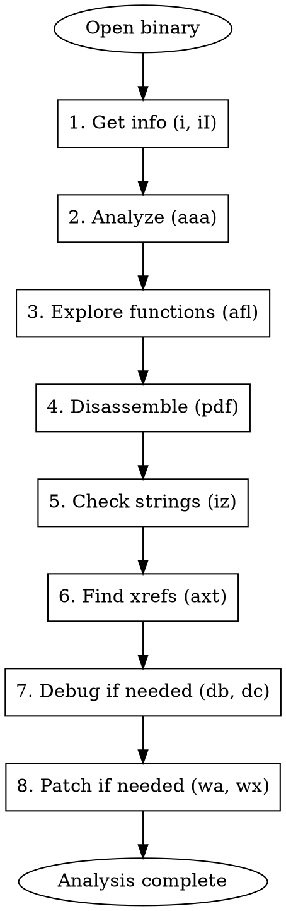

# Radare2 Reverse Engineering

Use radare2 for authorized binary analysis, disassembly, xrefs, debugging, patching, CTF crackmes, malware labs, and Android native `.so` analysis.

## Agent Workflow

1. Identify the target first: run `file_info`, `binary_mitigations`, and `extract_symbols` when available. Record architecture, bitness, endianness, PIE/base address, imports, exports, and whether the binary is stripped.
2. Open read-only first. Use `r2 -A <file>` for normal binaries; only add `-a`, `-b`, or `-m` after the file metadata confirms the architecture or load base.
3. Start broad: `iI`, `ii`, `ie`, `izz`, `afl`, then xref from useful strings/imports with `axt`.
4. Move from evidence to functions: inspect `main`, JNI exports, suspicious imports, string xrefs, and validation branches with `pdf @ <addr>`.
5. Patch only after a hypothesis is tested. Re-open with `r2 -w` and record original bytes, patched bytes, file offset, and virtual address.
6. Hand off when useful: APK/Dex work goes to `jadx`; JNI/SO algorithm emulation goes to `unidbg`; isolated instruction/function emulation goes to `unicorn-emulator`; pwn triage goes to `native-pwn-re`.

## Analysis Caching (Use for Large Binaries)

r2's `aaa` analysis can be very slow on large binaries. Always use caching to avoid re-analyzing.

### Cache Directory Convention

Use `~/.cache/r2_analysis/` as cache root. Create a subdirectory per binary based on its SHA256:

```bash
# One-time setup
mkdir -p ~/.cache/r2_analysis
```

### Method 1: r2 Project Save/Load (Recommended)

```bash
portable_sha256_16() {
    if command -v sha256sum >/dev/null 2>&1; then
        sha256sum "$1" | awk '{print substr($1,1,16)}'
    else
        shasum -a 256 "$1" | awk '{print substr($1,1,16)}'
    fi
}

# First time: analyze and save project
HASH=$(portable_sha256_16 binary)
PROJ_DIR=~/.cache/r2_analysis/$HASH
mkdir -p "$PROJ_DIR"
r2 binary -e "prj.dir=$PROJ_DIR" -i /dev/stdin <<'EOF'
aaa
afr @@f
Ps cache
EOF

# Subsequent times: load cached project (instant)
r2 binary -e "prj.dir=$PROJ_DIR" -i /dev/stdin <<'EOF'
Po cache
EOF
```

If metadata proves a non-default target, set explicit flags before both commands, for example `R2FLAGS="-a arm -b 64"` and run `r2 $R2FLAGS binary`.

### Method 2: r2 Script Cache (Simpler, More Portable)

Save analysis results as an r2 script file that can be sourced instantly:

```bash
# Helper: get cache path for a binary
r2_cache_path() {
    local file="$1"
    local hash
    if command -v sha256sum >/dev/null 2>&1; then
        hash=$(sha256sum "$file" | awk '{print substr($1,1,16)}')
    else
        hash=$(shasum -a 256 "$file" | awk '{print substr($1,1,16)}')
    fi
    echo "$HOME/.cache/r2_analysis/${hash}"
}

# First time: full analysis → export to r2 script
CACHE=$(r2_cache_path binary)
mkdir -p "$CACHE"
r2 -q binary -c "
aaa
afr @@f
agfj > $CACHE/functions.json
izzj > $CACHE/strings.json
aflj > $CACHE/funclist.json
axtj @@f > $CACHE/xrefs.json
" 2>/dev/null

# Subsequent times: load JSON caches directly from files
# (no need to re-open r2 for basic queries)
cat $CACHE/funclist.json | python3 -c "
import json, sys
for f in json.load(sys.stdin):
    print(f'{f[\"offset\"]:#x}  {f[\"name\"]}')
"
```

### Method 3: Auto-Cache Wrapper Function

Add this to your `~/.zshrc` or use directly:

```bash
# r2a: radare2 with auto-analysis caching
# Usage: r2a [r2 flags] binary
# First run: does aaa + saves. Subsequent: loads cached analysis instantly.
r2a() {
    local args=()
    local binary=""
    # Extract binary (last non-flag argument)
    for arg in "$@"; do
        if [[ "$arg" != -* && -f "$arg" ]]; then
            binary="$arg"
        fi
        args+=("$arg")
    done
    if [[ -z "$binary" ]]; then
        echo "Usage: r2a [r2-flags] binary" >&2
        return 1
    fi
    local hash=$(shasum -a 256 "$binary" 2>/dev/null | cut -c1-16)
    local cache_dir="$HOME/.cache/r2_analysis/$hash"
    mkdir -p "$cache_dir"
    local proj_name="cached"
    if [[ -f "$cache_dir/$proj_name.r2" || -d "$cache_dir/$proj_name" ]]; then
        echo "[r2a] Loading cached analysis from $cache_dir" >&2
        r2 "${args[@]}" -e "prj.dir=$cache_dir" -c "Po $proj_name"
    else
        echo "[r2a] First run: analyzing + caching to $cache_dir" >&2
        r2 "${args[@]}" -e "prj.dir=$cache_dir" -c "aaa; Ps $proj_name"
    fi
}
```

### Method 4: Non-Interactive Batch with Cache

For agent/script use — run r2 commands against a binary with caching:

```bash
# r2_cached_cmd: run r2 command(s) on binary with auto-cached analysis
# Usage: r2_cached_cmd "binary" "r2-flags" "commands"
r2_cached_cmd() {
    local binary="$1" flags="$2" cmds="$3"
    local hash=$(shasum -a 256 "$binary" 2>/dev/null | cut -c1-16)
    local cache="$HOME/.cache/r2_analysis/$hash"
    mkdir -p "$cache"
    if [[ -f "$cache/cached.r2" || -d "$cache/cached" ]]; then
        r2 -q $flags "$binary" -e "prj.dir=$cache" -c "Po cached; $cmds" 2>/dev/null
    else
        r2 -q $flags "$binary" -e "prj.dir=$cache" -c "aaa; Ps cached; $cmds" 2>/dev/null
    fi
}

# Examples:
# r2_cached_cmd widevine.mbn "-a arm -b 64 -m 0" "pdf @ 0x173a0"
# r2_cached_cmd libfoo.so "" "afl~JNI"
# r2_cached_cmd crackme.elf "" "iz; axt @ str.password"
```

### Cache Management

```bash
# List cached analyses
ls -la ~/.cache/r2_analysis/

# Prefer targeted cleanup. Avoid clearing all caches unless the operator asks.
HASH=$(portable_sha256_16 binary)
rm -rf -- "$HOME/.cache/r2_analysis/$HASH"
```

## Quick Reference - Essential Commands

| Command | Description |
|---------|-------------|
| `r2 binary` | Open binary |
| `r2 -A binary` | Open with auto-analysis |
| `r2 -d binary` | Open in debug mode |
| `r2 -w binary` | Open in write mode |
| `aaa` | Analyze all (functions, strings, xrefs) |
| `afl` | List all functions |
| `pdf` | Print disassembly of function |
| `s addr` | Seek to address |
| `px N` | Print N hex bytes |
| `iz` | List strings in data section |
| `ii` | List imports |
| `ie` | List exports/entry points |
| `V` | Enter visual mode |
| `VV` | Enter graph mode |
| `q` | Quit |

## Workflow



## Opening and Basic Info

```bash
# Open binary (read-only)
r2 binary

# Open with auto-analysis (recommended)
r2 -A binary

# Open in write mode (for patching)
r2 -w binary

# Open in debug mode
r2 -d binary

# Open with specific architecture only after file metadata confirms it
r2 -a arm -b 64 binary

# Open Android SO
r2 -A libfoo.so
```

### Binary Information Commands

```
[0x00000000]> i          # File info
[0x00000000]> iI         # Binary info (arch, bits, endian)
[0x00000000]> iS         # Sections
[0x00000000]> iS~.text   # Filter .text section
[0x00000000]> ie         # Entry points
[0x00000000]> ii         # Imports
[0x00000000]> iE         # Exports
[0x00000000]> il         # Libraries
[0x00000000]> is         # Symbols
[0x00000000]> ic         # Classes (for C++/ObjC)
```

## Analysis Commands

```
[0x00000000]> aa         # Analyze all (basic)
[0x00000000]> aaa        # Analyze more (recommended)
[0x00000000]> aaaa       # Analyze even more (slow but thorough)
[0x00000000]> aac        # Analyze function calls
[0x00000000]> aap        # Analyze function preludes
[0x00000000]> aar        # Analyze xrefs
[0x00000000]> aas        # Analyze syscalls
[0x00000000]> e anal.depth=10  # Set analysis depth
```

## Function Analysis

```
# List functions
[0x00000000]> afl        # All functions
[0x00000000]> afl~main   # Filter by name
[0x00000000]> afll       # Verbose function list
[0x00000000]> afn name addr  # Rename function

# Analyze specific function
[0x00000000]> af @ addr  # Analyze function at addr
[0x00000000]> afr        # Analyze function recursively

# Function info
[0x00000000]> afi        # Function info at current
[0x00000000]> afv        # Function variables
[0x00000000]> afvn new old  # Rename variable
```

## Disassembly

```
# Print disassembly
[0x00000000]> pd 20      # Disassemble 20 instructions
[0x00000000]> pdf        # Disassemble current function
[0x00000000]> pdf @ main # Disassemble main
[0x00000000]> pdc        # Pseudo-C decompilation
[0x00000000]> pdd        # Disassemble with dwarf info
[0x00000000]> pdr        # Disassemble recursively

# Disassembly modes
[0x00000000]> e asm.syntax=intel  # Intel syntax
[0x00000000]> e asm.syntax=att    # AT&T syntax
[0x00000000]> e asm.pseudo=true   # Pseudo code
[0x00000000]> e asm.bytes=false   # Hide bytes
[0x00000000]> e asm.comments=true # Show comments
```

## Seeking and Navigation

```
# Seek commands
[0x00000000]> s main     # Seek to main
[0x00000000]> s 0x401000 # Seek to address
[0x00000000]> s+10       # Seek forward 10 bytes
[0x00000000]> s-10       # Seek backward 10 bytes
[0x00000000]> s-         # Undo seek
[0x00000000]> s+         # Redo seek
[0x00000000]> sr rip     # Seek to register value

# Seek history
[0x00000000]> sh         # Seek history
```

## String Analysis

```
# Find strings
[0x00000000]> iz         # Strings in data sections
[0x00000000]> izz        # Strings in whole binary
[0x00000000]> iz~password # Filter strings
[0x00000000]> izj        # JSON output

# String settings
[0x00000000]> e str.min=5    # Min string length
[0x00000000]> e str.search.encoding=utf8

# Search for patterns
[0x00000000]> / password     # Search string
[0x00000000]> /x 90909090    # Search hex pattern
[0x00000000]> /a jmp eax     # Search assembly
[0x00000000]> /r esp         # Search for refs to esp
```

## Cross References (Xrefs)

```
# Find xrefs
[0x00000000]> axt @ addr     # Xrefs TO this address
[0x00000000]> axf @ addr     # Xrefs FROM this address
[0x00000000]> axt @ str.password  # Who uses this string?
[0x00000000]> axtj @ addr    # JSON output

# All xrefs
[0x00000000]> ax             # List all xrefs
```

## Visual Mode

```
# Enter visual modes
[0x00000000]> V            # Visual mode
[0x00000000]> VV           # Graph mode (function CFG)
[0x00000000]> v            # Visual panels mode

# Visual mode keys:
#   p/P     - rotate print modes
#   hjkl    - navigate (vim-style)
#   Enter   - follow jump/call
#   u       - undo seek
#   x       - show xrefs
#   d       - define (function, code, string)
#   ;       - add comment
#   /       - search
#   n/N     - next/prev search result
#   q       - quit visual mode

# Graph mode keys:
#   tab     - switch between nodes
#   +/-     - zoom in/out
#   0       - reset zoom
#   g       - goto address
```

## Debugging

```bash
# Start debugging
r2 -d ./binary           # Debug local binary
r2 -d gdb://host:port    # Remote GDB
r2 -d frida://Gadget/App # Frida backend
```

```
# Breakpoints
[0x00000000]> db main       # Set breakpoint at main
[0x00000000]> db 0x401234   # Set breakpoint at addr
[0x00000000]> db -0x401234  # Remove breakpoint
[0x00000000]> dbi           # List breakpoints
[0x00000000]> dbc addr cmd  # Breakpoint with command

# Execution control
[0x00000000]> dc            # Continue execution
[0x00000000]> ds            # Step one instruction
[0x00000000]> dso           # Step over
[0x00000000]> dsu addr      # Step until address
[0x00000000]> dcr           # Continue until ret

# Registers
[0x00000000]> dr            # Show registers
[0x00000000]> dr rax        # Show rax
[0x00000000]> dr rax=0x123  # Set rax value
[0x00000000]> drs           # Show register stack
[0x00000000]> drr           # Show regs with refs

# Memory
[0x00000000]> dm            # Show memory maps
[0x00000000]> dmi           # List loaded modules
[0x00000000]> dmh           # Heap info
[0x00000000]> dms           # Show stack
```

## Patching

```
# Write mode required: r2 -w binary

# Write assembly
[0x00000000]> wa nop         # Write NOP
[0x00000000]> wa jmp 0x1234  # Write jump
[0x00000000]> "wa mov eax, 1; ret"  # Multiple instrs

# Write hex bytes
[0x00000000]> wx 90909090    # Write NOPs
[0x00000000]> wx 00 @ addr   # Write at address

# Write string
[0x00000000]> w hello        # Write string
[0x00000000]> wz hello       # Write null-terminated

# Overwrite operations
[0x00000000]> wao nop        # NOP current instruction
[0x00000000]> wao jmp        # Convert to jump
[0x00000000]> wao trap       # Write trap/int3

# Revert changes
[0x00000000]> wop file       # Write original bytes from file
```

## Common Reverse Engineering Scenarios

### Scenario 1: Finding Main Function

```
[0x00000000]> aaa
[0x00000000]> afl~main
[0x00000000]> s main
[0x00000000]> pdf
```

### Scenario 2: Analyzing Password Check

```
# Find password-related strings
[0x00000000]> iz~pass
[0x00000000]> iz~secret
[0x00000000]> iz~correct

# Find xrefs to the string
[0x00000000]> axt @ str.password

# Go to function and analyze
[0x00000000]> s sym.check_password
[0x00000000]> pdf

# Look at comparison operations
[0x00000000]> pdf~cmp
[0x00000000]> pdf~je,jne
```

### Scenario 3: Bypassing License Check

```
# Find license check function
[0x00000000]> afl~license
[0x00000000]> afl~check
[0x00000000]> afl~verify

# Analyze the function
[0x00000000]> pdf @ sym.verify_license

# Find the conditional jump
[0x00000000]> pdf~je,jne,jz,jnz

# Patch to always succeed (r2 -w)
[0x00000000]> s 0x401234     # Go to conditional jump
[0x00000000]> wa jmp 0x401250  # Patch to unconditional
# OR
[0x00000000]> wao nop        # NOP out the check
```

### Scenario 4: Crackme / CTF

```
# Initial recon
[0x00000000]> iI              # Check arch, bits
[0x00000000]> ie              # Entry point
[0x00000000]> iz              # Interesting strings
[0x00000000]> ii              # Imports (crypto? strcmp?)

# Analyze
[0x00000000]> aaa
[0x00000000]> afl             # Functions overview
[0x00000000]> s main; pdf     # Main function

# Find flag/password related
[0x00000000]> iz~flag
[0x00000000]> iz~{
[0x00000000]> afl~check,verify,valid

# Trace algorithm
[0x00000000]> VV @ sym.encrypt  # Visual graph
```

### Scenario 5: Android SO Analysis

```bash
# Open Android SO file
r2 -A libfoo.so
```

```
# Check JNI exports
[0x00000000]> iE~Java_
[0x00000000]> is~JNI

# Analyze JNI function
[0x00000000]> s sym.Java_com_app_Native_check
[0x00000000]> pdf

# Find native strings
[0x00000000]> iz

# Check for anti-tampering
[0x00000000]> iz~frida
[0x00000000]> iz~root
[0x00000000]> iz~debug
```

### Scenario 6: Malware Analysis

```
# Safe analysis (no execution)
r2 -n malware.exe   # Don't load symbols/libs

# Check for packers/protectors
[0x00000000]> iI
[0x00000000]> iS~UPX,ASPack,Themida

# Entropy analysis (packed sections have high entropy)
[0x00000000]> p=e @ section..text

# Find suspicious imports
[0x00000000]> ii~CreateRemoteThread
[0x00000000]> ii~VirtualAlloc
[0x00000000]> ii~WriteProcessMemory
[0x00000000]> ii~LoadLibrary
[0x00000000]> ii~GetProcAddress

# Find suspicious strings
[0x00000000]> izz~http://
[0x00000000]> izz~cmd.exe
[0x00000000]> izz~powershell
[0x00000000]> izz~reg
```

## Scripting and Automation

### r2pipe (Python)

```python
#!/usr/bin/env python3
import r2pipe

# Open binary
r2 = r2pipe.open("./binary")
r2.cmd("aaa")  # Analyze

# Get info
info = r2.cmdj("ij")  # JSON output
print(f"Arch: {info['bin']['arch']}")
print(f"Bits: {info['bin']['bits']}")

# List functions
functions = r2.cmdj("aflj")
for func in functions:
    print(f"{func['name']}: 0x{func['offset']:x}")

# Disassemble main
r2.cmd("s main")
print(r2.cmd("pdf"))

# Find strings containing "password"
strings = r2.cmdj("izj")
for s in strings:
    if "password" in s.get("string", "").lower():
        print(f"0x{s['vaddr']:x}: {s['string']}")

# Search for patterns
results = r2.cmdj("/j password")
for r in results:
    print(f"Found at: 0x{r['offset']:x}")

r2.quit()
```

### r2 Script File

```bash
# analysis.r2 - r2 script file
aaa
afl
s main
pdf
izz~flag
```

```bash
# Run script
r2 -i analysis.r2 binary
# Or in interactive mode
[0x00000000]> . analysis.r2
```

### Batch Processing

```bash
#!/bin/bash
# analyze_all.sh - Analyze multiple binaries

for binary in *.exe; do
    echo "=== Analyzing $binary ==="
    r2 -q -c "aaa; afl; iz" "$binary" > "${binary}.analysis"
done
```

## Comparison Operations

```
# Compare binaries
r2 -m 0x10000 original.bin -B modified.bin
[0x00000000]> cc   # Compare code
[0x00000000]> ccd  # Compare disassembly

# Diff functions
radiff2 -g main original modified

# Binary diff
radiff2 original modified
```

## Configuration

```
# Useful config options
[0x00000000]> e asm.arch=x86        # Set architecture
[0x00000000]> e asm.bits=64         # Set bits
[0x00000000]> e asm.syntax=intel    # Intel syntax
[0x00000000]> e asm.bytes=false     # Hide hex bytes
[0x00000000]> e asm.comments=true   # Show comments
[0x00000000]> e asm.lines=true      # Show flow lines
[0x00000000]> e scr.utf8=true       # UTF-8 output
[0x00000000]> e scr.color=2         # Full colors

# Save config
[0x00000000]> e~asm > ~/.radare2rc
```

## Common Command Patterns

| Task | Commands |
|------|----------|
| Quick overview | `iI; iS; ie; ii` |
| Full analysis | `aaa; afl; iz` |
| Find function | `afl~keyword` |
| Disassemble func | `pdf @ funcname` |
| Find string refs | `iz; axt @ str.xxx` |
| Visual analysis | `VV @ main` |
| Patch jump | `wa jmp addr` or `wao nop` |
| Debug | `db addr; dc; dr` |
| Search hex | `/x 41414141` |
| Search string | `/ keyword` |

## Tips and Tricks

```
# Get help
[0x00000000]> ?              # General help
[0x00000000]> a?             # Analysis help
[0x00000000]> p?             # Print help
[0x00000000]> pdf?           # Specific command help

# JSON output (for scripting)
[0x00000000]> aflj           # Functions as JSON
[0x00000000]> izj            # Strings as JSON
[0x00000000]> pdfj           # Disasm as JSON

# Grep/filter output
[0x00000000]> afl~main       # Filter functions
[0x00000000]> iz~pass,key    # Multiple filters
[0x00000000]> pdf~cmp        # Filter disasm

# Save output
[0x00000000]> pdf > func.asm # Save to file
[0x00000000]> pr > dump.bin  # Raw bytes to file
```

## Dependencies

```bash
# Install radare2
# macOS
brew install radare2

# Linux
git clone https://github.com/radareorg/radare2
cd radare2
./sys/install.sh

# Python bindings
pip install r2pipe
```
