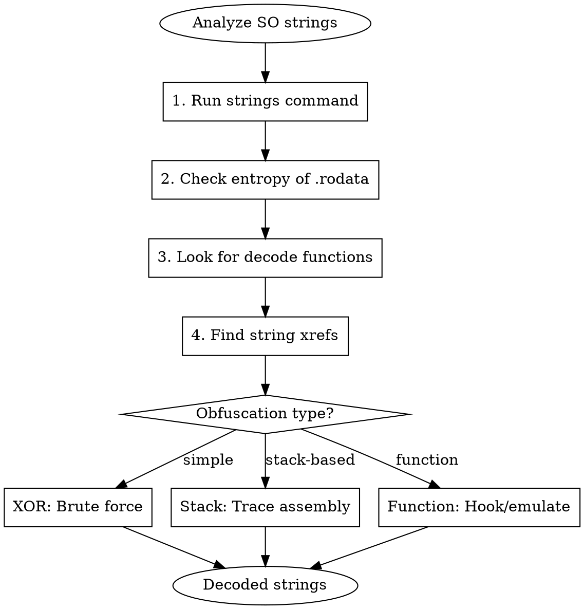

# SO String Deobfuscation

Techniques to identify and decode obfuscated strings in Android/Linux SO (shared library) files.

## When to Use

- Strings in SO appear as gibberish or non-printable characters
- Important strings (URLs, keys, configs) are hidden
- `strings` command returns nothing useful
- Static analysis shows encrypted data blobs
- Need to extract hardcoded secrets from native code

## Obfuscation Types Overview

| Type | Pattern | Identification | Difficulty |
|------|---------|----------------|------------|
| XOR single-byte | Repeated patterns in hex | Try all 256 keys | Easy |
| XOR multi-byte | Less obvious patterns | Frequency analysis | Medium |
| Base64 | Charset A-Za-z0-9+/= | Decode directly | Easy |
| Stack strings | `mov byte [sp+N], 0xXX` | Trace assembly | Medium |
| RC4 | S-box initialization | Look for 256-byte array | Medium |
| AES/DES | Block cipher patterns | Find key schedule | Hard |
| Custom algorithm | Unique deobfuscation func | Reverse function | Hard |
| OLLVM StringEncryption | `.datadiv_decode*` sections | Section names | Medium |

## Identification Workflow



## Step 1: Initial Analysis

```bash
# Check if strings are visible
strings -a target.so | head -50

# Check entropy of data sections (high = encrypted)
rabin2 -S target.so | grep -E "rodata|data"

# In radare2: analyze entropy
r2 -A target.so
[0x00000000]> p=e @ section..rodata

# Look for decode/decrypt function patterns
r2 -A target.so -c "afl~decode,decrypt,init,string"
```

## Step 2: Identify Obfuscation Pattern

### XOR Detection

```python
# xor_detect.py - Detect single-byte XOR
import sys

def detect_xor(data):
    """Try all XOR keys, check for printable results"""
    results = []
    for key in range(256):
        decoded = bytes([b ^ key for b in data])
        # Check printable ratio
        printable = sum(1 for c in decoded if 32 <= c <= 126)
        if printable > len(data) * 0.7:
            results.append((key, decoded))
    return results

# Usage: python xor_detect.py <hex_bytes>
data = bytes.fromhex(sys.argv[1])
for key, decoded in detect_xor(data):
    print(f"Key 0x{key:02x}: {decoded}")
```

### Stack String Detection (IDA/Ghidra)

Look for patterns like:
```c
// Decompiled stack string
char s[16];
s[0] = 'h';
s[1] = 't';
s[2] = 't';
s[3] = 'p';
// ...
```

Or in assembly:
```asm
mov     byte ptr [rsp+0], 68h  ; 'h'
mov     byte ptr [rsp+1], 74h  ; 't'
mov     byte ptr [rsp+2], 74h  ; 't'
mov     byte ptr [rsp+3], 70h  ; 'p'
```

### OLLVM StringEncryption

```bash
# Check for OLLVM markers
readelf -S target.so | grep datadiv
r2 -A target.so -c "iS~datadiv"

# Look for .init_array entries that call decode functions
r2 -A target.so -c "pxr @ section..init_array"
```

## Frida Dynamic Decryption

### Hook String Decode Function

```javascript
// Hook the decode function and log results
// First, find the decode function address in IDA/Ghidra

var moduleBase = Module.findBaseAddress("libtarget.so");
var decodeFunc = moduleBase.add(0x1234);  // Replace with actual offset

Interceptor.attach(decodeFunc, {
    onEnter: function(args) {
        this.input = args[0];
        this.len = args[1].toInt32();
        console.log("[Decode] Input length: " + this.len);
    },
    onLeave: function(retval) {
        if (retval.isNull() === false) {
            var decoded = retval.readCString();
            console.log("[Decode] Result: " + decoded);
        }
    }
});
```

### Hook String Functions

```javascript
// Hook common string functions to catch decoded strings
var hooks = [
    {name: "strlen", idx: 0},
    {name: "strcpy", idx: 1},
    {name: "strcat", idx: 1},
    {name: "strcmp", idx: 0},
    {name: "__strlen_chk", idx: 0}
];

hooks.forEach(function(h) {
    var ptr = Module.findExportByName("libc.so", h.name);
    if (ptr) {
        Interceptor.attach(ptr, {
            onEnter: function(args) {
                try {
                    var str = args[h.idx].readCString();
                    if (str && str.length > 5 && str.length < 200) {
                        console.log("[" + h.name + "] " + str);
                    }
                } catch(e) {}
            }
        });
    }
});
```

### Dump All Strings at Runtime

```javascript
// Scan memory for strings after app initialization
function scanStrings(module) {
    var ranges = Process.enumerateRanges({protection: 'r--', coalesce: true});
    ranges.forEach(function(range) {
        Memory.scan(range.base, range.size, "00 ?? ?? ?? ?? ?? ?? ?? 00", {
            onMatch: function(address, size) {
                try {
                    var str = address.add(1).readCString();
                    if (str && str.length > 4 && /^[\x20-\x7e]+$/.test(str)) {
                        console.log(address + ": " + str);
                    }
                } catch(e) {}
            },
            onComplete: function() {}
        });
    });
}

// Run after app initializes
setTimeout(function() {
    scanStrings("libtarget.so");
}, 3000);
```

## Unicorn Emulation for Decode Functions

```python
# unicorn_decode.py - Emulate decode function
from unicorn import *
from unicorn.arm64_const import *
import struct

# Load SO and find decode function
with open("libtarget.so", "rb") as f:
    so_data = f.read()

# Setup emulator
mu = Uc(UC_ARCH_ARM64, UC_MODE_ARM)

# Map memory
BASE = 0x10000
STACK = 0x80000
mu.mem_map(BASE, 0x100000)
mu.mem_map(STACK, 0x10000)

# Write SO to memory
mu.mem_write(BASE, so_data)

# Setup stack
mu.reg_write(UC_ARM64_REG_SP, STACK + 0x8000)

# Write encrypted string
encrypted = bytes.fromhex("deadbeef...")  # Your encrypted data
mu.mem_write(STACK + 0x1000, encrypted)

# Set function arguments (ARM64 ABI)
mu.reg_write(UC_ARM64_REG_X0, STACK + 0x1000)  # input
mu.reg_write(UC_ARM64_REG_X1, len(encrypted))   # length

# Emulate decode function
DECODE_FUNC = BASE + 0x1234  # Function offset
mu.emu_start(DECODE_FUNC, DECODE_FUNC + 0x100)

# Read result
result = mu.mem_read(STACK + 0x1000, len(encrypted))
print("Decoded:", result)
```

## Common Patterns & Solutions

### XOR with Key Array

```javascript
// Often keys are stored near the encrypted data
// Pattern: encrypted XOR key[i % key_len]

function xorDecode(addr, len, keyAddr, keyLen) {
    var result = [];
    for (var i = 0; i < len; i++) {
        var enc = addr.add(i).readU8();
        var key = keyAddr.add(i % keyLen).readU8();
        result.push(String.fromCharCode(enc ^ key));
    }
    return result.join('');
}
```

### RC4 Decryption

```javascript
// RC4 detection: look for S-box (256-byte array)
function rc4(key, data) {
    var S = [];
    for (var i = 0; i < 256; i++) S[i] = i;

    var j = 0;
    for (var i = 0; i < 256; i++) {
        j = (j + S[i] + key[i % key.length]) % 256;
        [S[i], S[j]] = [S[j], S[i]];
    }

    var result = [];
    var i = 0, j = 0;
    for (var k = 0; k < data.length; k++) {
        i = (i + 1) % 256;
        j = (j + S[i]) % 256;
        [S[i], S[j]] = [S[j], S[i]];
        result.push(data[k] ^ S[(S[i] + S[j]) % 256]);
    }
    return result;
}
```

### OLLVM StringEncryption Bypass

```javascript
// OLLVM decodes strings in .init_array
// Hook after module load to get decoded strings

var target = "libtarget.so";

// Wait for module to fully initialize
var checkModule = setInterval(function() {
    var base = Module.findBaseAddress(target);
    if (base) {
        clearInterval(checkModule);
        setTimeout(function() {
            // Strings should now be decoded in memory
            dumpModuleStrings(target);
        }, 1000);
    }
}, 100);

function dumpModuleStrings(moduleName) {
    var module = Process.findModuleByName(moduleName);
    module.enumerateRanges('r--').forEach(function(range) {
        console.log("[*] Scanning " + range.base + " - " + range.size);
        // Scan for null-terminated strings
    });
}
```

## radare2 Analysis Script

```bash
# r2_strings.sh - Analyze obfuscated strings

r2 -A -q -c '
# List potential decode functions
echo "=== Potential decode functions ==="
afl~decode,decrypt,deobf,init_string

# Check .rodata entropy
echo "\n=== .rodata entropy ==="
p=e @ section..rodata

# Find XOR operations
echo "\n=== XOR instructions ==="
/ad xor

# Find string xrefs
echo "\n=== String references ==="
izz~http,key,pass,token,secret

# Check init_array
echo "\n=== .init_array ==="
pxr @ section..init_array
' "$1"
```

## IDA Python Script

```python
# ida_string_decode.py - Find and decode obfuscated strings
import idautils
import idc

def find_string_decode_funcs():
    """Find functions that might decode strings"""
    suspects = []
    for func_ea in idautils.Functions():
        name = idc.get_func_name(func_ea)
        # Check function name
        if any(x in name.lower() for x in ['decode', 'decrypt', 'deobf', 'init']):
            suspects.append((func_ea, name))
        # Check for XOR patterns
        for head in idautils.FuncItems(func_ea):
            if idc.print_insn_mnem(head) == 'xor':
                suspects.append((func_ea, name + " (has XOR)"))
                break
    return suspects

def extract_stack_strings(func_ea):
    """Extract strings built on stack"""
    chars = {}
    for head in idautils.FuncItems(func_ea):
        mnem = idc.print_insn_mnem(head)
        if mnem == 'mov':
            op1 = idc.print_operand(head, 0)
            op2 = idc.print_operand(head, 1)
            # Look for mov byte ptr [rbp+X], imm
            if 'byte ptr' in op1 and op2.isdigit():
                offset = int(op1.split('+')[-1].rstrip(']'), 16)
                chars[offset] = chr(int(op2))
    if chars:
        return ''.join(chars[k] for k in sorted(chars.keys()))
    return None

# Run analysis
for ea, name in find_string_decode_funcs():
    print(f"[*] {name} at 0x{ea:x}")
```

## Quick Reference

| Situation | Tool | Command/Script |
|-----------|------|----------------|
| Check string visibility | strings | `strings -a lib.so` |
| Check entropy | rabin2 | `rabin2 -S lib.so` |
| Find decode funcs | r2 | `afl~decode` |
| Single-byte XOR | Python | xor_detect.py |
| Runtime capture | Frida | Hook strlen/strcpy |
| Complex decode | Unicorn | Emulate function |
| OLLVM | Frida | Wait for init, dump |

## Common Mistakes

| Mistake | Fix |
|---------|-----|
| Analyzing before init | Wait for .init_array to run |
| Missing key location | Keys often near encrypted data |
| Wrong endianness | Check SO architecture |
| Incomplete emulation | Setup proper memory/registers |
| Static-only analysis | Dynamic often much easier |
