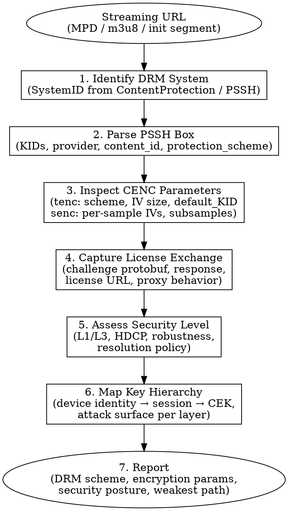

# DRM Protocol Analysis

End-to-end workflow for analyzing Digital Rights Management protocols in streaming media: system identification, container inspection, license protocol capture, security level assessment, and key hierarchy mapping.

**Scope:** Protocol analysis and defensive security assessment only. No content key extraction, no license replication, no protected content export. All techniques assume authorized research on self-owned or test content.

## When to Use

- Identifying which DRM system(s) protect a stream
- Parsing PSSH boxes and CENC encryption parameters
- Capturing and decoding license request/response exchanges
- Assessing device security level and output protection
- Mapping key hierarchies for threat modeling
- Auditing DRM integration for misconfigurations

---

## 1. DRM System Identification

### SystemID Quick Reference

| DRM System | SystemID (UUID) | Hex (no dashes) |
|------------|----------------|-----------------|
| **Widevine** | `edef8ba9-79d6-4ace-a3c8-27dcd51d21ed` | `edef8ba979d64acea3c827dcd51d21ed` |
| **PlayReady** | `9a04f079-9840-4286-ab92-e65be0885f95` | `9a04f07998404286ab92e65be0885f95` |
| **FairPlay** | `94ce86fb-07ff-4f43-adb8-93d2fa968ca2` | `94ce86fb07ff4f43adb893d2fa968ca2` |
| **ClearKey** | `1077efec-c0b2-4d02-ace3-3c1e52e2fb4b` | `1077efecc0b24d02ace33c1e52e2fb4b` |
| **Marlin** | `5e629af5-38da-4063-8977-97ffbd9902d4` | `5e629af538da4063897797ffbd9902d4` |
| **CENC Common** | `1077efec-c0b2-4d02-ace3-3c1e52e2fb4b` | Same as ClearKey |

### Detection from MPD (DASH)

```xml
<!-- Widevine ContentProtection in MPD -->
<ContentProtection
  schemeIdUri="urn:uuid:edef8ba9-79d6-4ace-a3c8-27dcd51d21ed"
  value="Widevine">
  <cenc:pssh>AAAA...</cenc:pssh>
</ContentProtection>

<!-- PlayReady ContentProtection in MPD -->
<ContentProtection
  schemeIdUri="urn:uuid:9a04f079-9840-4286-ab92-e65be0885f95"
  value="MSPR 2.0">
  <mspr:pro>...</mspr:pro>
</ContentProtection>

<!-- CENC default_KID (DRM-agnostic) -->
<ContentProtection
  schemeIdUri="urn:mpeg:dash:mp4protection:2011"
  value="cenc"
  cenc:default_KID="eb676abc-beef-cafe-1234-abcdef012345"/>
```

### Detection from HLS (FairPlay / Widevine)

```
#EXT-X-KEY:METHOD=SAMPLE-AES,URI="skd://content-id",KEYFORMAT="com.apple.streamingkeydelivery"
#EXT-X-SESSION-KEY:METHOD=SAMPLE-AES-CTR,URI="data:text/plain;base64,AAAA...",KEYFORMAT="urn:uuid:edef8ba9-79d6-4ace-a3c8-27dcd51d21ed"
```

### Quick Detection Commands

```bash
# Extract ContentProtection elements from MPD
curl -s "$MPD_URL" | grep -oP 'schemeIdUri="urn:uuid:[^"]*"'

# Extract PSSH from MPD
curl -s "$MPD_URL" | grep -oP '<cenc:pssh>[^<]*</cenc:pssh>'

# Decode base64 PSSH and find SystemID
echo "$PSSH_B64" | base64 -d | xxd | head -5

# Search binary for known SystemIDs
grep -obUaP '\xed\xef\x8b\xa9' file.mp4      # Widevine
grep -obUaP '\x9a\x04\xf0\x79' file.mp4      # PlayReady
```

### Multi-DRM Coexistence

A single DASH manifest commonly carries multiple `ContentProtection` elements — Widevine for Android/Chrome, PlayReady for Edge/Xbox, FairPlay via separate HLS. The `cenc:default_KID` in the `mp4protection` element is shared across all systems: the same content key encrypts the media regardless of which DRM delivers it.

**Security implication:** The weakest DRM path determines the effective protection level. If PlayReady SL150 allows a lower security level than Widevine L1 on the same content, an attacker targets PlayReady.

---

## 2. PSSH Box Parsing

### ISO BMFF `pssh` Box Structure

```
Box Type: 'pssh'
├── version (1 byte): 0 or 1
├── flags (3 bytes): usually 0x000000
├── SystemID (16 bytes): UUID identifying the DRM system
├── [v1 only] KID_count (4 bytes, big-endian)
├── [v1 only] KIDs (16 bytes × KID_count)
├── DataSize (4 bytes, big-endian)
└── Data (DataSize bytes): DRM-specific payload
```

### Widevine PSSH Protobuf Schema

```protobuf
// WidevinePsshData — lives inside the pssh box Data field
message WidevinePsshData {
  enum Algorithm {
    UNENCRYPTED = 0;
    AESCTR = 1;
  }
  optional Algorithm algorithm = 1;
  repeated bytes key_id = 2;           // 16-byte KIDs
  optional string provider = 3;        // e.g. "widevine_test"
  optional bytes content_id = 4;       // opaque content identifier
  optional string policy = 6;          // e.g. "" (empty = default)
  optional uint32 crypto_period_index = 7;  // for key rotation
  optional uint32 grouped_license = 8;
  optional uint32 protection_scheme = 9;    // FourCC: cenc/cbc1/cens/cbcs
  repeated bytes entitled_keys = 10;
}
```

### PlayReady PRO Structure

```
PlayReady Object (PRO):
├── Length (4 bytes LE)
├── Record Count (2 bytes LE)
└── Records[]
    ├── Record Type (2 bytes LE)
    │   1 = Rights Management Header (WRMHEADER)
    │   2 = Reserved
    │   3 = Embedded License Store
    ├── Record Length (2 bytes LE)
    └── Record Value (XML for type 1)

WRMHEADER XML contains:
  <PROTECTINFO> → <KID> (base64, byte-swapped GUID)
  <DATA> → <LA_URL> (license acquisition URL)
  <CHECKSUM> (optional)
```

### Parsing Tools

```bash
# Bento4: full box tree
mp4dump --verbosity 3 encrypted.mp4 | grep -A20 "pssh"

# GPAC: detailed box inspection
gpac -i encrypted.mp4 inspect:deep:allp

# ffprobe: quick metadata
ffprobe -show_format -show_streams encrypted.mp4 2>&1 | grep -i drm

# Python: decode Widevine PSSH
python3 -c "
import base64, struct

pssh_b64 = '$PSSH_B64'
data = base64.b64decode(pssh_b64)

# Skip box header (8 bytes) + version/flags (4 bytes)
offset = 12
system_id = data[offset:offset+16]
print(f'SystemID: {system_id.hex()}')
offset += 16

# Version 1: KID list
version = data[8]
if version == 1:
    kid_count = struct.unpack('>I', data[offset:offset+4])[0]
    offset += 4
    for i in range(kid_count):
        kid = data[offset:offset+16]
        print(f'KID[{i}]: {kid.hex()}')
        offset += 16

data_size = struct.unpack('>I', data[offset:offset+4])[0]
offset += 4
drm_data = data[offset:offset+data_size]
print(f'DRM-specific data ({data_size} bytes): {drm_data.hex()[:80]}...')
"
```

### Widevine Protobuf Decode

```python
#!/usr/bin/env python3
"""Decode Widevine PSSH protobuf data."""
import base64, struct, sys

def decode_varint(data, offset):
    result, shift = 0, 0
    while offset < len(data):
        b = data[offset]; offset += 1
        result |= (b & 0x7f) << shift
        if not (b & 0x80): break
        shift += 7
    return result, offset

def decode_pssh_data(raw):
    """Parse WidevinePsshData protobuf (no external dependency)."""
    offset, fields = 0, {}
    while offset < len(raw):
        tag, offset = decode_varint(raw, offset)
        field_num, wire_type = tag >> 3, tag & 7
        if wire_type == 0:
            val, offset = decode_varint(raw, offset)
            fields.setdefault(field_num, []).append(val)
        elif wire_type == 2:
            length, offset = decode_varint(raw, offset)
            val = raw[offset:offset+length]; offset += length
            fields.setdefault(field_num, []).append(val)
        elif wire_type == 1: offset += 8
        elif wire_type == 5: offset += 4
        else: break

    if 1 in fields: print(f"  algorithm: {fields[1][0]}")
    for kid in fields.get(2, []):
        print(f"  key_id: {kid.hex()}")
    for p in fields.get(3, []):
        print(f"  provider: {p.decode('utf-8', errors='replace')}")
    for c in fields.get(4, []):
        print(f"  content_id: {c.hex()} ({c.decode('utf-8', errors='replace')})")
    if 6 in fields: print(f"  policy: {fields[6][0].decode()}")
    if 7 in fields: print(f"  crypto_period_index: {fields[7][0]}")
    if 9 in fields:
        scheme = fields[9][0]
        if isinstance(scheme, int):
            print(f"  protection_scheme: {struct.pack('>I', scheme)}")
        else:
            print(f"  protection_scheme: {scheme}")

# Usage: python3 decode_pssh.py <base64_pssh>
if __name__ == "__main__":
    raw = base64.b64decode(sys.argv[1])
    # Skip ISO BMFF box header to reach protobuf data
    version = raw[8]
    off = 12 + 16  # past fullbox header + SystemID
    if version == 1:
        kid_count = struct.unpack('>I', raw[off:off+4])[0]
        off += 4 + kid_count * 16
    data_size = struct.unpack('>I', raw[off:off+4])[0]
    off += 4
    decode_pssh_data(raw[off:off+data_size])
```

---

## 3. CENC Encryption Analysis

### CENC vs CBCS

| Property | `cenc` (CTR full) | `cbcs` (CBC pattern) |
|----------|-------------------|----------------------|
| Mode | AES-128-CTR | AES-128-CBC |
| Encryption scope | Full sample | 1-of-10 pattern (1:9 skip) |
| IV | 8-byte (counter) or 16-byte | 16-byte (constant per sample) |
| Subsample encryption | Optional | Required for video (clear NAL headers) |
| Browser support | Chrome, Edge, Firefox | Safari (mandatory), Chrome 74+, Edge |
| Seeking | Byte-precise | Block-aligned |
| FourCC | `cenc` | `cbcs` |

### ISO BMFF Encryption Box Hierarchy

```
moov/
└── trak/
    └── mdia/
        └── minf/
            └── stbl/
                └── stsd/
                    └── encv (or enca for audio)/
                        ├── sinf/
                        │   ├── frma/         → original codec (avc1, hvc1, mp4a)
                        │   ├── schm/         → scheme_type (cenc/cbcs), version
                        │   └── schi/
                        │       └── tenc/     → default encryption params
                        │           ├── default_isProtected (1 byte)
                        │           ├── default_Per_Sample_IV_Size (1 byte)
                        │           ├── default_KID (16 bytes)
                        │           └── [cbcs] default_constant_IV_size + IV
                        └── codec-specific boxes (avcC, hvcC, esds, etc.)

moof/
└── traf/
    ├── tfhd/
    ├── trun/
    ├── sbgp + sgpd     → sample-to-group + group description (for per-group keys)
    ├── saiz/           → sample auxiliary information sizes
    ├── saio/           → sample auxiliary information offsets
    └── senc/           → per-sample IVs and subsample ranges
        ├── sample_count
        └── per sample:
            ├── IV (Per_Sample_IV_Size bytes)
            └── [if subsamples]
                ├── subsample_count
                └── per subsample:
                    ├── BytesOfClearData (2 bytes)
                    └── BytesOfProtectedData (4 bytes)
```

### Extraction Commands

```bash
# Show tenc box (default encryption params)
mp4dump --verbosity 3 enc.mp4 | grep -A10 "tenc"

# Show senc box (per-sample IVs)
mp4dump --verbosity 3 enc.mp4 | grep -A5 "senc"

# GPAC deep inspection
gpac -i enc.mp4 inspect:deep:allp 2>&1 | grep -E "sinf|schm|tenc|senc|saiz|saio"

# Extract default_KID from tenc
python3 -c "
import struct
with open('enc.mp4', 'rb') as f:
    data = f.read()
idx = data.find(b'tenc')
if idx > 0:
    off = idx + 4  # past box type
    # skip version(1) + flags(3) + reserved(2) + default_isProtected(1) + default_Per_Sample_IV_Size(1)
    off += 8
    kid = data[off:off+16]
    print(f'default_KID: {kid.hex()}')
"
```

### Subsample Encryption (NAL Unit Level)

For H.264/H.265 video with CENC, only the slice data is encrypted; NAL headers, SPS, PPS, VPS, SEI remain clear so the decoder can parse the bitstream structure:

```
NAL Unit:
├── Start code (00 00 01 or 00 00 00 01) — CLEAR
├── NAL header (1-2 bytes)               — CLEAR
└── RBSP (Raw Byte Sequence Payload)     — ENCRYPTED (for slice NALs)
```

The `senc` box's subsample entries define exactly where clear/protected boundaries fall within each sample.

---

## 4. License Protocol Analysis

### Generic License Flow

```
┌────────┐         ┌──────────────┐         ┌──────────────┐
│ Client │         │License Proxy │         │  DRM License │
│ (App)  │         │  (Partner)   │         │   Service    │
└───┬────┘         └──────┬───────┘         └──────┬───────┘
    │  1. Challenge        │                        │
    │─────────────────────>│  2. Auth + forward     │
    │                      │───────────────────────>│
    │                      │  3. License response   │
    │                      │<───────────────────────│
    │  4. License          │                        │
    │<─────────────────────│                        │
    │                                               │
    │  5. Decrypt content locally                   │
```

### Widevine License Proxy

The client never talks to Google's Widevine License Service directly. The content provider operates a **License Proxy** that:

1. **Authenticates** the user (subscription check, geo-fence, device limit)
2. **Wraps** the challenge with a signing key and provider credentials
3. **Forwards** to `https://license.widevine.com/cenc/getcontentkey/<provider>`
4. **Injects policy** (license duration, rental window, HDCP requirements)
5. **Returns** the signed license to the client

The proxy holds the provider's **signing key** and **encryption key** (AES key pair from Widevine); compromise of these keys allows forging arbitrary licenses for that provider's content.

### Chrome EME Path

```
JavaScript (player.js)
  → navigator.requestMediaKeySystemAccess("com.widevine.alpha", configs)
  → mediaKeys.createSession("temporary")
  → session.generateRequest("cenc", initData)  // initData = PSSH
  → [CDM generates license challenge internally]
  → session.addEventListener("message", e => {
       // e.message = license challenge (protobuf)
       fetch(LICENSE_URL, { body: e.message })
         .then(r => r.arrayBuffer())
         .then(license => session.update(license));
     });
```

Internal path: `Blink EME API → Mojo IPC → CDM (Widevine .so/.dll) → License Challenge`

### Android MediaDrm Path

```java
UUID WV_UUID = new UUID(0xedef8ba979d64aceL, 0xa3c827dcd51d21edL);
MediaDrm drm = new MediaDrm(WV_UUID);
byte[] sessionId = drm.openSession();

// Generate license request
MediaDrm.KeyRequest keyReq = drm.getKeyRequest(
    sessionId, initData, "video/mp4",
    MediaDrm.KEY_TYPE_STREAMING, null);

// keyReq.getData() = Widevine SignedMessage protobuf
// keyReq.getDefaultUrl() = license server URL (may be empty)

// Send to license proxy, get response
byte[] licenseResponse = sendToProxy(keyReq.getData());
drm.provideKeyResponse(sessionId, licenseResponse);
// Content keys now available inside the CDM
```

Internal path: `App → MediaDrm (Java) → AIDL HAL → libwvhidl.so (OEMCrypto) → License Request`

### Traffic Capture

#### Chrome DevTools

```
1. Open DevTools → Network tab
2. Filter by "license" or "drm" or "widevine"
3. Play protected content
4. Look for POST requests to license URLs
5. Request body = SignedMessage (protobuf, binary)
6. Response body = SignedLicense (protobuf, binary)

Common license URL patterns:
  */widevine/*
  */license*
  */drm*
  */getcontentkey*
  */acquire*
```

#### mitmproxy Addon

```python
"""mitmproxy addon: log DRM license exchanges."""
import mitmproxy.http

DRM_PATTERNS = [
    "widevine", "license", "drm", "playready",
    "getcontentkey", "rightsmanager", "acquire",
]

class DRMLicenseLogger:
    def request(self, flow: mitmproxy.http.HTTPFlow):
        url = flow.request.pretty_url.lower()
        if any(p in url for p in DRM_PATTERNS):
            body = flow.request.get_content()
            print(f"\n[DRM REQUEST] {flow.request.method} {flow.request.pretty_url}")
            print(f"  Content-Type: {flow.request.headers.get('content-type', 'N/A')}")
            print(f"  Body size: {len(body)} bytes")
            print(f"  Body hex (first 64): {body[:64].hex()}")

    def response(self, flow: mitmproxy.http.HTTPFlow):
        url = flow.request.pretty_url.lower()
        if any(p in url for p in DRM_PATTERNS):
            body = flow.response.get_content()
            print(f"\n[DRM RESPONSE] {flow.response.status_code} {flow.request.pretty_url}")
            print(f"  Body size: {len(body)} bytes")
            print(f"  Body hex (first 64): {body[:64].hex()}")

addons = [DRMLicenseLogger()]
# Usage: mitmproxy -s drm_logger.py
```

### Frida Hooks: MediaDrm Lifecycle (Android)

```javascript
Java.perform(function() {
    var MediaDrm = Java.use("android.media.MediaDrm");
    var UUID = Java.use("java.util.UUID");

    // Constructor — which DRM is being initialized?
    MediaDrm.$init.overload("java.util.UUID").implementation = function(uuid) {
        var msb = uuid.getMostSignificantBits();
        var lsb = uuid.getLeastSignificantBits();
        console.log("\n[MediaDrm] $init UUID: " +
            Long.toHexString(msb) + Long.toHexString(lsb));
        return this.$init(uuid);
    };

    // openSession
    MediaDrm.openSession.overload().implementation = function() {
        var sid = this.openSession();
        console.log("[MediaDrm] openSession → " + bytesToHex(sid));
        return sid;
    };

    // getKeyRequest — the license challenge
    MediaDrm.getKeyRequest.overload(
        "[B", "[B", "java.lang.String", "int", "java.util.HashMap"
    ).implementation = function(sessionId, initData, mimeType, keyType, optParams) {
        console.log("[MediaDrm] getKeyRequest");
        console.log("  mimeType: " + mimeType);
        console.log("  keyType: " + keyType);
        if (initData) console.log("  initData (" + initData.length + "B): " +
            bytesToHex(initData).substring(0, 64) + "...");

        var req = this.getKeyRequest(sessionId, initData, mimeType, keyType, optParams);
        var reqData = req.getData();
        console.log("  challenge (" + reqData.length + "B): " +
            bytesToHex(reqData).substring(0, 64) + "...");
        console.log("  defaultUrl: " + req.getDefaultUrl());
        return req;
    };

    // provideKeyResponse — the license delivery
    MediaDrm.provideKeyResponse.overload("[B", "[B").implementation = function(sid, response) {
        console.log("[MediaDrm] provideKeyResponse");
        console.log("  response (" + response.length + "B): " +
            bytesToHex(response).substring(0, 64) + "...");
        var result = this.provideKeyResponse(sid, response);
        console.log("  result: " + (result ? bytesToHex(result) : "null"));
        return result;
    };

    // getPropertyString
    MediaDrm.getPropertyString.implementation = function(name) {
        var val = this.getPropertyString(name);
        console.log("[MediaDrm] getPropertyString('" + name + "') → " + val);
        return val;
    };
});

function bytesToHex(bytes) {
    if (!bytes) return "null";
    var hex = [];
    for (var i = 0; i < bytes.length; i++) {
        hex.push(("0" + (bytes[i] & 0xff).toString(16)).slice(-2));
    }
    return hex.join("");
}

var Long = Java.use("java.lang.Long");
```

---

## 5. Security Level Assessment

### Widevine Security Levels

| Level | Key Handling | Content Decryption | Typical Use |
|-------|-------------|-------------------|-------------|
| **L1** | Keys in TEE/SE | Decryption in TEE; decrypted frames never leave secure memory | UHD/4K on certified devices |
| **L2** | Keys in TEE/SE | Decryption on host CPU | Deprecated / rarely used |
| **L3** | Keys in software (white-box) | Decryption in software | SD on unverified devices, Chrome desktop |

#### Detection (Android)

```java
UUID WV_UUID = new UUID(0xedef8ba979d64aceL, 0xa3c827dcd51d21edL);
MediaDrm drm = new MediaDrm(WV_UUID);
String secLevel = drm.getPropertyString("securityLevel");
// Returns: "L1", "L2", or "L3"
String systemId = drm.getPropertyString("systemId");
String hdcpLevel = drm.getPropertyString("maxHdcpLevel");
```

#### Detection (Chrome / JavaScript)

```javascript
async function checkWidevine() {
    const configs = [{
        initDataTypes: ["cenc"],
        videoCapabilities: [{
            contentType: 'video/mp4; codecs="avc1.42E01E"',
            robustness: "HW_SECURE_ALL"       // L1
        }],
    }];

    try {
        const access = await navigator.requestMediaKeySystemAccess(
            "com.widevine.alpha", configs);
        console.log("L1 supported (HW_SECURE_ALL)");
        return "L1";
    } catch(e) {
        // Fall back to check SW_SECURE_DECODE (L3)
        configs[0].videoCapabilities[0].robustness = "SW_SECURE_DECODE";
        try {
            await navigator.requestMediaKeySystemAccess(
                "com.widevine.alpha", configs);
            console.log("L3 (SW_SECURE_DECODE)");
            return "L3";
        } catch(e2) {
            console.log("Widevine not available");
            return null;
        }
    }
}

// Robustness levels (strongest → weakest):
// HW_SECURE_ALL > HW_SECURE_DECODE > HW_SECURE_CRYPTO >
// SW_SECURE_DECODE > SW_SECURE_CRYPTO > empty string
```

### PlayReady Security Levels

| Level | Description |
|-------|-------------|
| **SL3000** | Hardware-backed TEE (comparable to Widevine L1) |
| **SL2000** | Software with hardware root of trust |
| **SL150** | Software-only (comparable to Widevine L3) |

### Resolution ↔ Security Level Mapping (Typical Policies)

| Content Tier | Required Widevine | Required PlayReady | HDCP |
|-------------|-------------------|-------------------|------|
| SD (480p) | L3 | SL150 | None |
| HD (1080p) | L1 | SL2000+ | HDCP 1.4 |
| UHD (4K HDR) | L1 | SL3000 | HDCP 2.2 |

**Note:** These are common industry patterns, not Widevine/PlayReady requirements. Each content provider sets its own policy via the license server.

### HDCP Output Protection

```java
// Android: query connected display HDCP level
MediaDrm drm = new MediaDrm(WV_UUID);
String maxHdcp = drm.getPropertyString("maxHdcpLevel");
// "HDCP_NONE", "HDCP_V1", "HDCP_V2", "HDCP_V2_1", "HDCP_V2_2", "HDCP_V2_3", "HDCP_NO_DIGITAL_OUTPUT"

String connectedHdcp = drm.getPropertyString("connectedHdcpLevel");
```

---

## 6. Key Hierarchy Mapping

### Generic DRM Key Hierarchy

```
Root of Trust
│   Device-unique secret anchored in hardware (TEE/SE/OTP) or software (keybox)
│
├── Device Identity Key
│   │   Proves device legitimacy to the license server
│   │   (RSA private key in Widevine, device certificate in PlayReady)
│   │
│   └── License Request Signing
│       Client signs the challenge to prove possession of the device key
│
├── Session Key
│   │   Ephemeral, derived per license session
│   │   Protects the license response in transit
│   │
│   └── Content Encryption Key (CEK)
│       │   Delivered inside the license, encrypted under the session key
│       │   One CEK per KID (one per track, or rotated periodically)
│       │
│       └── Decrypted content (frames/samples)
│           Never leaves the TEE in L1; on host CPU in L3
```

### Widevine Key Hierarchy

```
Keybox (128 bytes, stored in /data/vendor/mediadrm/ or TEE)
├── Device ID (32 bytes)
├── Device Key area → derives AES key + RSA key pair
│   ├── RSA Private Key → signs license challenges
│   └── Client ID → identifies device to license server
│
License Exchange:
  1. Client sends SignedMessage { challenge = LicenseRequest { client_id, content_id } }
  2. Server verifies client_id against provisioning DB
  3. Server responds with SignedLicense { license = { key[] = { id, iv, key_encrypted } } }
  4. CDM decrypts key_encrypted using session key derived from DH exchange
  5. CEK available inside CDM for AES-CTR/CBC decryption

Attack Surfaces:
  [1] Keybox extraction → forge device identity (L3: white-box AES + DFA; L1: hardware attack)
  [2] RSA private key extraction → sign arbitrary challenges
  [3] CDM memory dump → capture CEK at runtime
  [4] License proxy compromise → issue arbitrary licenses
  [5] HDMI capture → bypass output protection entirely (analog hole)
```

### PlayReady Key Hierarchy

```
Device Certificate (issued during manufacturing or provisioning)
├── Model Certificate → Device Certificate chain
├── Device Private Key (ECC or RSA)
│
Domain (optional, for multi-device):
├── Domain Certificate
└── Domain Private Key → allows license sharing within a domain
│
License:
├── Content Header → KID mapping
├── Policy → rights (play, copy, transfer), constraints (expiration, output)
└── Content Key → encrypted under device-specific or domain key
    └── CEK → AES-128-CTR or AES-128-CBC

Attack Surfaces:
  [1] Device certificate extraction → clone device identity
  [2] Domain key theft → access all devices in domain
  [3] License tampering → modify policy (requires breaking signature)
  [4] Secure clock manipulation → extend time-limited licenses
  [5] SL150 memory inspection → capture CEK at runtime
```

### FairPlay Key Hierarchy (Limited Public Information)

```
Device Identity
├── Device certificate provisioned by Apple
├── HDCP tied to hardware output
│
Content Key Derivation:
  1. Player requests key via "skd://" URI
  2. Key server returns encrypted CK inside SPC/CKC exchange
  3. CK decrypted inside Apple's CDM (CoreMedia / AVContentKeySession)
  4. AES-128-CBC (SAMPLE-AES) decryption of media

Note: FairPlay internals are largely undocumented publicly.
Apple's FairPlay Streaming specification is available only under NDA.
```

---

## 7. Common Tools Reference

| Tool | Install | Primary Use |
|------|---------|-------------|
| **Bento4** (`mp4dump`, `mp4decrypt`, `mp4info`) | `brew install bento4` or [GitHub release](https://www.bento4.com/) | ISOBMFF box inspection, PSSH extraction, test decryption |
| **GPAC** (`gpac`, `MP4Box`) | `brew install gpac` | Mux/demux, deep box inspection, DASH packaging |
| **Shaka Packager** | [GitHub release](https://github.com/shaka-project/shaka-packager) | CENC encryption/packaging for test content |
| **Shaka Player** | Browser, [shaka-player-demo](https://shaka-player-demo.appspot.com/) | EME playback testing, DRM diagnostics |
| **ffprobe / ffmpeg** | `brew install ffmpeg` | Quick metadata, stream inspection, muxing |
| **protoc** | `brew install protobuf` | Decode Widevine protobuf messages |
| **mitmproxy** | `pip install mitmproxy` | License traffic interception |
| **Frida** | `pip install frida-tools` | Runtime hook for MediaDrm / OEMCrypto |
| **Wireshark** | `brew install wireshark` | Low-level network capture |
| **radare2** | `brew install radare2` | CDM binary analysis (libwvhidl.so, etc.) |

### Quick Diagnostic Commands

```bash
# List all ISOBMFF boxes
mp4dump encrypted.mp4

# Extract PSSH boxes only
mp4dump encrypted.mp4 | grep -B2 -A15 "pssh"

# Show encryption info per track
mp4info --show-layout encrypted.mp4

# GPAC deep box dump
gpac -i encrypted.mp4 inspect:deep:allp 2>&1 | less

# Test decryption with known key (verify encryption setup)
mp4decrypt --key KID_HEX:KEY_HEX encrypted.mp4 decrypted.mp4

# Package test content with Widevine PSSH
packager \
  in=clear.mp4,stream=video,output=enc_video.mp4 \
  in=clear.mp4,stream=audio,output=enc_audio.mp4 \
  --enable_widevine_encryption \
  --key_server_url https://license.uat.widevine.com/cenc/getcontentkey/widevine_test \
  --content_id $(echo -n "test" | xxd -p) \
  --signer widevine_test \
  --mpd_output manifest.mpd
```

---

## 8. Analysis Workflow



### Step-by-Step

1. **Identify:** Fetch the manifest; extract `schemeIdUri` UUIDs or `#EXT-X-KEY` KEYFORMAT values. Note all DRM systems present.

2. **Parse PSSH:** Decode each `<cenc:pssh>` from base64. Match SystemID. For Widevine, decode the protobuf payload to extract KIDs and provider. For PlayReady, parse the WRMHEADER XML for `<KID>` and `<LA_URL>`.

3. **Inspect CENC:** Download an init segment (`mp4dump`). Read `sinf/schm` for the encryption scheme (`cenc` or `cbcs`). Read `sinf/schi/tenc` for default parameters. Check `senc` in media segments for per-sample IVs.

4. **Capture License:** Set up traffic interception (DevTools / mitmproxy / Frida). Play the content. Capture the license request (challenge) and response. Note the license URL and any authentication headers the proxy requires.

5. **Assess Security:** Query the device's security level. Check HDCP. Correlate with the content provider's resolution policy. Determine the effective security boundary.

6. **Map Keys:** Trace the key hierarchy from root of trust to CEK. Identify where each secret is stored, how it is protected, and what access would be needed to extract it.

7. **Report:** Summarize findings: DRM system(s), encryption parameters, security level, weakest path, and recommendations.

---

## 9. Defensive Analysis

### Multi-DRM Weakest-Path Effect

When content is available through multiple DRM systems (Widevine + PlayReady + FairPlay), the effective security level is determined by the weakest system the attacker can use. A PlayReady SL150 path that delivers the same CEK as a Widevine L1 path reduces the entire scheme to SL150 security.

**Assessment checklist:**
- Are all DRM systems enforcing equivalent security levels?
- Does the license server apply consistent policies across DRM systems?
- Can a lower-security-level device request the same content quality?

### License Proxy Misconfiguration Patterns

| Misconfiguration | Impact | Detection |
|-----------------|--------|-----------|
| License URL exposed without authentication | Anyone can request licenses | Replay challenge from another device |
| Hardcoded provider credentials in client | Forge license requests | Reverse client binary / JS |
| No device binding in policy | License reusable across devices | Transfer license blob |
| Permissive security level policy | HD/UHD served to L3 devices | Query security level, request high-res |
| No rate limiting on license requests | Bulk key harvesting | Automated license request loop |
| License response caching at CDN | Stale or shared licenses | Repeat request from different session |

### Output Protection Residual Risks

- **HDCP strippers** exist as commodity hardware; HDCP protection is an obstacle, not a guarantee
- **Screen capture** on desktop OS may bypass HDCP (depends on OS-level enforcement)
- **Virtual displays / VMs** may not report HDCP capability, causing fallback to lower quality
- **Analog outputs** (3.5mm, composite) are never protected

### Offline License Security Boundaries

- Offline licenses have an expiration timestamp, but it is enforced by the CDM's **secure clock**
- L3 devices have no hardware-backed clock → time manipulation is trivial
- L1 devices rely on TEE-backed secure time, but some implementations fall back to network time
- **Assessment:** Check whether the offline license duration is reasonable for the content value, and whether the CDM enforces time integrity

---

## 10. Common Mistakes

| Mistake | Reality |
|---------|---------|
| "The PSSH contains the content key" | PSSH is a referral, not a vault; it carries KIDs and metadata |
| "Base64 in the MPD is the license" | It is the PSSH box, not a license |
| "L1 means the content is fully secure" | L1 protects keys and decryption; the decoded frames can still be captured at the display output |
| "CENC and cbcs are interchangeable" | Different modes, different browser/device support, different subsample rules |
| "One DRM is enough" | Each platform requires its own: Widevine for Android/Chrome, FairPlay for Safari/iOS, PlayReady for Edge/Xbox |
| "The license URL is the Widevine server" | It is the partner's proxy; the proxy talks to Google |
| Confusing KID byte order | PlayReady uses little-endian GUIDs; Widevine uses big-endian; they represent the same KID differently |

## Dependencies

```bash
# Container tools
brew install bento4 gpac ffmpeg

# Protocol analysis
pip install mitmproxy protobuf frida-tools

# Binary analysis (CDM inspection)
brew install radare2
```
