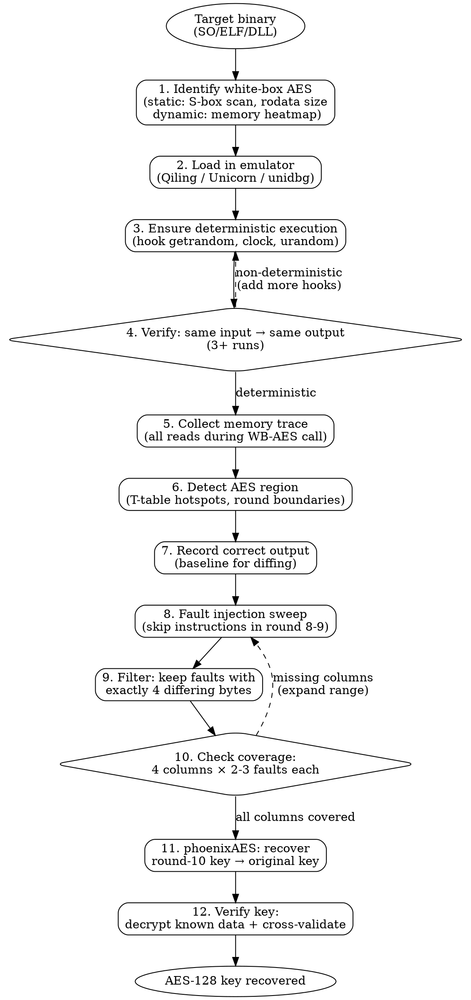

# White-Box AES Analysis & DFA Key Recovery

End-to-end workflow for recovering AES keys from white-box implementations using Differential Fault Analysis. Covers identification, deterministic emulation, trace collection, fault injection, key recovery, and defense detection.

## When to Use

- Analyzing a binary suspected of containing white-box AES (e.g., DRM clients, license validators, payment SDKs)
- Recovering embedded AES keys from T-table implementations
- Setting up a deterministic emulation environment for fault injection
- Evaluating the strength of a white-box AES deployment
- Choosing between DFA, DCA, and BGE attacks based on target characteristics

## Part 1: White-Box AES Identification

### Standard AES vs White-Box AES

Standard AES separates key material from operations:

```
Plaintext → AddRoundKey(key) → SubBytes(S-box) → ShiftRows → MixColumns → ... → Ciphertext
              ↑ key visible here
```

White-box AES fuses the key into lookup tables so the key never appears in isolation:

```
Plaintext → T-box[i][x] = S-box[x ⊕ key[i]] → ShiftRows → MixColumns → ... → Ciphertext
              ↑ key embedded inside each T-box
```

### T-Table Signatures

| Property | Value |
|----------|-------|
| Table count | 4 T-tables (T0, T1, T2, T3) per round, or 16 byte-level T-boxes |
| Entry size | 4 bytes per entry (32-bit T-table) or 1 byte (byte-level T-box) |
| Entries per table | 256 |
| Table size | 1 KB each (32-bit) or 256 bytes each (byte-level) |
| Total per round | 4 KB (32-bit) or 4 KB (16 byte-level T-boxes) |
| Access pattern | 160 lookups for 10-round AES-128 (4 tables × 4 columns × 10 rounds) |
| Memory layout | Tables are typically contiguous or at fixed stride |

### Common White-Box Schemes

| Scheme | Year | Encoding | DFA Resistant | Notes |
|--------|------|----------|---------------|-------|
| Chow et al. | 2002 | Linear/affine mixing bijections | No | First practical WB-AES; broken by BGE (2004) |
| Karroumi | 2010 | Affine + dual AES | No | Broken same year |
| Billet-Gilbert-Ech-Chatbi (BGE) | 2004 | N/A (attack) | N/A | Algebraic attack on Chow-style encodings |
| CHES 2016 challenges | 2016 | Various | Varies | Public benchmark targets |
| Klinec WB-AES | 2013 | Chow-style (open source) | No | Good for testing; github.com/niccokunzmann/whiteboxaes |

### Locating White-Box AES in Binaries

**Static indicators:**

```bash
# Look for large aligned data regions (T-tables)
r2 -A target.so
[0x0]> iS~.rodata         # Data sections where tables live
[0x0]> /x 637c777bf26b    # Standard AES S-box (may not be present in WB)
[0x0]> s section..rodata
[0x0]> pxw 1024            # Look for 256-entry aligned tables
```

**Dynamic indicators — memory access heatmap:**

A white-box AES call produces a characteristic access pattern:
- 10 bursts of table lookups (one per round)
- Each burst hits 4 table regions
- Each region is accessed 4 times (one per column)
- Total: ~160 clustered memory reads in a tight address range

```python
#!/usr/bin/env python3
"""Detect white-box AES by memory access pattern analysis."""

def detect_wb_aes(trace_reads: list[tuple[int, int]]) -> list[dict]:
    """
    trace_reads: list of (instruction_index, memory_address)
    Returns candidate AES regions.
    """
    from collections import Counter

    addr_counts = Counter(addr & ~0xFFF for _, addr in trace_reads)

    candidates = []
    for page, count in addr_counts.most_common(20):
        # T-table page: accessed 40+ times (4 lookups × 10 rounds)
        if count >= 40:
            # Check for 256-entry alignment
            page_reads = [addr for _, addr in trace_reads if (addr & ~0xFFF) == page]
            unique_offsets = set(addr & 0xFFF for addr in page_reads)
            # A T-table touches many of the 256 possible offsets
            if len(unique_offsets) >= 16:
                candidates.append({
                    'base': hex(page),
                    'accesses': count,
                    'unique_offsets': len(unique_offsets),
                })

    return candidates
```

## Part 2: Deterministic Emulation Environment

DFA requires bit-exact reproducibility: same input must always produce the same output.

### Non-Determinism Sources to Hook

| Source | Syscall / Path | Replacement |
|--------|---------------|-------------|
| Random bytes | `getrandom()`, `SYS_getrandom` | Return fixed bytes (e.g., `\x00` × N) |
| `/dev/urandom` | `open("/dev/urandom")` | Redirect to `/dev/zero` |
| `/dev/random` | `open("/dev/random")` | Redirect to `/dev/zero` |
| Wall clock | `clock_gettime()` | Return `(0, 0)` |
| Time of day | `gettimeofday()` | Return `(0, 0)` |
| System properties | `__system_property_get()` | Return fixed values |
| Thread ID | `gettid()` | Return fixed value |
| CPU features | `getauxval(AT_HWCAP)` | Return 0 or minimal feature set |

### Qiling Setup Template

```python
#!/usr/bin/env python3
"""Load a white-box AES SO in Qiling with deterministic hooks."""

from qiling import Qiling
from qiling.const import QL_VERBOSE

ROOTFS = "./rootfs/arm64_android"  # Prepare an Android rootfs
TARGET = "./generic_whitebox.so"
WB_AES_FUNC = 0x1234              # Offset of the white-box encrypt/decrypt function

def hook_getrandom(ql: Qiling, buf: int, buflen: int, flags: int):
    ql.mem.write(buf, b"\x00" * buflen)
    ql.os.set_syscall_return(buflen)

def hook_clock_gettime(ql: Qiling, clock_id: int, tp: int):
    ql.mem.write(tp, b"\x00" * 16)  # timespec: tv_sec=0, tv_nsec=0
    ql.os.set_syscall_return(0)

def hook_gettimeofday(ql: Qiling, tv: int, tz: int):
    if tv:
        ql.mem.write(tv, b"\x00" * 16)
    if tz:
        ql.mem.write(tz, b"\x00" * 8)
    ql.os.set_syscall_return(0)

def setup_deterministic(ql: Qiling):
    """Patch all non-determinism sources."""
    ql.os.set_syscall("getrandom", hook_getrandom)
    ql.os.set_syscall("clock_gettime", hook_clock_gettime)
    ql.os.set_syscall("gettimeofday", hook_gettimeofday)

    # Redirect /dev/urandom → /dev/zero
    ql.add_fs_mapper("/dev/urandom", "/dev/zero")
    ql.add_fs_mapper("/dev/random", "/dev/zero")

def call_wb_aes(ql: Qiling, input_data: bytes) -> bytes:
    """Call the white-box function and return its output."""
    assert len(input_data) == 16

    # Allocate buffers
    in_addr = ql.os.heap.alloc(16)
    out_addr = ql.os.heap.alloc(16)
    ql.mem.write(in_addr, input_data)
    ql.mem.write(out_addr, b"\x00" * 16)

    # Call: wb_aes(input, output) — adjust calling convention as needed
    base = ql.mem.get_lib_base(TARGET.split("/")[-1])
    func = base + WB_AES_FUNC
    ql.run(begin=func, end=0)  # Adjust end address

    return ql.mem.read(out_addr, 16)

def verify_deterministic(ql: Qiling, input_data: bytes, n_runs: int = 3) -> bool:
    """Run the same input multiple times and verify identical output."""
    outputs = []
    for _ in range(n_runs):
        out = call_wb_aes(ql, input_data)
        outputs.append(out)
    return all(o == outputs[0] for o in outputs)

# Main
ql = Qiling([TARGET], ROOTFS, verbose=QL_VERBOSE.OFF)
setup_deterministic(ql)

test_input = b"\x00" * 16
assert verify_deterministic(ql, test_input), "Non-deterministic! Check hooks."
print(f"Correct output: {call_wb_aes(ql, test_input).hex()}")
```

### Alternative Emulation Backends

| Backend | Language | Best For | Limitations |
|---------|----------|----------|-------------|
| **Qiling** | Python | Full Android SO emulation, syscall hooks | Slow for large sweep |
| **Unicorn** | Python/C | Lightweight function-level emulation | No syscall layer; manual setup |
| **unidbg** | Java | Android JNI + native, JNI call emulation | JVM overhead, harder scripting |
| **Frida (live)** | JS/Python | Real device, no rootfs needed | Non-determinism harder to control |

### Unicorn Minimal Example

```python
from unicorn import *
from unicorn.arm64_const import *

mu = Uc(UC_ARCH_ARM64, UC_MODE_ARM)
CODE_BASE = 0x10000
STACK_BASE = 0x80000

# Map and load binary
with open("generic_whitebox.so", "rb") as f:
    code = f.read()
mu.mem_map(CODE_BASE, 0x100000)
mu.mem_write(CODE_BASE, code)
mu.mem_map(STACK_BASE, 0x10000)
mu.reg_write(UC_ARM64_REG_SP, STACK_BASE + 0x8000)

# Set up input in X0, output in X1
IN_BUF = 0x200000
OUT_BUF = 0x200100
mu.mem_map(0x200000, 0x1000)
mu.mem_write(IN_BUF, b"\x00" * 16)
mu.reg_write(UC_ARM64_REG_X0, IN_BUF)
mu.reg_write(UC_ARM64_REG_X1, OUT_BUF)

# Execute
FUNC_OFFSET = 0x1234
mu.emu_start(CODE_BASE + FUNC_OFFSET, CODE_BASE + FUNC_OFFSET + 0x2000)
output = mu.mem_read(OUT_BUF, 16)
print(f"Output: {bytes(output).hex()}")
```

## Part 3: Trace Collection & AES Region Detection

### Frida Stalker Trace Template

Attach to a running process and trace memory reads during the white-box function execution.

```javascript
'use strict';

const lib = Process.findModuleByName('libgeneric_whitebox.so');
const base = lib.base;
const end = base.add(lib.size);
send({type: 'info', msg: 'Target @ ' + base + ' size=' + lib.size});

const TARGET_FUNC = base.add(0x1234);  // Adjust offset

let tracing = false;
let memReads = [];
let instrIdx = 0;
const MAX_INSTR = 500000;

Interceptor.attach(TARGET_FUNC, {
    onEnter: function(args) {
        send({type: 'info', msg: '>>> target function entered'});
        tracing = true;
        memReads = [];
        instrIdx = 0;

        const tid = Process.getCurrentThreadId();

        Stalker.follow(tid, {
            events: { compile: true },
            transform: function(iterator) {
                let insn = iterator.next();
                do {
                    const addr = insn.address;
                    const mn = insn.mnemonic;

                    if (addr.compare(base) >= 0 && addr.compare(end) < 0) {
                        if (mn && (mn.startsWith('ldr') || mn.startsWith('ldm') ||
                                   mn.startsWith('vldr') || mn.startsWith('ldp'))) {
                            iterator.putCallout(function(ctx) {
                                if (!tracing) return;
                                instrIdx++;
                                if (instrIdx > MAX_INSTR) return;
                                memReads.push({
                                    idx: instrIdx,
                                    pc: ctx.pc.toInt32()
                                });
                            });
                        }
                    }
                    iterator.keep();
                } while ((insn = iterator.next()) !== null);
            }
        });
    },
    onLeave: function(retval) {
        tracing = false;
        Stalker.unfollow();
        Stalker.flush();

        send({type: 'info', msg: '<<< function returned. Traced ' + memReads.length + ' loads'});

        // Find hotspots (T-table candidates)
        const counts = {};
        for (const r of memReads) {
            const offset = r.pc - base.toInt32();
            counts[offset] = (counts[offset] || 0) + 1;
        }

        const sorted = Object.entries(counts).sort((a, b) => b[1] - a[1]);
        send({type: 'info', msg: 'Top 20 hot load instructions:'});
        for (const [offset, count] of sorted.slice(0, 20)) {
            send({type: 'info', msg: '  0x' + parseInt(offset).toString(16) + ': ' + count + 'x'});
        }

        send({type: 'trace', reads: memReads.slice(0, 100000)});
    }
});

send({type: 'info', msg: 'Hooks installed. Trigger the target function.'});
```

### Qiling Trace Collection

```python
def collect_trace(ql: Qiling, input_data: bytes) -> list[tuple[int, int, int]]:
    """
    Collect (instruction_index, instruction_address, memory_address) tuples
    for all memory reads during the white-box function.
    """
    trace = []
    idx = [0]

    def mem_read_hook(ql, access, address, size, value):
        idx[0] += 1
        pc = ql.arch.regs.arch_pc
        trace.append((idx[0], pc, address))

    handle = ql.hook_mem_read(mem_read_hook)
    call_wb_aes(ql, input_data)
    ql.hook_del(handle)

    return trace
```

### AES Round Boundary Detection

T-table AES produces a characteristic temporal pattern:

```
Time (instruction index) →

Round 1:  ████████        (burst of ~16 T-table reads)
Round 2:        ████████
Round 3:              ████████
...
Round 10:                              ████████
```

Detection algorithm:

```python
def find_round_boundaries(trace, ttable_base, ttable_size):
    """
    Given a memory trace and known T-table region, find the instruction
    indices that mark AES round boundaries.
    """
    # Filter to T-table accesses only
    tt_accesses = [
        (idx, pc, addr) for idx, pc, addr in trace
        if ttable_base <= addr < ttable_base + ttable_size
    ]

    if not tt_accesses:
        return []

    # Group by temporal proximity (gap > threshold = new round)
    rounds = []
    current_round = [tt_accesses[0]]
    for i in range(1, len(tt_accesses)):
        gap = tt_accesses[i][0] - tt_accesses[i-1][0]
        if gap > 50:  # Adjust threshold based on target
            rounds.append(current_round)
            current_round = [tt_accesses[i]]
        else:
            current_round.append(tt_accesses[i])
    rounds.append(current_round)

    print(f"Detected {len(rounds)} rounds")
    for i, r in enumerate(rounds):
        start_idx = r[0][0]
        end_idx = r[-1][0]
        print(f"  Round {i+1}: instructions {start_idx}-{end_idx} ({len(r)} accesses)")

    return rounds
```

### Visualization with TraceGraph

```bash
# Install TraceGraph (https://github.com/AdrienMusic/tracegraph)
pip install tracegraph

# Convert trace to TraceGraph format
python3 -c "
import json
trace = json.load(open('trace.json'))
with open('trace.tg', 'w') as f:
    for idx, pc, addr in trace:
        f.write(f'{idx} R {addr:#x}\n')
"

# Generate visualization
tracegraph trace.tg -o trace.png
# X-axis: instruction index (time)
# Y-axis: memory address
# Look for: periodic vertical bands = T-table rounds
```

## Part 4: DFA Fault Injection

### Theory (Compact)

DFA exploits AES round 8→9 boundary: a single-byte fault before the last MixColumns spreads to exactly 4 output bytes (one column). Comparing correct vs faulted output constrains the round-10 key bytes algebraically. With 8-12 valid faults covering all 4 columns, the full round-10 key is recovered, then reversed through the key schedule to get the original AES-128 key.

### Valid Fault Criteria

| Output diff bytes | Meaning | Valid? |
|-------------------|---------|--------|
| 0 | Skipped instruction had no effect | No |
| 1-3 | Fault too late (after MixColumns) or too localized | No |
| **4** | **Fault before MixColumns, correct 1→4 diffusion** | **Yes** |
| 5-16 | Fault too early or too broad | No |

### Coverage Requirements

```
AES-128 output = 16 bytes = 4 columns of 4 bytes each

Column 0: bytes {0, 1, 2, 3}
Column 1: bytes {4, 5, 6, 7}
Column 2: bytes {8, 9, 10, 11}
Column 3: bytes {12, 13, 14, 15}

Need: at least 2-3 valid faults per column
Total: ~8-12 valid faults for full recovery
```

### Fault Injection Script

```python
#!/usr/bin/env python3
"""
Automated DFA fault injection via instruction skipping.

For each instruction in the AES round 8-9 region, skip it and
compare the output to the correct output. Collect faults with
exactly 4 differing bytes.
"""

import struct

def count_diff_bytes(a: bytes, b: bytes) -> int:
    return sum(x != y for x, y in zip(a, b))

def diff_positions(a: bytes, b: bytes) -> list[int]:
    return [i for i, (x, y) in enumerate(zip(a, b)) if x != y]

def column_of(positions: list[int]) -> int | None:
    """Map diff positions to AES column (0-3). Returns None if ambiguous."""
    # After ShiftRows, column mapping for the last round:
    col_map = {
        frozenset({0, 7, 10, 13}): 0,
        frozenset({1, 4, 11, 14}): 1,
        frozenset({2, 5, 8, 15}): 2,
        frozenset({3, 6, 9, 12}): 3,
    }
    return col_map.get(frozenset(positions))

def run_dfa_sweep(loader, entry, input_data, instruction_addrs):
    """
    loader: object with call(entry, input) -> bytes
                        and call_with_skip(entry, input, skip_addr) -> bytes
    entry: function entry point address
    input_data: 16-byte plaintext
    instruction_addrs: list of instruction addresses in round 8-9 region
    """
    correct = loader.call(entry, input_data)
    print(f"Correct output: {correct.hex()}")

    faults = []
    coverage = {0: 0, 1: 0, 2: 0, 3: 0}

    for i, addr in enumerate(instruction_addrs):
        faulted = loader.call_with_skip(entry, input_data, addr)
        ndiff = count_diff_bytes(correct, faulted)

        if ndiff == 4:
            positions = diff_positions(correct, faulted)
            col = column_of(positions)
            faults.append({
                'addr': hex(addr),
                'output': faulted.hex(),
                'positions': positions,
                'column': col,
            })
            if col is not None:
                coverage[col] += 1
            print(f"  [{i}/{len(instruction_addrs)}] "
                  f"VALID fault @ {hex(addr)} → {ndiff} diff bytes, "
                  f"col={col}, positions={positions}")

        if i % 100 == 0:
            print(f"  [{i}/{len(instruction_addrs)}] "
                  f"tested={i}, valid={len(faults)}, "
                  f"coverage={dict(coverage)}")

        # Early stop if all columns have enough faults
        if all(v >= 3 for v in coverage.values()):
            print(f"Full coverage reached after {i+1} instructions")
            break

    return correct, faults, coverage

def write_tracefile(correct: bytes, faults: list[dict], path: str):
    """Write tracefile in phoenixAES format."""
    with open(path, 'w') as f:
        f.write(correct.hex() + '\n')
        for fault in faults:
            f.write(fault['output'] + '\n')
    print(f"Tracefile written: {path} ({1 + len(faults)} lines)")
```

### Tracefile Format

```
a1b2c3d4e5f6a7b8c9d0e1f2a3b4c5d6     ← correct output (line 1)
a1b2c3d4e5f6a7b8c9XXe1XXa3XXc5XX     ← faulted output (4 bytes differ)
XXb2XXd4e5f6a7b8c9d0e1f2a3b4c5d6     ← faulted output (different column)
a1b2c3d4XXf6XXb8XXd0e1f2a3b4c5d6     ← ...
...
```

Each line is 32 hex characters (16 bytes). First line is the reference (correct) output. All subsequent lines are faulted outputs. `XX` marks bytes that differ from line 1.

## Part 5: Key Recovery with phoenixAES

### Installation

```bash
pip install phoenixAES
```

### Key Recovery

```python
import phoenixAES

# Direction matters:
#   encrypt=True  if the white-box performs AES ENCRYPTION
#   encrypt=False if the white-box performs AES DECRYPTION
#
# How to determine direction:
#   - If the function is called during content decryption → it performs AES decryption
#   - If the function is called to encrypt a challenge/nonce → it performs AES encryption
#   - If unsure, try both; wrong direction returns None

key = phoenixAES.crack_file("tracefile", encrypt=False, verbose=2)

if key:
    print(f"Recovered AES-128 key: {key}")
else:
    print("Recovery failed. Check troubleshooting table below.")
```

### How phoenixAES Works (Compact)

```
Faulted output ⊕ Correct output → Differential values
        ↓
Exploit MixColumns inverse algebraic relations (GF(2^8))
        ↓
Enumerate candidate bytes for round key 10
        ↓
Constraints from multiple faults → unique round key 10
        ↓
Reverse AES-128 key schedule (invertible)
        ↓
Original AES-128 key
```

### Troubleshooting

| Symptom | Likely Cause | Fix |
|---------|-------------|-----|
| `phoenixAES.crack_file` returns `None` | Insufficient faults or wrong direction | Add more faults; try `encrypt=True/False` |
| Only 1-2 columns covered | Fault injection range too narrow | Expand the instruction address range |
| No 4-byte faults found at all | Target region is not round 8-9 | Re-analyze trace to find correct round boundaries |
| Key recovered but verification fails | White-box uses non-standard AES variant | Check for modified S-box, non-standard MixColumns |
| Multiple candidate keys | Faults from different inputs mixed | Use faults from a single fixed input only |
| `phoenixAES` crashes | Malformed tracefile | Verify: 32 hex chars per line, no blank lines, LF endings |

## Part 6: Key Verification

### AES Decryption Verification

```python
from Crypto.Cipher import AES
import struct

def verify_key(recovered_key_hex: str, encrypted_data: bytes,
               expected_magic: bytes = b"kbox", iv: bytes = b"\x00" * 16):
    """
    Verify a recovered key by decrypting known data and checking structure.
    """
    key = bytes.fromhex(recovered_key_hex)
    cipher = AES.new(key, AES.MODE_CBC, iv=iv)
    decrypted = cipher.decrypt(encrypted_data)

    print(f"Key:       {key.hex()}")
    print(f"Decrypted: {decrypted[:32].hex()}...")

    # Check for known magic bytes
    if expected_magic:
        magic_offset = len(decrypted) - 8  # Typical: magic near end
        found_magic = decrypted[magic_offset:magic_offset + len(expected_magic)]
        if found_magic == expected_magic:
            print(f"Magic '{expected_magic.decode()}' found at offset {magic_offset} — KEY VERIFIED")
            return True
        else:
            print(f"Magic not found (got {found_magic.hex()} at offset {magic_offset})")
            return False

    return None  # No magic to check, manual inspection needed
```

### Multi-Input Cross-Validation

```python
def cross_validate(loader, entry, recovered_key_hex: str, n_tests: int = 5):
    """
    Validate the key by encrypting/decrypting random inputs with the standard
    AES library and comparing to the white-box output.
    """
    import os
    from Crypto.Cipher import AES

    key = bytes.fromhex(recovered_key_hex)
    all_match = True

    for i in range(n_tests):
        test_input = os.urandom(16)
        wb_output = loader.call(entry, test_input)

        # Compare against standard AES
        # Adjust mode (ECB for single-block) and direction
        cipher = AES.new(key, AES.MODE_ECB)
        std_output = cipher.decrypt(test_input)  # or .encrypt()

        match = wb_output == std_output
        status = "OK" if match else "MISMATCH"
        print(f"  Test {i+1}: {status}  in={test_input[:4].hex()}... "
              f"wb={wb_output[:4].hex()}... std={std_output[:4].hex()}...")
        if not match:
            all_match = False

    print(f"\nCross-validation: {'PASSED' if all_match else 'FAILED'}")
    return all_match
```

## Part 7: Complete Workflow



**Typical time estimates:**

| Step | Time |
|------|------|
| Emulator setup | 1-4 hours (rootfs, hook tuning) |
| Trace + detection | 10-30 minutes |
| Fault sweep (1000 instructions) | 5-60 minutes (depends on emulator speed) |
| phoenixAES solve | < 1 second |
| Verification | < 1 minute |

## Part 8: Tool Reference

| Tool | Install | Purpose |
|------|---------|---------|
| **phoenixAES** | `pip install phoenixAES` | DFA algebraic key recovery |
| **Qiling** | `pip install qiling` | Full Android/Linux SO emulation |
| **Unicorn** | `pip install unicorn` | Lightweight CPU emulation |
| **Frida** | `pip install frida-tools` | Live process instrumentation |
| **PyCryptodome** | `pip install pycryptodome` | Standard AES for verification |
| **TraceGraph** | [GitHub](https://github.com/AdrienMusic/tracegraph) | Memory trace visualization |
| **Deadpool** | [GitHub](https://github.com/SideChannelMarvels/Deadpool) | White-box attack collection (reference) |
| **r2** | `brew install radare2` | Static binary analysis |
| **LIEF** | `pip install lief` | ELF manipulation (SO → executable) |
| **capstone** | `pip install capstone` | Disassembly (for instruction enumeration) |

### Instruction Enumeration Helper

```python
from capstone import Cs, CS_ARCH_ARM64, CS_MODE_ARM

def enumerate_instructions(binary_path: str, start_offset: int, end_offset: int):
    """List all instruction addresses in a range (for fault sweep target list)."""
    with open(binary_path, 'rb') as f:
        f.seek(start_offset)
        code = f.read(end_offset - start_offset)

    cs = Cs(CS_ARCH_ARM64, CS_MODE_ARM)
    addrs = []
    for insn in cs.disasm(code, start_offset):
        addrs.append(insn.address)

    print(f"Enumerated {len(addrs)} instructions in range "
          f"{hex(start_offset)}-{hex(end_offset)}")
    return addrs
```

## Part 9: Defense Detection & Alternative Attacks

### Common DFA Defenses

| Defense | How It Works | Detection |
|---------|-------------|-----------|
| **Redundant computation** | Execute AES twice, compare outputs | Two identical T-table access bursts in trace |
| **Infective computation** | If fault detected, corrupt output with random data | Faulted outputs look random (high entropy, not 4-byte pattern) |
| **Integrity checks** | Hash intermediate state, abort on mismatch | Process crashes or returns error on fault injection |
| **Randomized execution order** | Shuffle round byte processing order | Trace shows different access patterns across runs (breaks determinism) |
| **Masking** | XOR intermediate values with random masks | Outputs vary even without fault injection (non-deterministic) |
| **Anti-emulation** | Detect Qiling/Unicorn execution | Function returns different results in emulator vs device |

### Is the Target DFA-Protected?

```
1. Can you achieve deterministic execution?
   NO  → masking or randomized order; try DCA instead
   YES ↓

2. Do instruction skips produce any 4-byte faults?
   NO  → infective countermeasure or wrong region; try broader sweep
   YES ↓

3. Does phoenixAES recover a valid key?
   NO  → redundant computation (both copies faulted) or integrity check;
         try faulting only one copy, or use DCA
   YES → target is not DFA-protected (or defense is ineffective)
```

### Alternative Attacks

#### DCA (Differential Computation Analysis)

When DFA is blocked (e.g., non-deterministic, anti-fault), DCA treats the white-box as a side-channel source.

```python
"""
DCA: correlate intermediate T-table outputs with known S-box values
to recover key bytes, similar to power analysis on hardware.
"""
import numpy as np

def dca_attack(traces: list[tuple[bytes, list[int]]], byte_index: int = 0):
    """
    traces: list of (input_16bytes, memory_access_trace)
    byte_index: which key byte to recover (0-15)
    """
    n = len(traces)
    # For each key candidate (0-255)
    best_corr = 0
    best_key = 0

    for key_guess in range(256):
        # Hypothetical S-box output for this key guess
        hyp = np.array([
            SBOX[traces[i][0][byte_index] ^ key_guess]
            for i in range(n)
        ], dtype=np.float64)

        # Correlate with each trace position
        for pos in range(len(traces[0][1])):
            actual = np.array([traces[i][1][pos] for i in range(n)], dtype=np.float64)
            corr = abs(np.corrcoef(hyp, actual)[0, 1])
            if corr > best_corr:
                best_corr = corr
                best_key = key_guess

    return best_key, best_corr

# Requires ~1000+ traces with different random inputs
# Each trace is the sequence of memory read values (not addresses)
```

**When to use DCA:**
- Target has non-deterministic execution (masking, randomized order)
- Fault injection is detected and blocked
- You can collect many traces with different inputs

#### BGE (Billet-Gilbert-Ech-Chatbi) Code Extraction

When you can extract the T-tables directly from memory or the binary:

```python
def bge_extract_key_from_tboxes(tboxes: list[list[int]]) -> bytes:
    """
    Given 16 extracted T-boxes (T[i][x] = S[x ^ k_i] with possible affine encoding),
    recover the key. Only works on Chow-style schemes without strong nonlinear encodings.

    For unencoded T-boxes (naive white-box):
    """
    SBOX = [0x63, 0x7c, 0x77, 0x7b, ...]  # Full AES S-box

    key = bytearray(16)
    for i, T in enumerate(tboxes):
        for k in range(256):
            if all(T[x] == SBOX[x ^ k] for x in range(256)):
                key[i] = k
                break
    return bytes(key)

# For encoded T-boxes, the full BGE attack involves:
# 1. Extract T-boxes and Tyi tables (mixing bijections)
# 2. Compose to eliminate external encodings
# 3. Solve for affine equivalences
# 4. Recover key from equivalence relations
# See: Billet et al. "Cryptanalysis of a White Box AES Implementation" (SAC 2004)
```

**When to use BGE:**
- You can dump the full T-table data from memory
- The implementation follows Chow et al. structure
- No strong nonlinear internal encodings

### Attack Selection Matrix

| Condition | Best Attack | Fallback |
|-----------|-------------|----------|
| Deterministic + can skip instructions | **DFA** | DCA |
| Deterministic + can dump T-tables | **BGE** | DFA |
| Non-deterministic + many traces possible | **DCA** | — |
| Infective countermeasure | **DCA** (avoids fault detection) | BGE if tables extractable |
| Hardware target (can't emulate) | **Frida DFA** (live, with care) | DCA via power traces |

## Dependencies

```bash
# Core
pip install phoenixAES pycryptodome numpy capstone

# Emulation (pick one or more)
pip install qiling
pip install unicorn
pip install frida-tools

# Visualization
pip install tracegraph

# Binary manipulation
pip install lief
```
